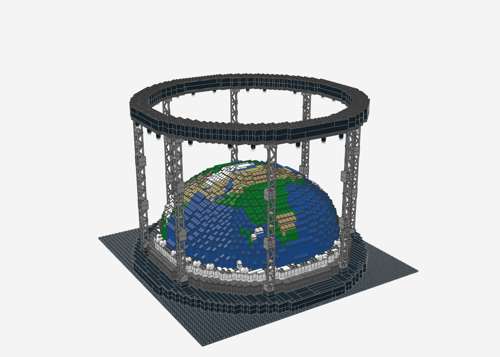

# lego-

LEGO-MOCs als LDraw-Dateien (`.mpd`) mit Stückliste und BrickLink-Wanted-List.

## Modelle

| Modell | Teile | Beschreibung |
|---|---|---|
| [Globe Stage](globe-stage/) | 7.064 | Stadion-Konzertbühne mit gerundeter Erdkugel-Kuppel, echter LED-Beleuchtung (Ring + 24 Scheinwerfer) und Truss-Ring auf 8 Gitterträger-Türmen |

## Werkzeuge

- [`tools/ldraw-render`](tools/ldraw-render/) – Headless-Renderer für LDraw/MPD (three.js + Chromium) und
  `ldbbox.py` zum Nachschlagen von Teil-Abmessungen und Ursprüngen.
