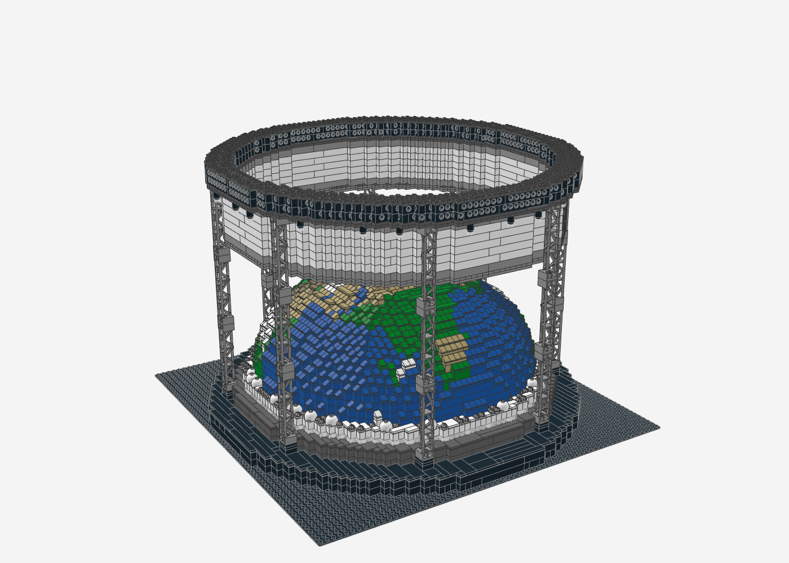

# lego-

LEGO-MOCs als LDraw-Dateien (`.mpd`) mit Stückliste und BrickLink-Wanted-List.

## Modelle

| Modell | Teile | Beschreibung |
|---|---|---|
| [Circus Maximus (UTOPIA)](circus-maximus/) | 7.062 | Travis Scotts Arena-Bühne auf 2 Baseplates 48×48: geschwungener Weg zwischen dunklen Felsen mit 14 Steinköpfen, Felsblock mit Durchgang und Performer, 154 schwarze Fans als Minifiguren, Pyro und CO2, Videoring mit Feuerwand, Scheinwerfer und PA |
| [Yeezus Stage](yeezus-stage/) | 2.301 | Mount Yeezus: Fels-Pyramide mit Wendelweg bis zum Gipfel vor dem runden Screen, Laufsteg mit Rampe zur Lower Stage im Publikum, Line-Arrays und Moving Heads – auf 2 Baseplates |
| [Globe Stage](globe-stage/) | 10.876 | Stadion-Konzertbühne mit gerundeter Erdkugel-Kuppel, echter LED-Beleuchtung (Ring + 24 Scheinwerfer), einem Truss-Ring an Seilen unter einem Dach auf vier schlanken Ecktürmen und dem Album-Cover als Dach-Mosaik |

Bauanleitung als PDF: [`globe-stage/Bauanleitung_Globe_Stage.pdf`](globe-stage/Bauanleitung_Globe_Stage.pdf)

## Skill: LEGO-Profi-Designer

[`.claude/skills/lego-profi-designer`](.claude/skills/lego-profi-designer/SKILL.md) bündelt Bautechniken,
Design-Prinzipien, Statik/legale Verbindungen, eine geprüfte Teile-Bibliothek und die Generator-Pipeline
dieses Repos. Claude Code lädt ihn automatisch, wenn in diesem Repo an LEGO-Modellen gearbeitet wird.

## Werkzeuge

- [`tools/mosaic`](tools/mosaic/make_mosaic.py) – Mosaik-Generator für 1 × 1-Fliesen: erzeugt mehrere Varianten und bewertet sie gegen die Vorlage (ΔL\* aus Abstand, SSIM im Detail).
- [`tools/ldraw-render`](tools/ldraw-render/) – Headless-Renderer für LDraw/MPD (three.js + Chromium) und
  `ldbbox.py` zum Nachschlagen von Teil-Abmessungen und Ursprüngen.
