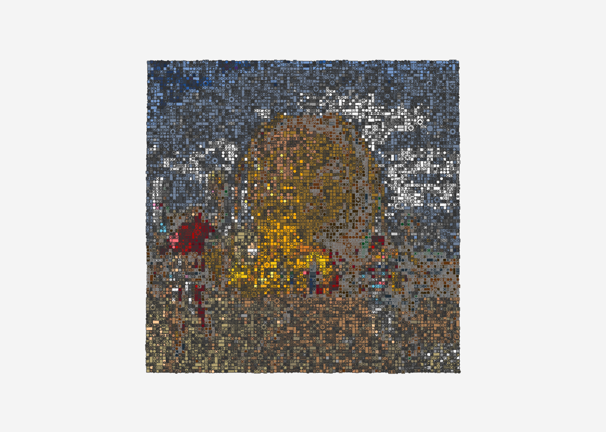
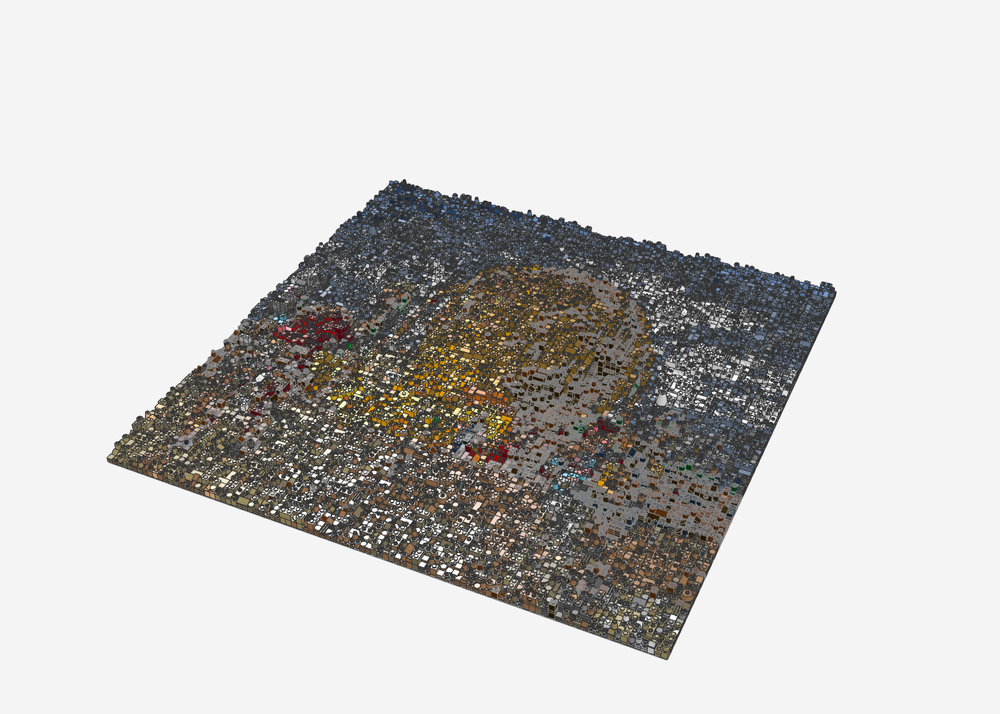
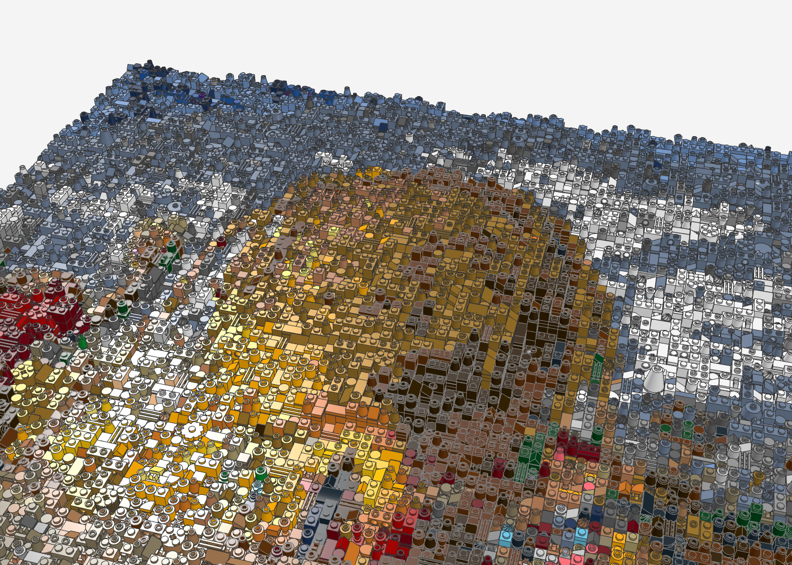
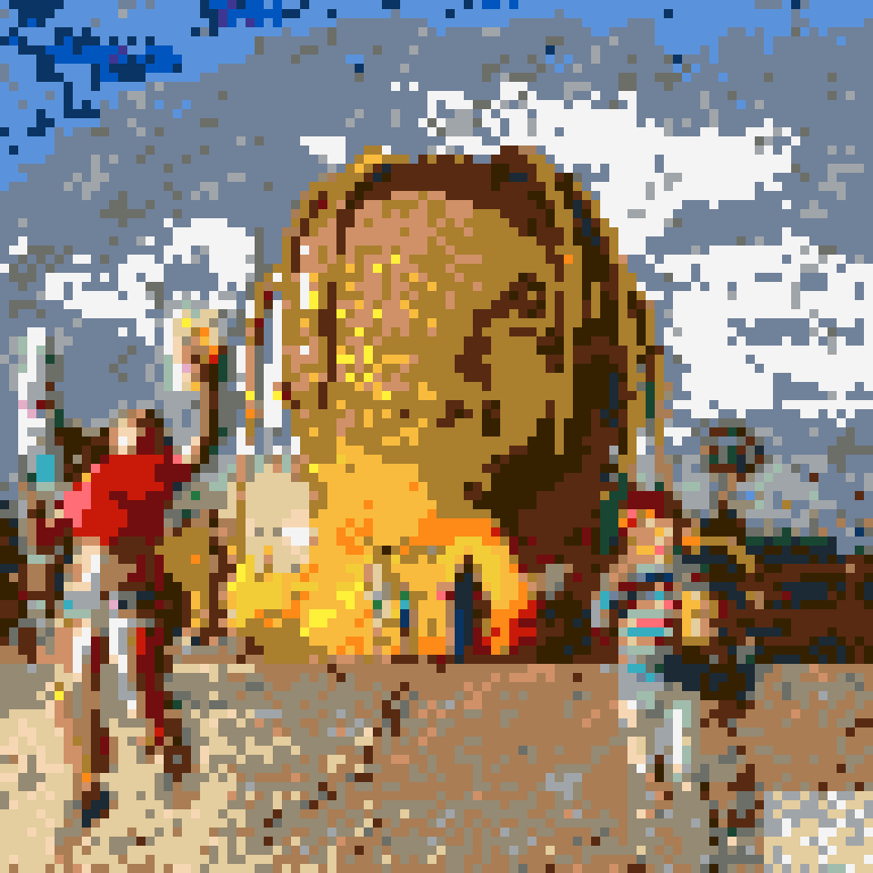
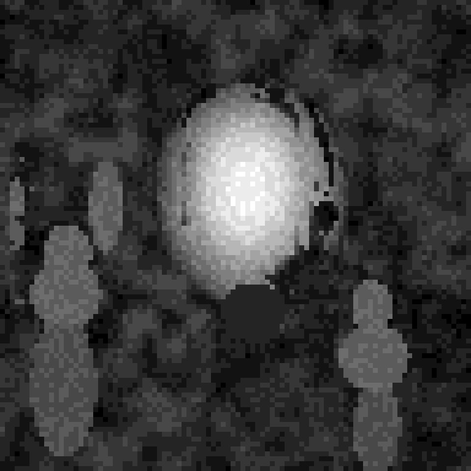

# ASTROWORLD-Relief (96 × 96)

Travis Scotts *ASTROWORLD*-Cover als 3D-Relief-Mosaik: **96 × 96 Noppen (ca. 77 × 77 cm)** auf 4 Baseplates 48 × 48.
Der riesige goldene Kopf ist die Plastik des Bildes: das Gesicht wölbt sich als Kuppel bis **14 Platten** heraus,
die Dreadlocks stehen mit hervor, der leuchtende Mund-Eingang liegt vertieft. Die beiden Kinder, die Rakete und die
Wolken treten als eigene Ebenen heraus. Das Parental-Advisory-Logo ist entfernt (Boden statt Aufkleber).

| Kennzahl | Wert |
|---|---|
| Teile | 25.099 |
| Positionen (Teil + Farbe) | 616 |
| Farben | 29 |
| max. Höhe | 14 Platten |

| Frontal | Schräg | Nah (Kopf) |
|---|---|---|
|  |  |  |

Vorschau:  · Höhenkarte: 

## Zonen (`zonen.json`)

| Zone | Umsetzung |
|---|---|
| Himmel und Wolken | nur Himmelsfarben (White, Bright Light Yellow, Sand Blue, Medium Blue, Blue, Dark Blue), Wolken-Relief |
| Boden | Sandtöne (Tan, Dark Tan, Light Bluish Gray, White, Medium/Light Nougat) wie verstreutes Popcorn |
| Gesicht | Kuppel bis 14 Platten, nur Goldtöne: **Pearl Gold**, Bright Light Orange, Yellow, Reddish Brown |
| Dreadlocks | goldene Pixel um das Gesicht, 10 Platten |
| Mund / Eingang | vertieft (2 Platten), leuchtende Bildfarben |
| Kinder, Rakete | je 4–5 Platten, saubere Bildfarben (Streifenpulli, Streifenhose) |
| Label | entfernt, Bodenfarben |

Neu im Werkzeug: Zonen-Schlüssel `"palette"` – eine Zone wählt nur aus diesen Farben (z. B. Gold fürs Gesicht).

## Dateien

- `astroworld_96x96.mpd` – Modell · `astroworld_96x96_bricklink.xml` – Teileliste für BrickLink
  (Reiter „Upload BrickLink XML format") · `astroworld_96x96_bom.csv` – Stückliste

## Neu erzeugen

Das Cover liegt aus Urheberrechtsgründen nicht im Repo.

```bash
python3 tools/relief/make_relief.py cover.jpg astroworld-relief/astroworld_96x96 --breite 96 --hoehe 96 --chaos 0.12 \
  --konfetti 0 --seed 11 --tiefe 1 --wolken 3 --zonen astroworld-relief/zonen.json --farben-plus 297,92,78,151 \
  --licht 1 --formfolge
```
