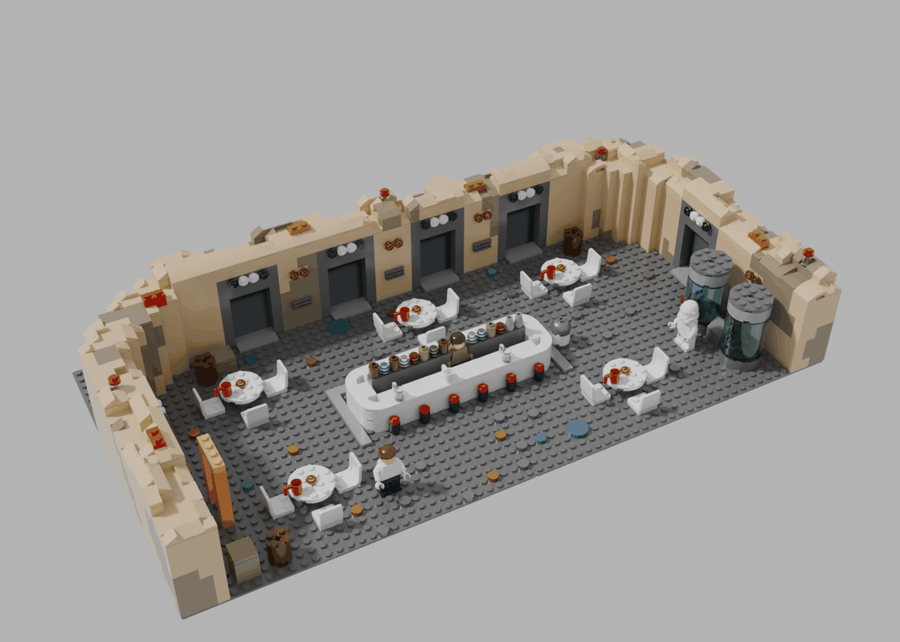
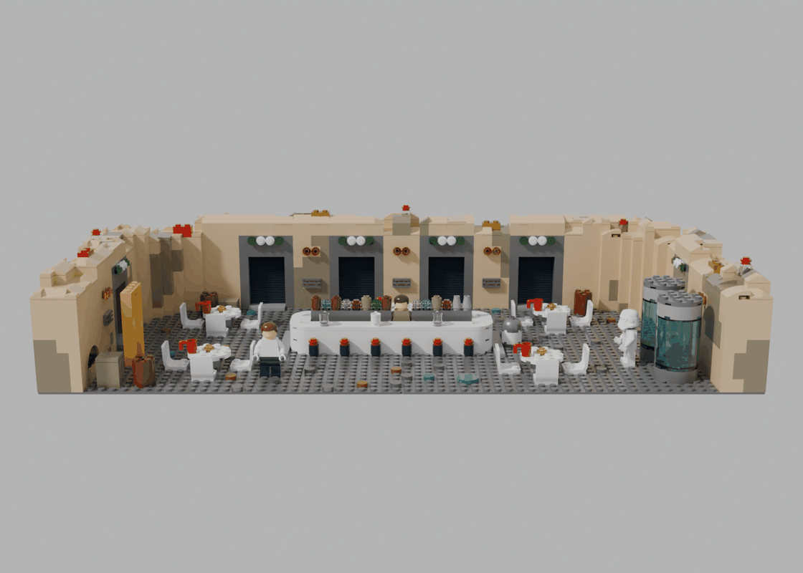
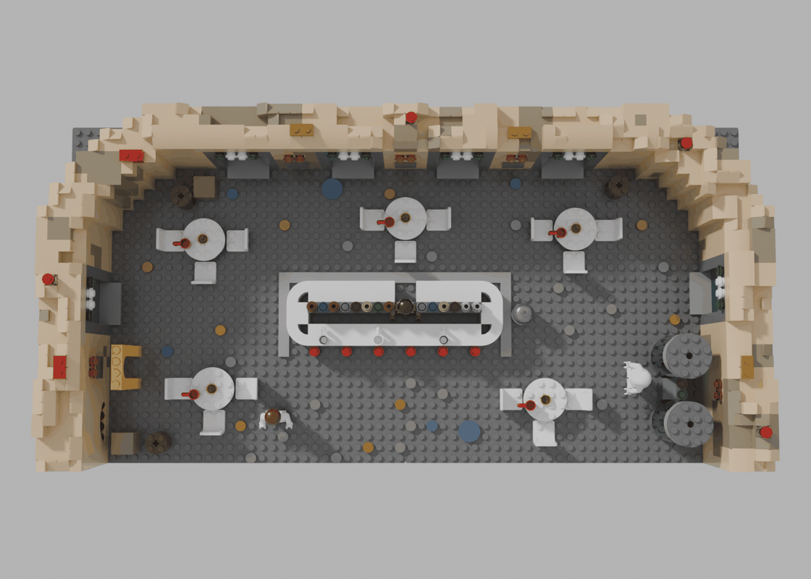
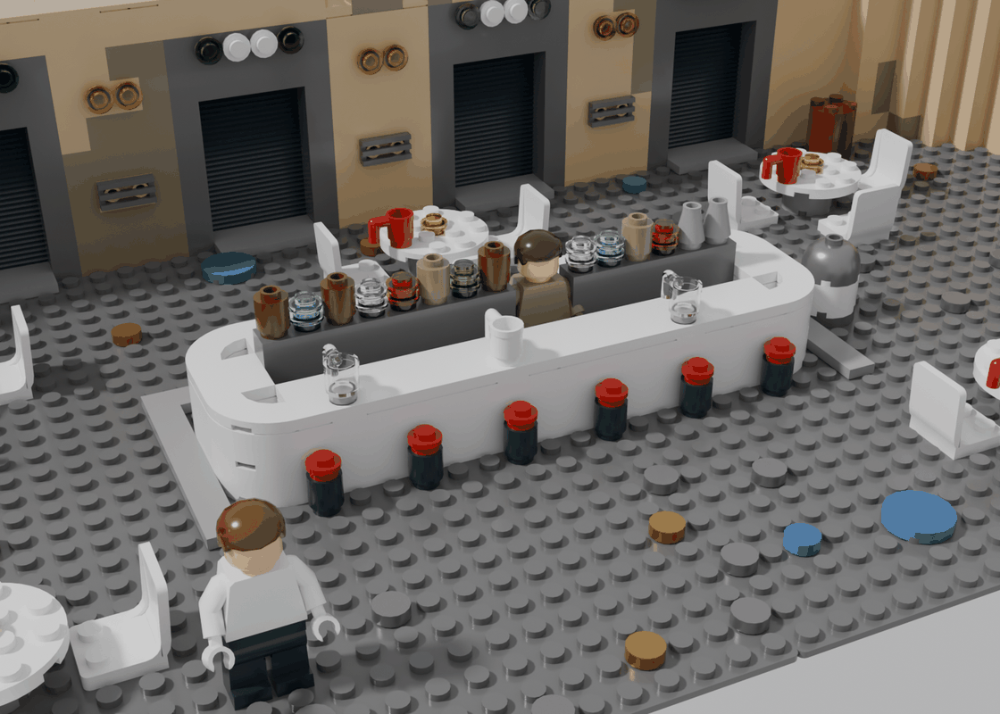
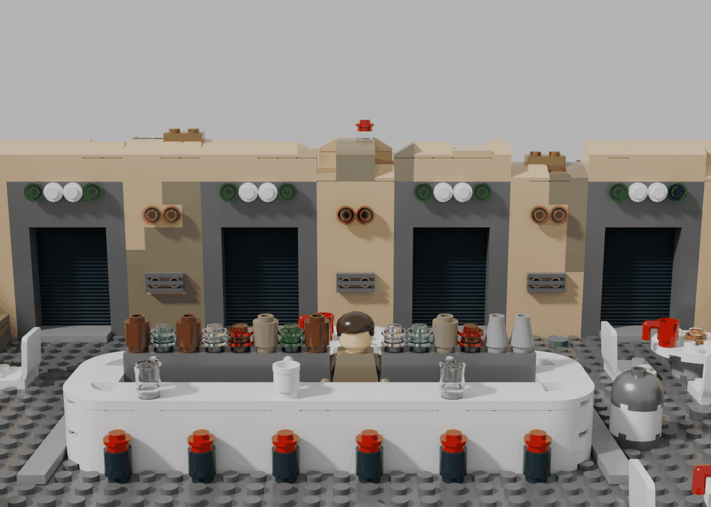
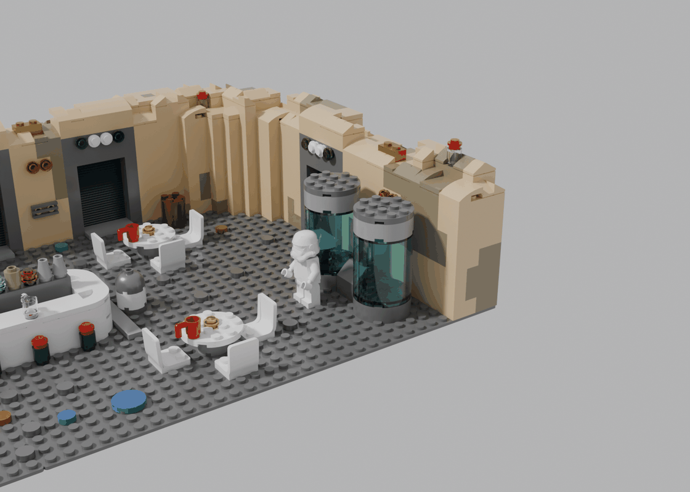
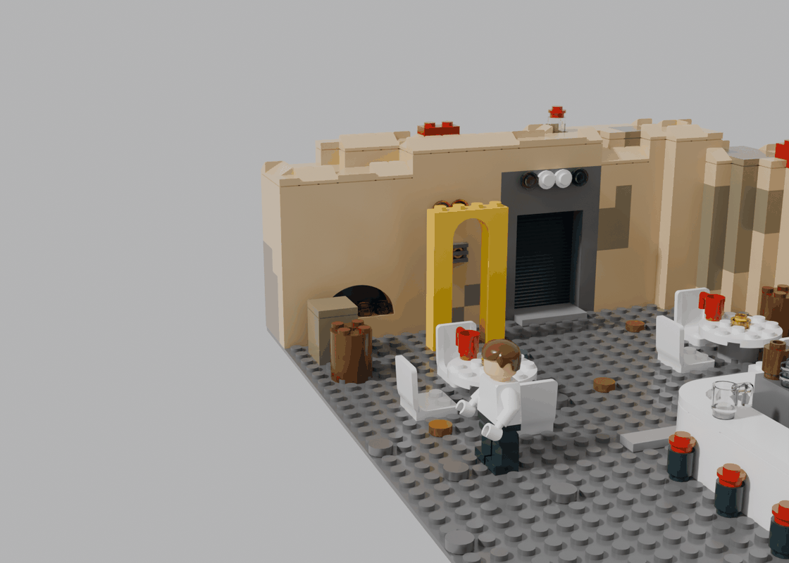
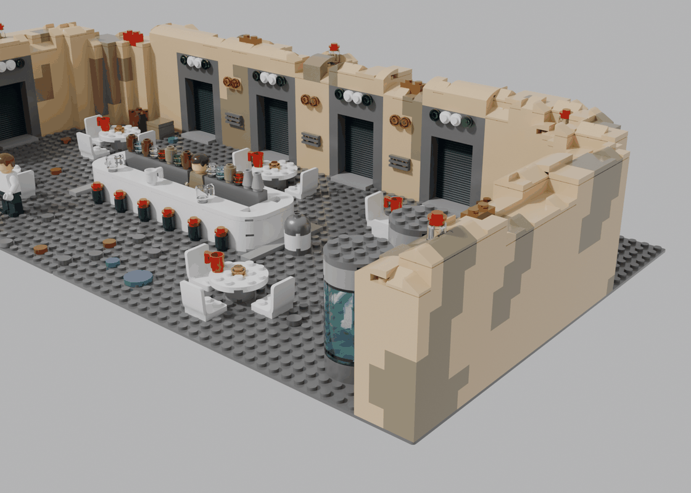
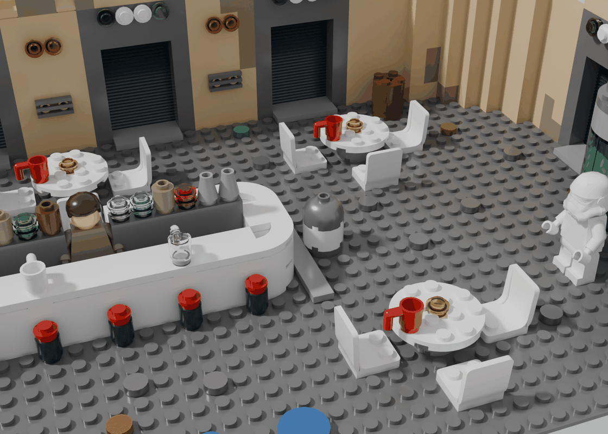

# Mos Eisley Cantina – LEGO Star Wars: The Complete Saga (LEGO MOC)

Der Hub aus *LEGO Star Wars: The Complete Saga* als Diorama auf **zwei Baseplates 32 × 32** (64 × 32 Noppen,
ca. 51 × 26 cm): ein runder Raum aus Adobe-Wänden mit den **sechs Episoden-Türen**, in der Mitte die **Bar** mit
Barkeeper, drumherum runde Tische mit weißen Stühlen, rechts vorne zwei **Bacta-Tanks**, links ein Kamin und ein
gelbes Tor – und überall liegen **Studs**, oben auf der Wand Gold- und Rote Steine wie im Spiel.



| Von vorne | Von oben |
|---|---|
|  |  |

| Bar mit Barkeeper | Episoden-Türen | Bacta-Tanks |
|---|---|---|
|  |  |  |

| Kamin und gelbes Tor | Rechte Seite | Details: R2, Becher, Kerzen, Studs |
|---|---|---|
|  |  |  |

## Vorlagen

- **Das Spiel:** Im Hub der *Complete Saga* führen Türen aus einem runden Raum zu den Episoden, an der Bar verkauft
  der Barkeeper Figuren und Extras, überall liegen Studs ([LEGO Games Wiki](https://legogames.fandom.com/wiki/Mos_Eisley_Cantina),
  [Prima Games](https://primagames.com/eguides/lego-star-wars-the-complete-saga-eguide/walkthrough)).
- **Community-MOCs** als Referenzbilder, vor allem [MOC-237649 „The complete Saga cantina“ von McMOC](https://rebrickable.com/mocs/MOC-237649/)
  (halbrunder Raum, Bar in der Mitte, Bacta-Tanks rechts) sowie gerade und dreiteilige Varianten mit Türreihe,
  Bar links und Tanks rechts. Das Modell hier ist ein eigener Entwurf nach diesen Vorbildern; Referenzbilder liegen
  nicht im Repo.

## Kennzahlen

- **1.375 Teile**, 107 Positionen (Teil × Farbe), davon 12 Teile für 3 Minifiguren (eigene Baugruppe, lässt sich weglassen)
- **Grundfläche** 64 × 32 Noppen (2 Baseplates in Dark Bluish Gray), **Wandhöhe** 7–8 Steine (ca. 7,5 cm)
- **6 Türen** (Episode I–IV in der Rückwand, V und VI in den Seitenwänden), 5 Tische mit 15 Stühlen, 6 Barhocker,
  2 Bacta-Tanks mit Kontrollpult, R2-Einheit, Fässer und Kisten, 26 Studs plus Stud-Spur und 2 große blaue Studs auf dem Boden,
  5 Sammelsteine und 4 Minikit-Behälter auf der Wand

## Aufbau (Submodelle)

1. **Grundplatten** – 2 × Baseplate 32 × 32 in Dark Bluish Gray (der dunkle Boden aus dem Spiel)
2. **Adobe-Wände** – ein 4 Noppen dickes Band um den Raum: gerade Seiten- und Rückwand, die hinteren Ecken rund
   (Radius 9, außen bleibt die Grundplatte frei). Tan mit einzelnen Dark-Tan-Flecken, Steine im Verband.
   Die Oberkante ist unruhig 7–8 Steine hoch; zum Raum hin weiche gebogene Slopes (11477), sonst Cheese-Slopes und Fliesen
3. **6 Episoden-Türen** – je ein Modul 6 Noppen breit: dunkelgrauer Rahmen aus 1 × 2-Steinen, die in die Wand greifen,
   eine Nische mit hellgrauer Schwelle und eine Trittplatte davor, dahinter ein **Rolladen aus Rillensteinen** (2877, schwarz), ein Sturz aus
   einem 2 × 6-Stein und darüber die **Leuchtreihe grün – weiß – weiß – grün**: Rundplatten 1 × 1 per SNOT auf den
   Seitennoppen zweier Steine 1 × 2 (11211)
4. **Bar** – Theke als weißes Band mit **runden Ecken** (Ecksteine 2 × 2 rund 3063b, Eckfliesen 27925), oben glatte
   Fliesen, hinten ein Durchgang für den Barkeeper. Dahinter die dunkelgraue Rückbar mit Fässern (Rundsteine 1 × 1)
   und Flaschen (gestapelte Rundplatten in Trans-Farben), zwei Zapfhähne (Kegel 1 × 1). Auf der Theke drei Becher auf
   Untersetzern, vorne 6 rote Hocker, um die Theke eine hellgraue Fliesenkante
5. **Tische** – Rundplatte 4 × 4 (60474) auf einem runden Stein 2 × 2, je 3 weiße Stühle (4079), die zum Tisch schauen,
   ein roter Becher und eine Kerze (Rundplatte Trans-Yellow) in der Mitte
6. **Bacta-Tanks** – je zwei Zylinderhälften 2 × 4 × 4 (6218) in Trans-Light Blue auf einem runden Stein 4 × 4,
   oben ein grauer Deckel; dazwischen ein Kontrollpult (Schräge 2 × 2 mit grüner und roter Leuchte)
7. **Details** – Kamin in der linken Wand (Bogen 1 × 6 × 2, Glut aus Trans-Orange/Trans-Red, dahinter Ruß),
   gelbes Tor (Bogen 1 × 4 × 2 auf zwei Säulen), **Studs** in Silber, Gold und Blau auf dem Boden (eine Spur führt zur Bar,
   zwei große blaue Studs aus Rundfliesen 2 × 2), **Gold- und Rote Steine** und **Minikit-Behälter** (Rundstein 1 × 1
   Trans-Clear mit rotem Teil) oben auf der Wand, eine **R2-Einheit** (Rundstein 2 × 2, Kuppel in Silber), Fässer und Kisten in den Ecken.
   An der Wand zwischen den Türen **Lüftungsgitter** und **warmes Wandlicht** (Trans-Yellow), beides per SNOT
8. **Figuren (optional)** – Barkeeper hinter der Theke, ein Schmuggler im weißen Hemd, ein Stormtrooper bei den Tanks;
   unbedruckte Teile (Beine 73200b-f1 = BrickLink 970c00, Torso 76382, Kopf 3626c, Haare 3901, Helm 30408)

## Angewandte Techniken

| Technik | Umsetzung |
|---|---|
| **SNOT für Details in der Wand** | Die Türleuchten stecken seitlich auf Steinen mit Seitennoppen (11211) und schauen in den Raum; der Check wertet die seitliche Verbindung mit |
| **Verband** | Wände, Rahmen und Theke im Verband; die Rahmensteine greifen 2 Noppen tief in die Wand statt nur davorzustehen |
| **Runde Formen ohne Spannung** | Runde Ecken der Theke aus fertigen Eck-Rundsteinen und Eckfliesen; die Raumecken als Stufenkreis mit Wanddicke konstant |
| **Detail mit Zweck** | Jedes Detail erzählt etwas aus dem Spiel (Türleuchten, Rolladen, Studs, Sammelsteine, Kamin) statt Greebling als Rauschen |
| **Ruhezonen** | Boden und Wandflächen zwischen den Türen bleiben ruhig; Detaildichte an Bar, Türen und Tanks |
| **Kamin mit Bogen** | Der Bogen trägt oben auf ganzer Länge, steht aber nur auf seinen zwei Beinen; darunter liegt die Glut |

## Prüfung

Der Generator prüft nach jedem Lauf: **0 nicht verbundene Teile, 0 schwebende Teile, 0 Kollisionen.** Die Figuren
stehen auf der Grundplatte; ihre Beine dienen dem Check als Platzhalter für die ganze Figurenhöhe.

## Neu erzeugen

```bash
python3 cantina/generate_cantina.py
```

Raumform (`IN_X`, `IN_Z`, `RC`, `WALL_T`), Türen (`DOORS`), Bar (`BX0` …), Tische (`TABLES`), Tanks (`TANKS`) und Figuren
(`FIG_STANDS`) stehen oben im jeweiligen Abschnitt des Skripts. Renders mit
`blender -b -P tools/blender-render/render_cycles.py -- cantina/cantina.mpd out/cantina`.

## Hinweise

- **Keine Lizenzdrucke:** Episodennummern, Gesichter und Stormtrooper-Helmdruck sind nicht bedruckt; das Modell nutzt nur
  unbedruckte Teile.
- **Seltene Farben prüfen:** Stein 1 × 2 (3004) in Pearl Gold für die Goldsteine und Zylinderhälfte 6218 in Trans-Light Blue
  vor der Bestellung auf BrickLink prüfen (Alternative Goldstein: Fliese 1 × 2 in Pearl Gold). Den Torso führt BrickLink
  je Farbkombination unter eigenen Nummern (973c…).
- **Raumform:** Der Raum im Spiel ist ganz rund. Hier sind nur die hinteren Ecken rund, damit alle Türen im Raster liegen
  und die Wände ohne Scharniere stabil stehen.
