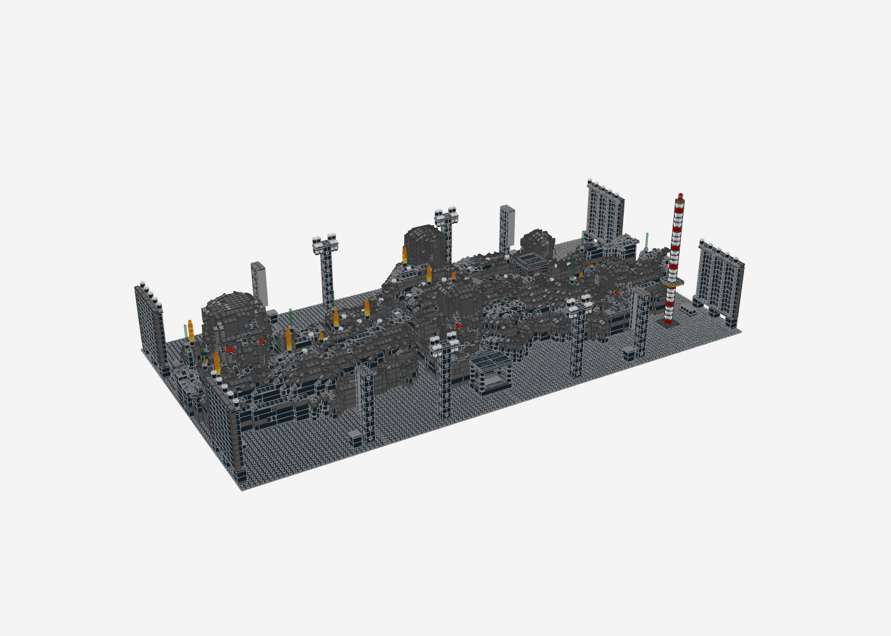
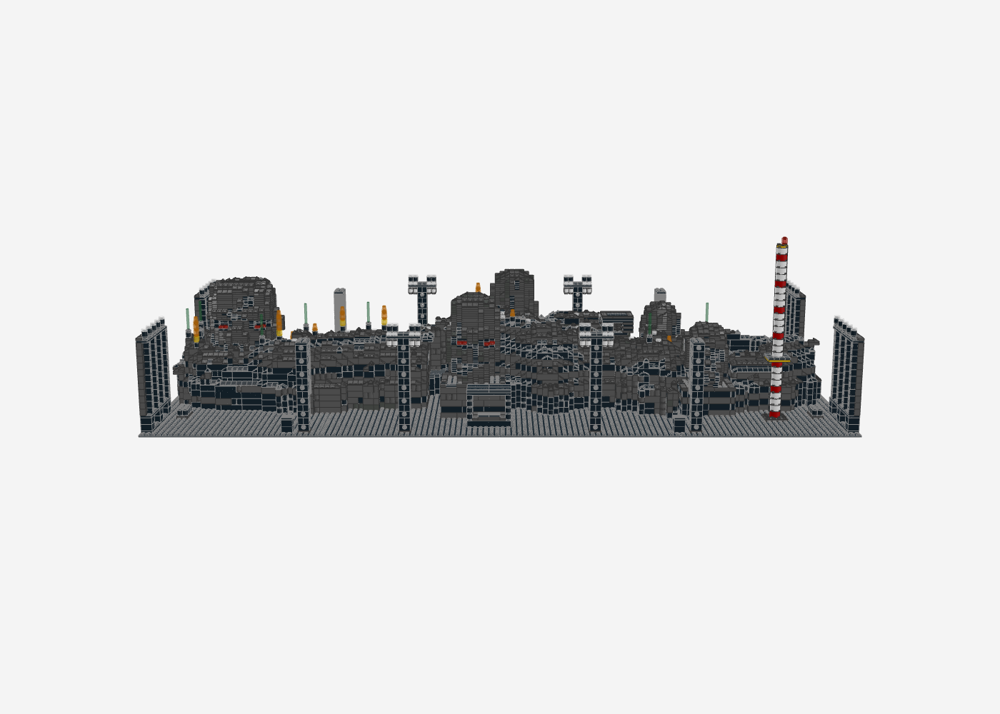
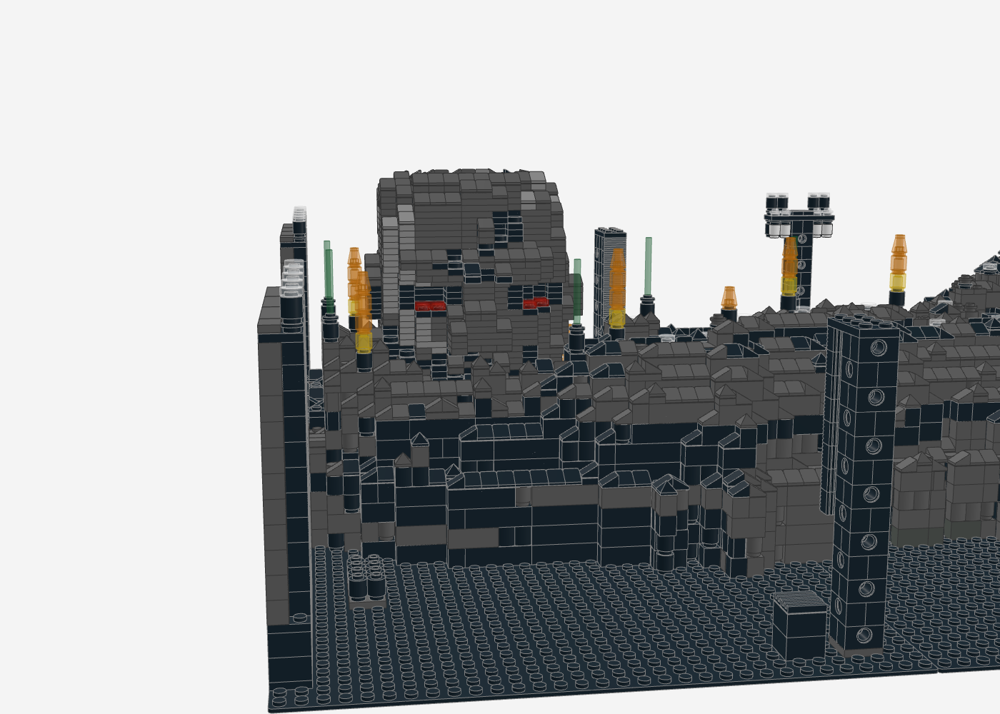
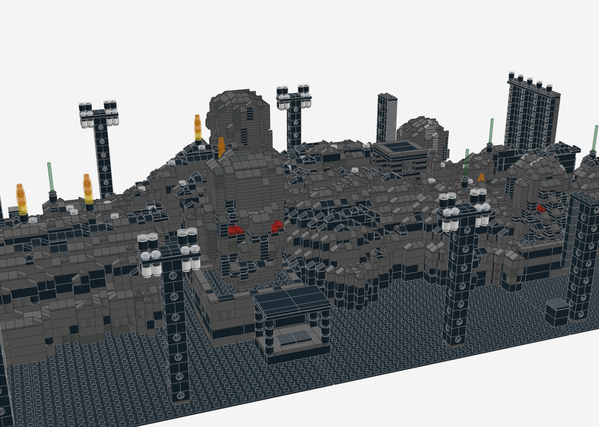
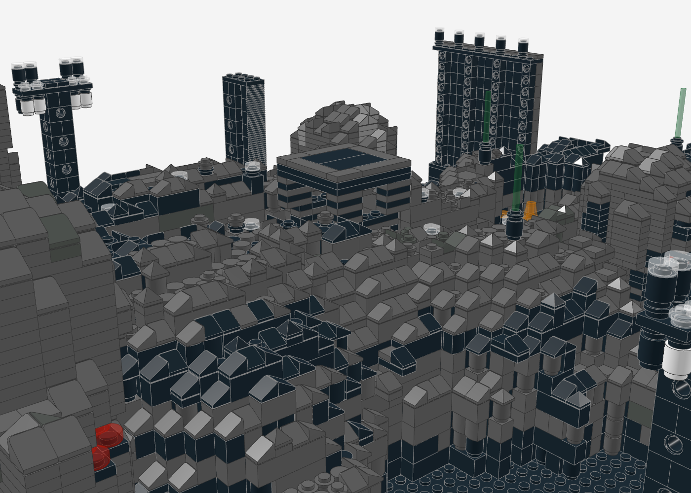
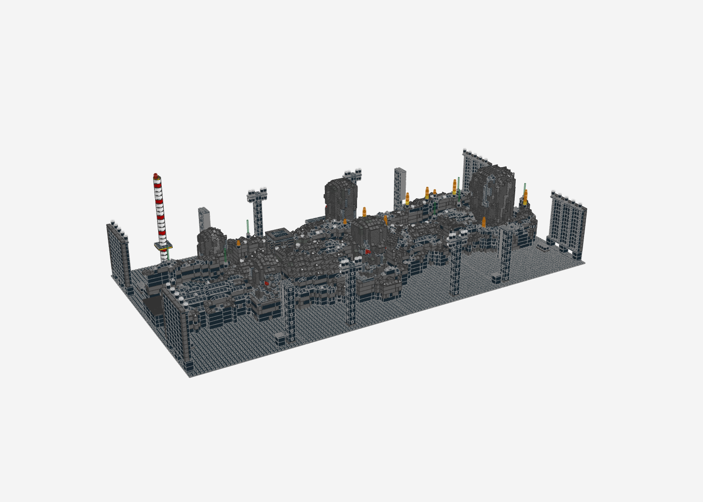
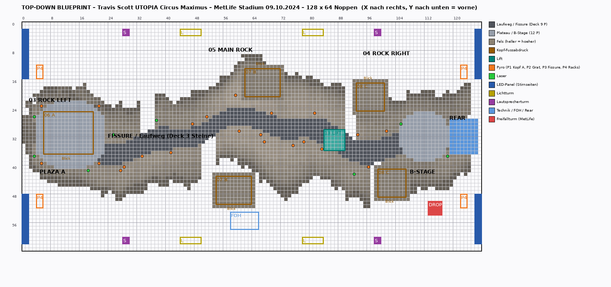
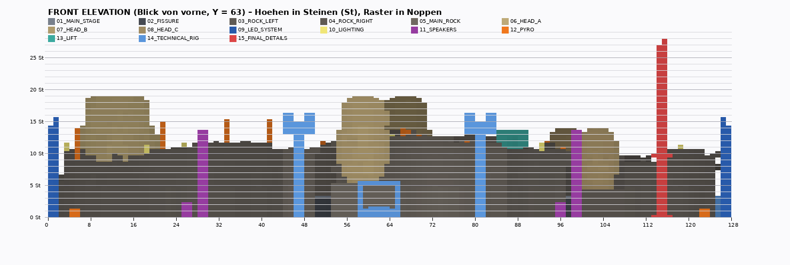
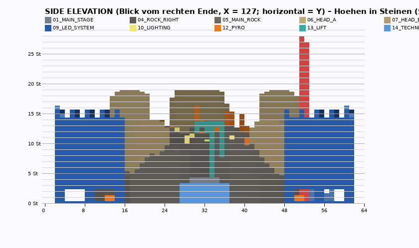
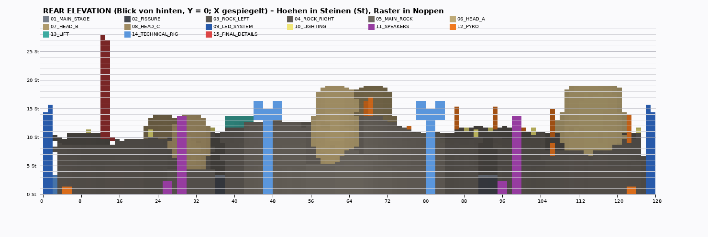

# Travis Scott – UTOPIA – Circus Maximus – MetLife Stadium, 09.10.2024 („One Night Only in Utopia")

LEGO-MOC als LDraw/Studio-Modell, **Hauptversion 128 × 64 Noppen** (8 Baseplates 32 × 32, ca. 1,02 × 0,51 m),
**13.613 Teile**, 102 Positionen, 16 Module + 7 verlinkte Master-Submodelle. Generator mit Selbstprüfung:
**0 lose, 0 schwebende Teile, 0 Kollisionen**.

> **Status: Version 1 – Rekonstruktion aus Textquellen.** In dieser Arbeitsumgebung sind Bild- und
> Videoquellen (Getty, A View From My Seat, ConcertArchives, YouTube, Rise Fabrication, See You Later) vom
> Netzwerk gesperrt; es konnte **kein einziges MetLife-Foto angesehen** werden. Alles, was nur aus Fotos
> bestätigbar wäre, ist deshalb **[INFERRED]** markiert. Mit Screenshots aus dem MetLife-Video / Getty
> lässt sich jedes Element gezielt auf [CONFIRMED – METLIFE] heben (siehe Abschnitt 21).

| 3/4-Ansicht | Frontansicht |
|---|---|
|  |  |
| **Kopf A (bespielbar, Plaza links)** | **Hauptfels Mitte** |
|  |  |
| **Lift, Fels-Mikrodetail, Laser** | **Rückseite** |
|  |  |

---

## 1. RESEARCH SUMMARY

| Quelle (Priorität) | Aussage | Nutzung |
|---|---|---|
| P1 – MetLife-Konzertberichte (Randolph Rampage, Meadowlands Media, Quo Vadis, ihspawprint) | „massive rock section with twists and turns“, Flammen, Feuerwerk „nonstop for almost an entire song“, Pyro + Lichter; **Freifallturm („drop tower“, „The Slingshot“) im Innenraum**; 80.000+ Zuschauer | Felsbühne mit Windungen, Pyro-Zonen, Feuerwerks-Racks, Freifallturm |
| P1 – MetLife-Fotos/Video (Getty, AVFMS Sect. 217, Full Concert Video) | **nicht einsehbar** (Netzwerksperre) | – |
| P2 – Rise Fabrication | Arena-Tour 2023: >275 laufende Fuß handgeschnitzte Felsen (EPS 1,5 lb, schwarze texturierte Flex-Beschichtung), **13 CNC-gefräste Köpfe 6–14 ft breit**, Stahlarmatur, fliegbar, interne Punkte für Crowd-Scanning-Laser und Licht | Kopfgrößen, Felsmaterial/-farbe, Laser in den Augen |
| P2 – See You Later | Show-Execution, Lichtdesign, Content; **360°-Videoring** um die Bühne (Arena); Bühne als **Erdspalte, die den Saal teilt** | Fissure-Konzept; Ring **nicht** übernommen (Arena) |
| P2 – Mixonline (Clair Global) | Arena: 202 Clair Cohesion CO10 in ~12 Stereo-Hangs je Seite über dem Videoring | Line-Arrays als dünne, gehängte Module |
| P2 – Elsa Hanneke (Stage Design, über die Recherche einer anderen Sitzung in `circus-maximus/README.md`) | Arena-Entwurf: sehr langer, flacher Felspfad mit Ausbuchtungen; **runde Köpfe an den Rändern** mit großen Ohren und runden gemeißelten Augen; **hoher Felsblock mit Tür und Gesicht an einem Ende** (laut Notiz aus der Stadionversion) | bestätigt Fissure-Pfad und Kopf-Randposition; **Block mit Tür → V2-Kandidat statt/zusätzlich zu Kopf A** |
| P2 – A World Away | keine Treffer im Suchindex | – |
| P3 – SoFi-Review (HotNewHipHop u. a.) | Bühne wie ein Felsweg, Rauch, spontane Flammen; **„massive head shaped piece“, auf dem Travis performt**; Stadion-Videoboard als IMAG | Kopf A als bespielbarer Riesenkopf |
| P3 – Stadion-Tour allgemein | Bühne nicht an einem Ende, sondern **quer durch den Innenraum** („spans across, cutting through the crowd“) | Bühne als Längsspalte über das Feld |
| P3 – Grokipedia (KI-Text, geringe Verlässlichkeit) | 88 ft × 62 ft × >30 ft, Ölfässer schwarz | nur Höhen-Plausibilität, Ölfässer als Detail |

## 2. CONFIRMED / TOUR / INFERRED

| Element | Klasse | Begründung |
|---|---|---|
| Felsbühne, gewunden („twists and turns“) | **[CONFIRMED – METLIFE]** (Text) | MetLife-Review |
| Flammen / Pyro auf der Bühne | **[CONFIRMED – METLIFE]** (Text) | MetLife-Reviews |
| Feuerwerk | **[CONFIRMED – METLIFE]** (Text) | „fireworks nonstop“ |
| Freifallturm im Innenraum | **[CONFIRMED – METLIFE]** (Text) | Reviews + Konzert-Posts; **Position und Aussehen [INFERRED]** |
| Bühne quer durch den Innenraum (Fissure) | [CONFIRMED – TOUR] | SoFi/Stadion-Berichte, See You Later |
| Schwarze, texturierte Felsen | [CONFIRMED – TOUR] | Rise Fabrication |
| Steinköpfe 6–14 ft, Laser in den Augen | [CONFIRMED – TOUR] | Rise (Arena, fliegend) |
| Bespielbarer Riesenkopf | [CONFIRMED – TOUR] | SoFi-Review; **Größe/Position [INFERRED]** |
| Köpfe am Boden statt fliegend | [INFERRED] | Open-Air-Stadion ohne Dachrigging; deckt sich mit Wunsch „keine fliegenden Köpfe“ |
| Anzahl 5 Köpfe, Verteilung | [INFERRED] | Randposition durch Hanneke-Entwurf (Arena) gestützt |
| Hoher Felsblock mit Tür/Gesicht an einem Ende | [CONFIRMED – TOUR] (Hanneke-Notiz, Stadion) | in V1 als Kopf A + Plaza umgesetzt; MetLife-Form offen |
| Hebeplattform (Lift) | [CONFIRMED – TOUR] (Arena: CyberMotion-Lifte) | MetLife-Position/Hub [INFERRED] |
| 360°-LED-Ring | **nicht übernommen** | nur Arena bestätigt |
| LED-Wände (4 Panels an den Stirnseiten) | [INFERRED] | Stadion nutzte eigene Videoboards (SoFi); MetLife-Screens unbekannt |
| Licht-/Lautsprechertürme (je 4) | [INFERRED] | Open-Air braucht Bodenstützen; Typ Clair (Arena) |
| FOH vorne | [INFERRED] | – |
| Ölfässer | [CONFIRMED – TOUR] (schwache Quelle) | – |

## 3. PHOTO ANALYSIS

Nicht durchführbar (Netzwerksperre für alle Bild-/Videodomains). Die geforderten Ansichten (Draufsicht, Front,
45°, Seite, Rock-, Head-, LED-, Truss-, Lautsprecher-, Pyro-, Lift-Nahaufnahmen) sind als **Checkliste** in
Abschnitt 21 übernommen. Ersatzweise wurden die Ansichten des Modells selbst erzeugt (`blueprint_topdown.png`,
`elevation_*.png`), damit sie 1:1 gegen Screenshots gelegt werden können.

## 4. STAGE DIMENSIONS (geschätzt)

| Maß | Wert | Grundlage |
|---|---|---|
| Bühnenlänge | ca. 48 m (159 ft) | Modell 121 Noppen; „spans across the floor“; MetLife-Feld 109,7 × 48,8 m – *estimated, nicht fotogrammetrisch* |
| Breite inkl. Felsbänder | ca. 12–17 m | Modell 30–43 Noppen |
| Deck (Laufweg) | ca. 1,4 m | 3 Steine |
| Felsen | 1,9–6,2 m | 4–13 Steine |
| Gesamthöhe Kopf A | ca. 9,1 m | Grokipedia „>30 ft“ |
| Köpfe | A 5,6 m · B 4,0 m · C 3,2 m breit | Rise 6–14 ft (1,8–4,3 m); A größer als „massive head piece“ [INFERRED] |
| Lift | Hub 4,8 m, Plattform 2,4 × 2,4 m | [INFERRED] |
| LED-Panels | 5,6 × 4,8 m (Fläche) | [INFERRED] |
| Freifallturm | ca. 13 m | [INFERRED] (reale Mobil-Türme oft höher) |

## 5. SCALE CALCULATION

**1 : 50** – 1 Noppe = 8 mm → 0,40 m; 1 Platte = 3,2 mm → 0,16 m; 1 Stein = 9,6 mm → 0,48 m.
Gewählt, weil damit drei unabhängige Angaben zugleich passen: Kopfbreiten 6–14 ft (B = 10 Noppen = 13 ft,
C = 8 Noppen = 10,5 ft), Höhe > 30 ft (Kopf A 57 Platten = 9,1 m) und ein übliches Bühnendeck (1,2–1,5 m).
Unsicherheit: ±20 % auf alle Längen, da keine Fotomessung möglich war.

## 6. TOP-DOWN BLUEPRINT



X = 0–127 (von vorne gesehen links → rechts), Y = 0–63 (0 = hinten, 63 = vorne). Zonen:

| Zone | Koordinaten | Modul |
|---|---|---|
| Plaza A + Kopf A (Spielfläche, Blick nach vorne) | X 4–22, Y 22–40; Kopf X 6–19, Y 25–36 | 01 / 06 |
| Fissure / Laufweg (gewunden, 4–7 breit) | X 20–107, Mittellinie Y ≈ 26–37 | 02 / 01 |
| Rock Left / Main Rock / Rock Right | X 0–43 / 44–85 / 86–127, Y ≈ 9–52 | 03 / 05 / 04 |
| Kopf B ×2 (Moai, Blick hinten/vorne) | X 62–71 Y 13–20 · X 54–63 Y 43–50 | 07 |
| Kopf C ×2 | X 93–100 Y 17–24 · X 99–106 Y 41–48 | 08 |
| Lift | X 84–89, Y 30–35 | 13 |
| B-Stage (rund) + Rear Stage/Technik | X 104–120 / X 119–126, Y 27–36 | 01 / 14 |
| Negativräume (Felsspalten zum Innenraum) | Nord X 33–36, 90–92; Süd X 50–53, 97–99 | – |
| LED-Panels (4, Stirnseiten) | X 0–1 und 126–127, Y 2–15 und 48–61 | 09 |
| Lichttürme / Lautsprechertürme | X 46, 80 / X 28, 98 jeweils Y 2 und 60 | 14 / 11 |
| FOH | X 58–65, Y 53–57 | 14 |
| Pyro P1–P4 | Plaza-Ecken, 12 Gratdüsen, 6 Fissure-Düsen, 4 Racks X 4/122 | 12 |
| Freifallturm | X 113–116, Y 50–53 | 15 |

## 7. FRONT VIEW · 8. SIDE VIEW (+ Rear)





Höhen in Steinen (St), Raster in Noppen, Farbe = Modul, dunkler = weiter hinten. Maßstäblich (Noppe : Platte = 20 : 8).

## 9. MODULE BREAKDOWN

| Submodell | Inhalt | Teile |
|---|---|---|
| 00_BASE | 8 Baseplates 32 × 32 schwarz | 8 |
| 01_MAIN_STAGE | Weg-Belag (Fliesen schwarz/dunkelgrau), Plaza A, B-Stage | 424 |
| 02_FISSURE | Unterbau des Laufwegs in der Felsspalte (3 Steine, Verband) | 269 |
| 03_ROCK_LEFT / 04_ROCK_RIGHT / 05_MAIN_ROCK | Felsmassen (Foundation, Relief, Mikro-Detail) | 1.921 / 1.856 / 2.828 |
| 06_HEAD_A / 07_HEAD_B / 08_HEAD_C | Instanzen der Kopf-Master (1 / 2 / 2) | 1.649 / 1.904 / 1.166 |
| 09_LED_SYSTEM | 4 × LED_PANEL | 652 |
| 10_LIGHTING | Laser (grüne Strahlen), Bodenstrahler | 80 |
| 11_SPEAKERS | 4 × SPEAKER_TOWER | 160 |
| 12_PYRO | 4 große Flammen, 12 Gratdüsen (4 feuern), 6 Fissure-Düsen, 4 Feuerwerks-Racks | 100 |
| 13_LIFT | Hebeplattform Zustand 2 (oben) | 169 |
| 14_TECHNICAL_RIG | 4 × LIGHT_TOWER, FOH mit Pult und Dach, Rear-Deck | 379 |
| 15_FINAL_DETAILS | Freifallturm, Ölfässer | 48 |

## 10. PART STRATEGY

Alle Teilenummern wurden in der LDraw-Bibliothek nachgeschlagen (`tools/ldraw-render/ldbbox.py`: Name, Ursprung,
Ausdehnung) – keine erfundenen Nummern. Im BrickLink-XML stehen 3062/3068/3069/3070 ohne „b“ (bekannter
Upload-Fehler). Kernteile: 3005/3004/3622/3010 (Haut), 3001/3007/3008 (Kern, schwarz), 3024/3023/3623
(Kopf-Voxel), **54200** Cheese-Slope (Kanten, Gefälle), **22388** Vierfach-Slope (Spitzen), 3070b/3069b/63864/2431
(Ruhezonen), 98138/6141 (Poren, Geröll), 30136 Log + 3062b Rundstein (Wandtextur), 3700/6541 (Traversen),
2877/2412b (Lautsprecher-Gitter), 85861 + 30374 (Laserstrahl), 3941 (Freifallturm), 4589 (Flammenspitzen).

Farben: Black, Dark Bluish Gray, Dark Gray (selten), Light Bluish Gray (nur Spuren auf Kronen/Köpfen); Akzente
Trans-Red (Laser-Augen), Trans-Green (Laser), Trans-Yellow/Trans-Neon-Orange (Flammen).

## 11. ROCK CONSTRUCTION METHOD

1. **Foundation:** Höhenfeld in Platten je Noppe. Je Steinlage: Kern mit großen schwarzen Steinen (Verband,
   Richtung wechselt je Lage), Außenhaut nur aus 1×1–1×4 in Gesteinsfarben → sichtbare **Schichtung**
   (Farbe folgt zusammenhängenden Gesteinsbändern, nicht Zufallsrauschen). Plattenreste für 1-Platten-Stufen.
2. **Medium Relief:** Terrassen in Steinstufen, Felsbänder mit gezackter Außenkante, Höhenprofil steigt vom Weg
   zum Grat, fällt außen ab; Negativräume (Spalten) bis zum Boden; **Überhänge**: 1×2-Platte ragt eine Noppe über
   die Kante, darauf Cheese-Slope (41 Stellen).
3. **Micro-Detail:** Kappen flächenweise nach Charakter – Kanten: Cheese-Slope in Gefällerichtung; Spitzen:
   Vierfach-Slope; Ruhezonen: Fliesen; rauhe Zonen: offene Noppen; porige Zonen: Rundfliesen/-platten;
   Geröll: Mix. Wandflächen: 1×1-Rundsteine und Log-Steine als Rillen.

## 12. HEAD CONSTRUCTION METHOD

Voxel-Skulptur (1 Noppe × 1 Platte) aus einer Formfunktion: Hals, Kiefer, Wangen, Schläfen, Schädel
(Superellipse), dazu **Nase** (2–3 Noppen vorstehend, Nasenflügel), **Kinn**, **Brauenwulst**, **Lippen**
(A, B), **Ohren**, **Augenhöhlen 2 tief mit Laser-Augen** (Rundfliese Trans-Red), **Mund** als dunkle Spalte,
**Risse** (Zufallspfade, 1 Voxel tief, schwarz). Wandungen von Höhlen/Rissen schwarz → Tiefe. Licht von oben:
oben hellere Steinfarbe, unten dunkler. Überhänge werden mit 1×2–1×4-Platten bis in die gestützte Zone überbrückt;
nicht verbundene Inseln entfernt (A: 12, B: 6 Teile = „abgebrochener Stein“).

| Master | Maße | Charakter |
|---|---|---|
| HEAD_MASTER_A | 14 × 12 Noppen, 48 Platten | Schädel oben **abgebrochen = Spielfläche**, Bruchecke, schwere Brauen, Risse |
| HEAD_MASTER_B | 10 × 8, 40 Platten | **Moai-Typ**: lang, gerade Nase 3 Noppen, Schmolllippen, flacher Schädel |
| HEAD_MASTER_C | 8 × 8, 28 Platten | klein, rund, ohne Brauenwulst, ein Ohr gebrochen |

Köpfe stehen auf flachen Felssockeln (Plateau mit Rand), Noppen der Sockel tragen die unterste Kopflage.

## 13. LED CONSTRUCTION

Master **LED_PANEL**: Fläche aus schwarzen 1×2-Steinen im **Stapelverband** (Fugen fluchten → Modulraster
2 × 1 Stein wie LED-Kacheln), Rahmen Dark Bluish Gray, oben Fliesenkante; dahinter Traverse (Technic-Steine
alle 4 Noppen), unten Stützen auf Fußplatte, oben Moving Heads. Ausgeschaltet fast schwarz. 4 Instanzen an den
Stirnseiten (verlinkt, gedreht 90°/270°).

## 14. LIGHTING CONSTRUCTION

Master **LIGHT_TOWER**: 2×2-Traverse aus Technic-Steinen (kreuzweise Lagen = Fachwerk-Optik), Kopfträger 6×2,
oben Moving Heads (Rundplatte + Rundstein + Linse) und Spots, **unten hängend** Moving Heads und Strobes (weiß).
Dazu: 8 Laser auf Felskronen (Emitter + Strahl Trans-Green), 28 Bodenstrahler an der Wegkante, Laser-Augen in
allen Köpfen, Moving Heads auf den LED-Panels. Kleine, zahlreiche Geräte statt großer Scheinwerfer.

## 15. PYRO CONSTRUCTION

| Zone | Ort | Ausführung |
|---|---|---|
| P1 | Ecken Plaza A (Kopf A) | 4 große Flammensäulen (Düse + gelb/neon-orange + Spitze) |
| P2 | 12 Felskronen | Düsenreihe, jede dritte feuert |
| P3 | Fissure-Kante | 6 kleine Stichflammen/Düsen |
| P4 | Innenraum an den Enden | 4 Feuerwerks-Racks (2×4-Platte, 8 Mörserrohre) – MetLife „fireworks“ |

## 16. LIFT CONSTRUCTION

Grundrahmen im Weg, **Scherenstruktur** aus versetzten 1×2-Platten (Dreieckswelle → gekreuzte Scheren auf beiden
Seiten), Mittelsäule (Hydraulik/Führung) aus Rundplatten, Trägerrost, Bühnenplatte mit Fliesen (Rand dunkelgrau).
**STATE 2** (oben, Hub 10 Steine) ist im Modell; **STATE 1** (unten, bündig mit dem Deck) liegt als eigenes
Submodell `13_LIFT_STATE1` in der .mpd und kann in Studio gegen `13_LIFT` getauscht werden.

## 17. SUBMODEL HIERARCHY

```
circus_maximus_metlife.ldr
├─ 00_BASE … 05_MAIN_ROCK
├─ 06_HEAD_A ─ HEAD_MASTER_A (1×)
├─ 07_HEAD_B ─ HEAD_MASTER_B (2×, gedreht 0°/180°)
├─ 08_HEAD_C ─ HEAD_MASTER_C (2×)
├─ 09_LED_SYSTEM ─ LED_PANEL (4×)
├─ 10_LIGHTING
├─ 11_SPEAKERS ─ SPEAKER_TOWER (4×)
├─ 12_PYRO
├─ 13_LIFT                         (13_LIFT_STATE1 als Alternative, nicht referenziert)
├─ 14_TECHNICAL_RIG ─ LIGHT_TOWER (4×) + FOH + Rear
└─ 15_FINAL_DETAILS
```

## 18. BUILD ORDER

1. 00_BASE: Baseplates auslegen und markieren (Blueprint-Raster).
2. 02_FISSURE: Laufweg-Unterbau Lage für Lage (Stabilisierung, Verband) → 01_MAIN_STAGE Belag.
3. 05_MAIN_ROCK, dann 03 / 04: je Felsband Unterkonstruktion (Kern) → Außenhaut → Kappen/Überhänge.
4. Kopfsockel fertigstellen, dann Köpfe als **Callout** (Master einmal bebildert, „2ד) aufsetzen.
5. 13_LIFT (Callout), 12_PYRO-Düsen auf den reservierten Kronen.
6. 14_TECHNICAL_RIG / 11 / 09 als Callouts (Turm einmal, „4ד), dann aufstellen.
7. 10_LIGHTING, 15_FINAL_DETAILS (Freifallturm, Fässer).

## 19. LDraw / STUDIO IMPLEMENTATION

- `circus_maximus_metlife.mpd` direkt in Studio öffnen (Submodelle bleiben erhalten); Step Editor: je Submodell
  Schritte nach Lagen (y-Ebenen) automatisch erzeugen lassen, Master als Callout.
- `circus_maximus_metlife_bricklink.xml` → BrickLink „Upload BrickLink XML format“.
- Neu erzeugen: `python3 generate_metlife_stage.py && python3 blueprint.py` (Renders: `tools/ldraw-render`).

## 20. QUALITY CONTROL

| Prüfpunkt | Ergebnis |
|---|---|
| A Geometrie | gewundene Spalte, asymmetrische Felsbänder, Terrassen, Negativräume, Überhänge ✔ |
| B Stabilität | Generator: 0 lose, 0 schwebend, 0 Kollisionen ✔ (Verband in allen Steinlagen) |
| C Symmetrie | nur bei Türmen/Panels; Bühne asymmetrisch ✔ |
| D Rock-Detail | 3 Ebenen (Foundation, Relief, Mikro) ✔ |
| E Köpfe | 3 Master, sichtbar verschieden ✔ – Proportionen nicht fotogeprüft ⚠ |
| F LED | Modulraster, schwarz, Rahmen ✔ – Position/Anzahl ungeprüft ⚠ |
| G Rigging | Bodentürme ✔ – reale MetLife-Konstruktion ungeprüft ⚠ |
| H Speaker | gehängte Arrays ✔ – gerade statt J-Kurve ⚠ |
| I Pyro | 4 Zonen ✔ |
| J Lift | 2 Zustände ✔ – Scheren sind optisch, nicht mechanisch |
| K Teile-Verfügbarkeit | ⚠ Dark Gray (alt) und Pearl-Farben selten; 22388 in Dark Bluish Gray prüfen |
| L LDraw-Nummern | alle nachgeschlagen ✔ |
| M Studio-Import | MPD-Struktur ✔ (nicht in Studio selbst getestet) |
| N Instruction-Eignung | Module + Callouts ✔; Steps noch nicht automatisch gesetzt |

**Fehlerliste (bekannt):**
1. Keine MetLife-Bildprüfung (Netzwerksperre) → Layout, Kopfanzahl, LED, Türme sind Annahmen.
2. Kopf-Augen/Laser nur als Rundfliesen; keine Strahlen aus den Augen.
3. Line-Arrays gerade gehängt (Clip-/Scharnier-Kurve fehlt).
4. Keine Absperrung/Barrikade, keine Kabelwege, kein Rauch.
5. Felsen innen massiv (viele Kernsteine) – für echte Bauten Hohlbau mit Stützen sinnvoll.
6. Schritte (0 STEP) noch nicht im MPD.

## 21. LIST OF ALL UNCERTAIN ASSUMPTIONS

1. Bühne als Längsspalte über den Innenraum, Länge ≈ 48 m – **estimated**, Ausrichtung im Stadion unbekannt.
2. Laufweg 3 Steine (1,4 m) hoch, 4–7 Noppen breit.
3. Köpfe stehen am Boden (nicht fliegend), Anzahl 5, Positionen und Blickrichtungen.
4. Kopf A als größter, oben abgebrochener, bespielbarer Kopf an einem Ende (Hanneke zeigt dort einen hohen Felsblock mit Tür und Gesicht – Abgleich mit MetLife-Fotos nötig).
5. B-Stage rund am anderen Ende, Rear Stage / Backstage-Zugang dort.
6. Lift-Position und Hub; Scheren-Optik.
7. LED: 4 Panels an den Stirnseiten (MetLife-Videoboards/IMAG nicht modelliert).
8. Je 4 Licht- und Lautsprechertürme im Innenraum; Clair-Typ aus der Arena übernommen.
9. Pyro-Positionen (Zonen frei verteilt), Feuerwerks-Racks an den Enden.
10. Freifallturm: Position vorne rechts, Höhe 13 m, Farben weiß/rot/gelb.
11. FOH vorne mittig.
12. Maßstab 1 : 50 (±20 %).

**Für Version 2 benötigt (bitte als Screenshots schicken):** Drohnen-/Oberrang-Draufsicht MetLife,
Frontal vom Unterrang, 45°, Seite, Nahaufnahmen Felsen, Köpfe, Screens, Türme/Truss, Lautsprecher, Pyro,
Lift, Freifallturm. Alternativ die Domains (gettyimages.com, youtube.com, aviewfrommyseat.com,
concertarchives.org, risefabrication.com, seeyoulater.la) in den Netzwerkeinstellungen der Umgebung freigeben.

### Quellen

- [Rise Fabrication – Travis Scott Circus Maximus Tour 2023](https://www.risefabrication.com/work/travis-scott-circus-maximus-tour-2023/)
- [See You Later – Circus Maximus Tour](https://seeyoulater.la/travis-scott/circus-maximus-tour-utopia-tour)
- [Mixonline – Mixing the Mayhem of Travis Scott's Circus Maximus Tour](https://www.mixonline.com/live-sound/tours/mixing-the-mayhem-of-travis-scotts-circus-maximus)
- [Randolph Rampage – MetLife Review](https://randolphrampage.com/5230/opinion/concert-review-travis-scott-stages-spectacular-one-off-show-one-night-only-in-utopia-for-new-jersey-fans/)
- [Meadowlands Media – One Night in Utopia](https://meadowlandsmedia.com/travis-scotts-one-night-in-utopia-show-brought-fans-all-that-was-promised-and-more-at-metlife-stadium/)
- [Quo Vadis – Travis Scott Turns MetLife Stadium Into Utopia](https://www.quovadisnewspaper.com/opinion/travis-scott-turns-metlife-stadium-into-utopia/article_2936728a-9185-11ef-843b-57d89dc9cfe3.html)
- [HotNewHipHop – SoFi Review](https://www.hotnewhiphop.com/732432-concert-review-travis-scott-utopia)
- [Hypebeast – MetLife One-Off](https://hypebeast.com/2024/7/travis-scott-circus-maximus-world-tour-latin-america-new-zealand-australia-metlife-stadium-ticket-info)
- [Wikipedia – Circus Maximus Tour](https://en.wikipedia.org/wiki/Circus_Maximus_Tour)
- [Grokipedia – Circus Maximus Tour](https://grokipedia.com/page/Circus_Maximus_Tour) (KI-generiert, nur Plausibilität)
