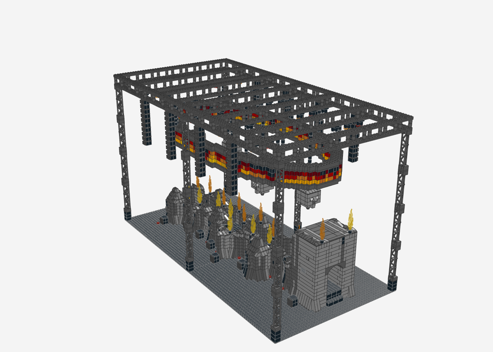
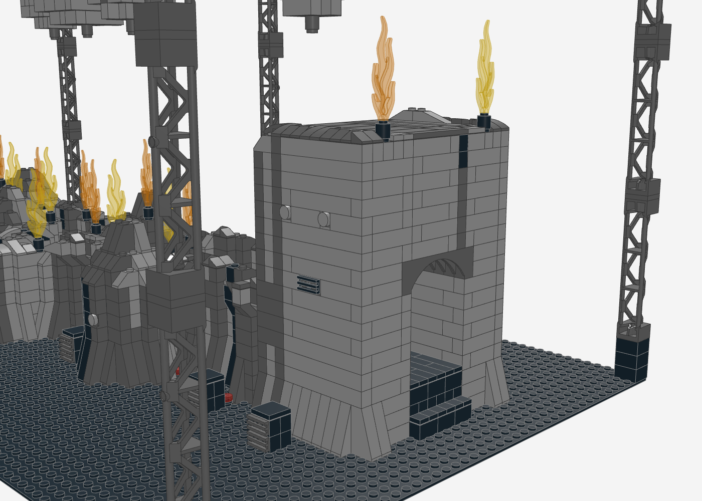
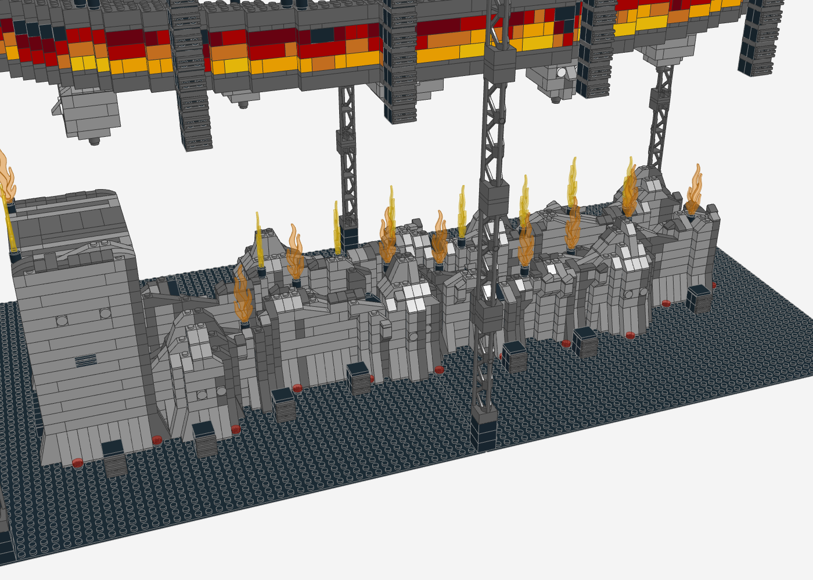
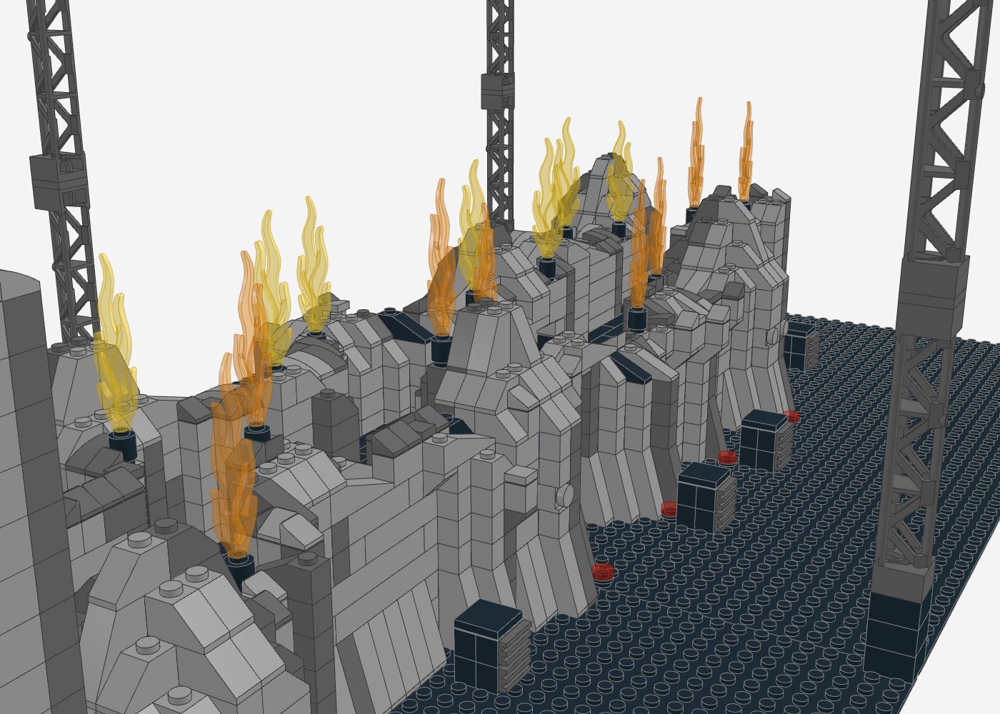
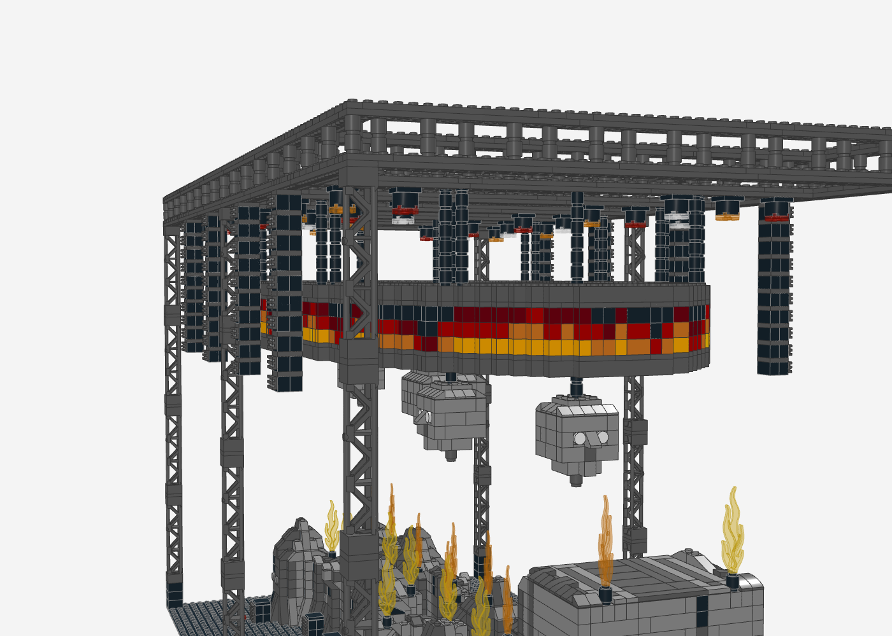
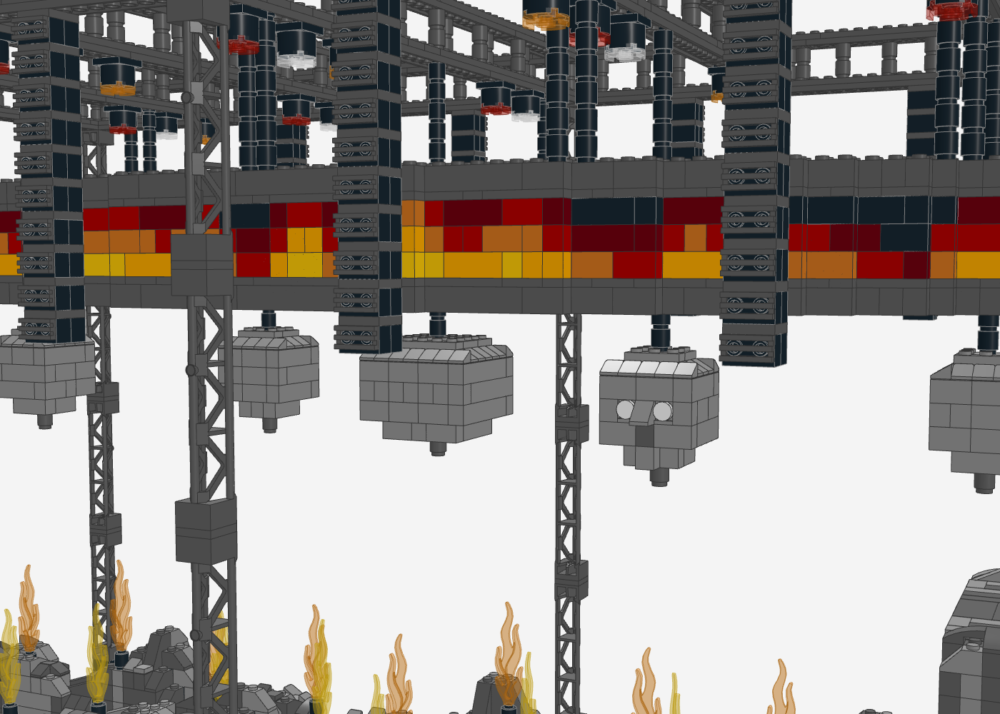
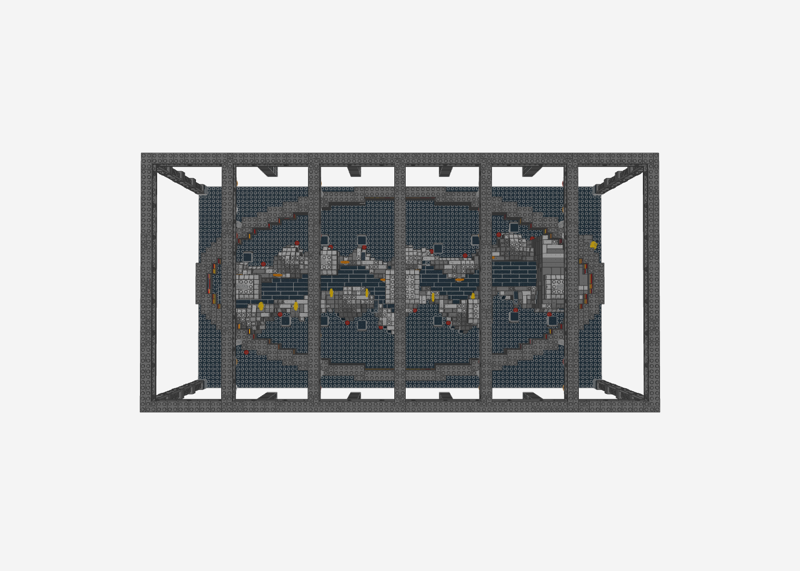
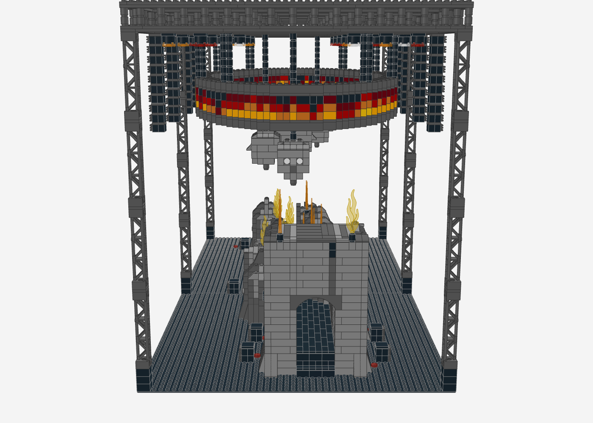

# Travis Scott – Circus Maximus Tour (UTOPIA-Bühne) als LEGO-MOC

Nachbau der Arena-Bühne der Circus-Maximus-Tour (Album *UTOPIA*, 2023–2025) auf **zwei Baseplates 48 × 48**
(96 × 48 Noppen, ca. 77 × 38 cm). Wie auf den Bühnen-Renderings windet sich ein **schmaler Weg durch die
Halle**, beidseitig von grauen, verwitterten Felswänden und **Findlingen mit Gesichtern** gesäumt. An einem Ende
steht ein **hoher Felsblock mit eingemeißelten Gesichtern und einem Durchgang**, oben eine Plattform für den
Performer (wie auf dem Stadionfoto). Auf den Felskanten schießen **Pyro-Flammen** hoch, am Boden stehen Subwoofer und rote Uplights. Über der Bühne
hängen ein **ovaler 360°-Videoring mit Feuerwand**, **fliegende Köpfe mit Glotzaugen**, farbige Scheinwerfer und
die PA an einem Traversen-Raster. Das Publikum steht rundherum.



| Felsblock mit Gesicht und Durchgang | Gewundener Weg mit Findlingen |
|---|---|
|  |  |

| Pyro, Subs und Uplights | Videoring mit Feuerwand | Köpfe unter dem Videoring |
|---|---|---|
|  |  |  |

| Von oben: Grundriss des Weges | Blick entlang der Bühne |
|---|---|
|  |  |

## Kennzahlen

- **5.925 Teile**, 151 Positionen (Teil × Farbe), keine Minifiguren
- **Maßstab** 1,5-fach gegenüber der ersten Version: **Grundfläche** 96 × 48 Noppen, **Höhe** ca. 46 cm
- **Weg** 84 Noppen lang und 6 breit, Felsblock 18 Steine hoch
- **Videoring** Oval 81 × 38 Noppen, 5 Bildlagen, an 20 Seilen
- **17 Pyro-Flammen**, 15 Subwoofer, 21 Uplights, 27 Scheinwerfer

## Vorlage

- **Bühnen-Renderings** (Ansichten und Grundriss): langer, schmaler, gewundener Weg mit Zickzack in der Mitte,
  Felswände und runde Findlinge mit Gesichtern am Rand, an einem Ende ein hoher Block mit Gesichtern und Durchgang
- **Probenfoto in der Arena**: graue Felswände etwa doppelt mannshoch, runder Steinkopf mit großen Augen am
  Traversen-Raster, viele Scheinwerfer und PA-Hänge
- **Stadionfoto**: hoher Fels mit eingemeißeltem Gesicht, Travis Scott oben auf dem Gipfel
- Beschreibungen der Produktion: 360°-Videoring, 13 fliegende Köpfe (2–4 m breit), Felsen mit strukturierter Beschichtung

## Aufbau (Submodelle)

1. **Grundplatten** – 2 × Baseplate 48 × 48 schwarz
2. **Felswände und Findlinge** – grauer Stein (Dunkelgrau, im Licht Hellgrau, Schwarz in Spalten), Slopes an jeder
   Stufe, Überhänge auf umgedrehten Slopes, Kanten aus gebogenen Slopes und Cheese-Slopes; 5 Findlinge als runde Kuppen
3. **Gewundener Laufweg** – 6 Noppen breit, schwarze Dielen im Verband, folgt der Zickzack-Linie aus dem Grundriss,
   Stufen an beiden Enden
4. **Plattform auf dem Block** – Performer-Fläche, Rand hellgrau
5. **Hoher Felsblock mit Durchgang** – 18 Steine hoch; der Weg führt unter 11 Bögen 1 × 8 × 2 hindurch
6. **Gesichter (SNOT)** – Augen aus Headlight-Steinen mit runden Fliesen auf der Seitennoppe, Mund aus einer
   Gitterfliese auf einem Stein mit Seitennoppen; am Block beidseitig, an den Findlingen zur Halle
7. **Ovaler Videoring** – 2 Noppen dick, Feuerwand als Bild (unten Gelb/Orange, nach oben Rot bis Schwarz), zwei Plattenlagen im Verbund, hängt an 20 dünnen Seilen
8. **Türme und Traversen-Raster** – 6 Gittertürme (je 4 × 95347), Außenrahmen plus 5 Quertraversen
9. **Fliegende Köpfe** – 5 Köpfe (einer groß in der Mitte): runder Schädel aus Cheese-Slopes, Glotzaugen aus
   Headlight + weißer Rundfliese, Nase als 45°-Slope, dunkler Mund
10. **PA-Hänge** – 8 Stränge an den Längstraversen, Lautsprechergitter per SNOT nach außen
11. **Moving Heads** – 27 Scheinwerfer an den Quertraversen, Linsen abwechselnd trans-rot, trans-orange, trans-klar
12. **Pyro-Flammen** – 17 Flammen (85959, trans-orange und trans-gelb) in schwarzen Rundstein-Düsen auf den Felskanten und auf dem Block
13. **Bodenlautsprecher, Uplights** – Subwoofer mit SNOT-Gittern entlang der Bühne, rote Bodenstrahler (Rundfliese trans-rot) am Felsfuß

## Angewandte Techniken (Skill `lego-profi-designer`)

| Technik | Umsetzung |
|---|---|
| **Grundriss aus der Vorlage** | Die Mittellinie des Weges ist als Polylinie aus dem Grundriss-Rendering übernommen, Felswände folgen ihr beidseitig |
| **SNOT-Gesichter** | Headlight-Stein (4070) + runde Fliese 1 × 1 = rundes Auge mit ½-Platten-Relief; Gitterfliese auf 11211 = Mund |
| **Bögen als Tunnel** | Bögen 1 × 6 × 2 überspannen den Weg im Block, die Felswände darüber sitzen auf den Noppen der Bögen |
| **Rockwork** | Slopes nach Stufenhöhe, Überhänge auf umgedrehten Slopes, erodierte Kanten, Schattierung nach Lichtrichtung |
| **Helligkeitsstufen** | Grauer Stein in drei Stufen, schwarzer Weg als Kontrast, weiße Augen der Köpfe als hellster Punkt |
| **Farbe gezielt als Feuer** | Die Bühne bleibt unbunt, alle Farbe ist „Feuer": Videoring-Verlauf Gelb → Orange → Rot → Dunkelrot, Flammen, rote Uplights und Scheinwerfer – warme Farben nur dort, wo Licht und Pyro sind |
| **Stange in Hohlnoppe** | Die Flammenteile stecken mit ihrer Stange in der Hohlnoppe eines runden Steins – legale Verbindung, Düse und Flamme in einem |
| **Verbund-Plattenlagen** | Der Videoring bekommt zwei Plattenlagen, die per Verbund-Algorithmus alle Steine zu einem Stück verbinden |
| **Dünne Aufhängung** | Ring, Köpfe und Scheinwerfer hängen an Säulen aus runden Steinen/Platten – liest sich als Seil |
| **Verband über Treppenecken** | Der ovale Ring ist 2 Noppen dick, damit die Lagen an den Diagonalen verbunden bleiben |

## Prüfung

Der Generator prüft nach jedem Lauf: **0 nicht verbundene Teile, 0 schwebende Teile, 0 Kollisionen**.
Hängende Teile (Ring, Seile, Köpfe, PA, Scheinwerfer, untere Traversenlage) halten mit Klemmkraft von oben;
Augen, Münder und Lautsprechergitter sitzen per SNOT an ihren Haltern.

## Neu erzeugen

```bash
python3 circus-maximus/generate_circus_maximus.py
```

## Hinweise

- **Arena- und Stadionversion gemischt:** Der hohe Block mit Gesicht und Gipfel stammt aus der Stadionversion,
  der gewundene Weg und das Raster aus der Arena-Version.
- **Spiral-Auge:** Das eingemeißelte Spiral-Auge lässt sich im Mikromaßstab nicht darstellen; es ist ein rundes Auge.
- **Videoring:** Auf den Fotos nicht sichtbar, Form und Lage stammen aus den Produktionsbeschreibungen.
- **Gitterträger in Dunkelgrau** (95347) sind seltener als in Hellgrau – Verfügbarkeit auf BrickLink prüfen.
- **Flammen:** LDraw 85959 (Flamme 7L mit Stange); BrickLink-Nummer und Farbverfügbarkeit vor der Bestellung prüfen.
- **Pyro-Licht:** In die Rundstein-Düsen passen kleine LEDs, dann leuchten die Flammen von unten.
