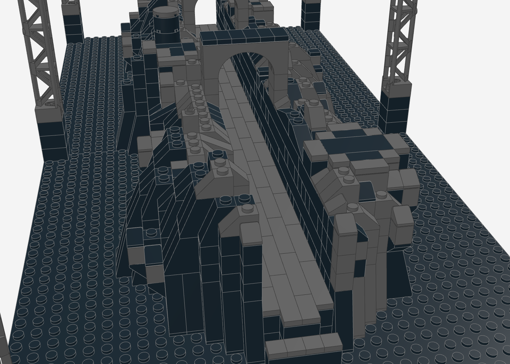

# Travis Scott – Circus Maximus Tour (UTOPIA-Bühne) als LEGO-MOC

Nachbau der Arena-Bühne der Circus-Maximus-Tour (Album *UTOPIA*, 2023–2025) auf **zwei Baseplates 32 × 32**
(64 × 32 Noppen, ca. 51 × 26 cm). Die Bühne liegt wie eine **Erdspalte quer durch die Halle**:
schwarz beschichtete Felsen mit mehreren erhöhten Plattformen, dazwischen ein Laufweg über die ganze Länge,
Publikum rundherum (in-the-round). Darüber hängen ein **ovaler 360°-Videoring**, **fliegende dystopische
Köpfe** mit roten Laser-Augen und die **PA**, getragen von einem Traversen-Raster.


| Stirnseite (Blick entlang der Spalte) | Seite |
|---|---|
|  |  |

| Laufweg in der Spalte mit Bögen | Köpfe unter dem Videoring | Von oben |
|---|---|---|
|  |  |  |

## Kennzahlen

- **2.682 Teile**, 96 Positionen (Teil × Farbe), keine Minifiguren
- **Grundfläche** 64 × 32 Noppen, **Höhe** ca. 36 cm
- **Bühne** 54 Noppen lang, bis 17 Noppen breit, Plattformen bis 8 Steine hoch
- **Videoring** Oval 54 × 25 Noppen, 4 Steine hoch, an 20 Seilen

## Vorlage

Es lagen keine Fotos vor; das Modell folgt den veröffentlichten Beschreibungen der Produktion
(Rise Fabrication, Mix Magazine, Wikipedia):
- Bühne als seismische Spalte, die die Arena in zwei Hälften teilt; mehrere erhöhte Plattformen;
  über 80 m handgeschnitzte Felsen mit schwarzer, strukturierter Beschichtung; Ölfässer in schwarzem Harz
- 360°-Videoring, der die Bühne umgibt; „towering archways"
- 13 fliegende dystopische Köpfe (2–4 m breit) mit Lasern, per Automation geflogen
- PA in Hängen je Seite über dem Screen

## Aufbau (Submodelle)

1. **Grundplatten** – 2 × Baseplate 32 × 32 schwarz
2. **Fels-Spalte** – schwarzer Fels mit steiler Innenwand zum Laufweg, Grat und steilem Außenabfall; Slopes an jeder Stufe, Überhänge auf umgedrehten Slopes
3. **Laufweg** – 4 Noppen breit über die ganze Länge, dunkelgraue Dielen im Verband, Stufen an beiden Enden
4. **Plattformen** – 6 flache Performer-Flächen (schwarz, dunkelgrauer Rand)
5. **Bögen** – zwei doppelte Bögen 1 × 6 × 2 auf Pfeilern über dem Laufweg
6. **Requisiten** – Ölfass (runde Steine 2 × 2, schwarz)
7. **Ovaler Videoring** – 2 Noppen dicke Wand, Bildinhalt als verrauschte Graustufen-Endzeitlandschaft, dunkelgraue Rahmen oben und unten; hängt an 20 dünnen Seilen aus runden Steinen
8. **Türme und Traversen-Raster** – 6 Gittertürme (95347), Außenrahmen plus 5 Quertraversen
9. **Fliegende Köpfe** – 5 Köpfe (einer groß in der Mitte): runder Schädel aus Cheese-Slopes, Nase als 45°-Slope, trans-rote Augen, dunkler Mund
10. **PA-Hänge** – 8 Stränge an den Längstraversen, Lautsprechergitter per SNOT nach außen zum Publikum

## Angewandte Techniken (Skill `lego-profi-designer`)

| Technik | Umsetzung |
|---|---|
| **Helligkeitsstufen statt Farbe** | Alles ist schwarz, deshalb tragen Dunkelgrau-Kanten die Form: Lichtkanten nach Lichtrichtung, dunkelgraue Kappen per Rauschfunktion |
| **Rockwork** | Slopes 45°/65°/75° nach Stufenhöhe, Überhänge auf umgedrehten Slopes, Kanten aus gebogenen Slopes und Cheese-Slopes |
| **Einziger Akzent** | Trans-Rot nur in den Augen der Köpfe (Laser) – der Blick springt zu den Köpfen |
| **Dünne Aufhängung** | Ring und Köpfe hängen an Säulen aus runden Steinen 1 × 1 statt an massiven Blöcken – liest sich als Seil |
| **Verband über Treppenecken** | Der ovale Ring ist 2 Noppen dick, sonst hielten die Lagen an den diagonalen Stufen nicht zusammen |
| **SNOT** | Lautsprechergitter auf Steinen mit Seitennoppen, nach außen gedreht |
| **Dielen im Verband** | Laufweg aus 1 Noppe breiten Fliesen mit versetzten Stößen |

## Prüfung

Der Generator prüft nach jedem Lauf: **0 nicht verbundene Teile, 0 schwebende Teile, 0 Kollisionen**.
96 Teile hängen mit Klemmkraft von oben (Ring, Seile, Köpfe, PA, untere Traversenlage); die Lautsprechergitter
sitzen per SNOT an ihren Haltern.

## Neu erzeugen

```bash
python3 circus-maximus/generate_circus_maximus.py
```

## Hinweise

- **Genauigkeit:** Ohne Fotos sind Umriss der Spalte, Lage der Plattformen, Form der Köpfe und Bildinhalt des
  Rings Annahmen. Mit Referenzfotos lässt sich das Modell gezielt angleichen.
- **Gitterträger in Dunkelgrau** (95347) sind seltener als in Hellgrau – Verfügbarkeit auf BrickLink prüfen.
- **Laser und Licht** lassen sich nicht aus Steinen bauen; die Augen können mit LEDs beleuchtet werden.
