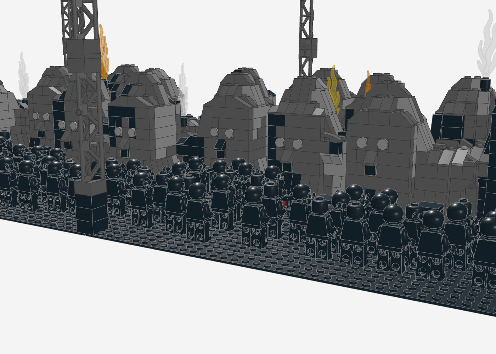
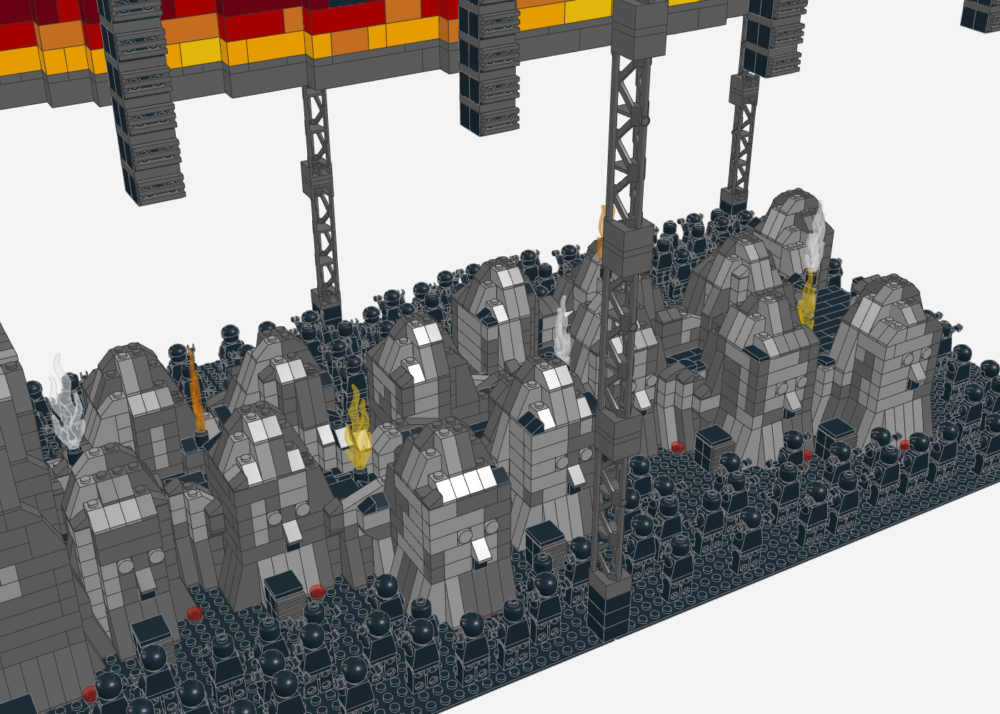
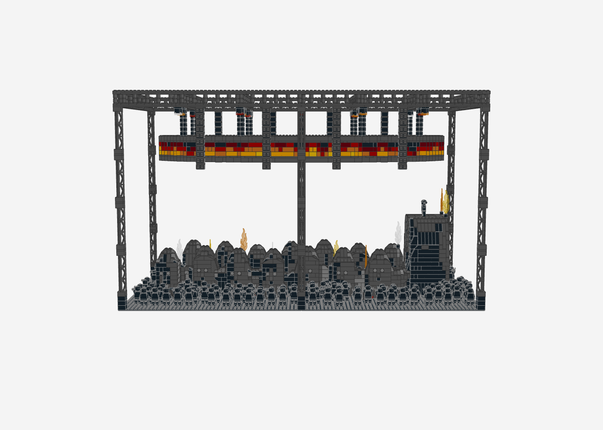

# Travis Scott – Circus Maximus Tour (UTOPIA-Bühne) als LEGO-MOC

Nachbau der Arena-Bühne der Circus-Maximus-Tour (Album *UTOPIA*, 2023–2025) auf **zwei Baseplates 48 × 48**
(96 × 48 Noppen, ca. 77 × 38 cm). Ein **geschwungener Laufweg** zieht sich knapp unter den Felsrändern durch die
Halle, gesäumt von dunklem, verwittertem Stein und **Steinköpfen mit Osterinsel-Gesichtern**. An einem Ende steht ein
**kuppelförmiger Felsblock mit Durchgang**, oben Travis Scott mit erhobenen Armen. Rund um die Bühne drängen sich
**154 Fans als komplett schwarze Minifiguren**. Pyro-Flammen und CO2-Säulen schießen aus den Felsen, darüber hängen ein **ovaler
360°-Videoring mit Feuerwand**, farbige Scheinwerfer und die PA an einem Traversen-Raster.


| Fans vor den Steinköpfen | Felsblock mit Performer |
|---|---|
|  |  |

| Weg mit Steinköpfen, Pyro und CO2 | Videoring mit Feuerwand |
|---|---|
|  |  |

| Von oben: Grundriss des Weges | Seitenansicht (wie im Bauplan) |
|---|---|
|  |  |

## Kennzahlen

- **7.062 Teile**, 157 Positionen (Teil × Farbe), davon 154 Fans und 1 Performer als Minifiguren (komplett schwarz)
- **Grundfläche** 96 × 48 Noppen, **Höhe** ca. 46 cm
- **Weg** 6 Noppen breit, 3 Steine hoch (Felsränder 1–3 Steine höher), Treppen an beiden Enden
- **Felsblock** 18 Steine hoch, **14 Steinköpfe** mit Gesichtern
- **Videoring** Oval 81 × 38 Noppen, 5 Bildlagen, an 20 Seilen
- **9 Pyro-Einheiten** (Flammen und CO2), 9 Bodenmonitore, 15 Subwoofer, 20 Uplights, 27 Scheinwerfer

## Vorlage

- **Bauplan-Skizze** (Draufsicht, Seitenansicht, Stirnansicht): geschwungener Weg, kuppelförmiger Block mit Rundbogen,
  dichte Reihen von Steinköpfen mit Gesichtern an beiden Wegseiten
- **Bühnen-Renderings und Probenfoto**: grauer Stein, Findlinge mit Gesichtern, Traversen-Raster, Scheinwerfer, PA
- **Stadionfoto**: hoher Fels mit Gesicht, Travis Scott oben auf dem Gipfel
- Beschreibungen der Produktion (Rise Fabrication über RapTV, Mix Magazine, Konzertkritiken):
  - Bühne wie eine „Cartoon-Fiebertraum-Version der Osterinsel": Felsen mit Steingesichtern, versteckte Tunnel, Lifts
  - über 80 m handgeschnitzte Felsen mit strukturierter Beschichtung
  - „Flammen schießen spontan aus der Felsbühne", Pyro und Laser von Strictly FX
  - 360°-Videoring, PA-Hänge über dem Screen

## Aufbau (Submodelle)

1. **Grundplatten** – 2 × Baseplate 48 × 48 schwarz
2. **Felswände und Steinköpfe** – dunkler Stein (Schwarz und Dunkelgrau, Hellgrau nur an den hellsten Kanten), Slopes an
   jeder Stufe, Überhänge auf umgedrehten Slopes, erodierte Kanten; 14 Steinköpfe (Grundriss als Squircle, damit die
   Gesichtsseite flach ist) abwechselnd an beiden Wegseiten
3. **Laufweg** – 6 Noppen breit, 3 Steine hoch, Felsränder nur 1–3 Steine höher, schwarze Dielen im Verband, geschwungen wie in der Skizze,
   Treppen an beiden Enden, 9 Bodenmonitore (Cheese-Slope 1 × 2) am Wegrand
4. **Plattform auf dem Block** – Performer-Fläche
5. **Felsblock mit Durchgang** – 18 Steine hoch, Kuppelform; der Weg führt unter 11 Bögen 1 × 8 × 2 hindurch
6. **Gesichter (SNOT)** – Augen aus Headlight-Steinen mit runden Fliesen, Nase aus einem vorspringenden 45°-Slope,
   Mund aus einer schwarzen Fliese auf einem Stein mit Seitennoppe (am Block eine Gitterfliese)
7. **Ovaler Videoring** – 2 Noppen dick, Feuerwand als Bild (Gelb → Orange → Rot → Schwarz), zwei Plattenlagen im Verbund
8. **Türme und Traversen-Raster** – 6 Gittertürme (je 4 × 95347), Außenrahmen plus 5 Quertraversen
9. **PA-Hänge** – 8 Stränge an den Längstraversen, Lautsprechergitter per SNOT nach außen
10. **Moving Heads** – 27 Scheinwerfer, Linsen abwechselnd trans-rot, trans-orange, trans-klar
11. **Pyro und CO2** – 9 Einheiten: Flammenteil 85959 (trans-orange, trans-gelb, trans-klar als CO2-Säule) in einer
    schwarzen Rundstein-Düse, auf den Felskanten und auf dem Block
12. **Bodenlautsprecher, Uplights** – Subwoofer mit SNOT-Gittern entlang der Bühne, rote Bodenstrahler am Felsfuß
13. **Fans** – 154 Minifiguren rundherum, komplett schwarz (Kopf, Hände, Haare), Blick zur Bühne; viele mit einem oder beiden Armen oben
14. **Performer** – Minifigur ganz in Schwarz oben auf dem Block, beide Arme oben

## Angewandte Techniken (Skill `lego-profi-designer`)

| Technik | Umsetzung |
|---|---|
| **Grundriss aus der Vorlage** | Weg-Mittellinie aus der Skizze: gerade durch den Block, danach zwei überlagerte Wellen |
| **SNOT-Gesichter** | Headlight-Stein (4070) + runde Fliese = rundes Auge mit ½-Platten-Relief; Nase als auskragender 45°-Slope; Mund als Fliese auf einem Stein mit Seitennoppe |
| **Bögen als Tunnel** | Bögen 1 × 8 × 2 überspannen den Weg im Block, die Felswände darüber sitzen auf ihren Noppen |
| **Rockwork** | Slopes nach Stufenhöhe, Überhänge auf umgedrehten Slopes, erodierte Kanten, Schattierung nach Lichtrichtung |
| **Dunkle Bühne, schwarzes Publikum** | Stein fast nur in Schwarz und Dunkelgrau, Fans als schwarze Silhouetten – so tragen allein Feuer, Scheinwerfer und Videoring die Farbe |
| **Farbe gezielt als Feuer** | Warme Farben nur bei Videoring, Flammen, Uplights und Scheinwerfern |
| **Stange in Hohlnoppe** | Flammenteile stecken mit ihrer Stange in der Hohlnoppe eines runden Steins – legale Verbindung |
| **Dynamik durch Posen** | Fans mit unterschiedlich gehobenen Armen (Arm-Rotation um die Schulterachse), Performer mit beiden Armen oben |
| **Verbund-Plattenlagen** | Der Videoring bekommt zwei Plattenlagen, die alle Steine zu einem Stück verbinden |

## Prüfung

Der Generator prüft nach jedem Lauf: **0 nicht verbundene Teile, 0 schwebende Teile, 0 Kollisionen**.
Hängende Teile (Ring, Seile, PA, Scheinwerfer, untere Traversenlage) halten mit Klemmkraft von oben; Augen, Münder und
Lautsprechergitter sitzen per SNOT an ihren Haltern. Die Minifiguren stehen mit den Beinen auf den Noppen.

## Neu erzeugen

```bash
python3 circus-maximus/generate_circus_maximus.py
```

## Hinweise

- **Arena- und Stadionversion gemischt:** Der hohe Block mit Performer stammt aus der Stadionversion, Weg und Raster aus der Arena.
- **Fliegende Köpfe** sind auf Wunsch entfernt.
- **Gitterträger in Dunkelgrau** (95347) sind seltener als in Hellgrau – Verfügbarkeit auf BrickLink prüfen.
- **Flammen:** LDraw 85959 (Flamme 7L mit Stange); BrickLink-Nummer und Farbverfügbarkeit vor der Bestellung prüfen.
- **Minifiguren:** Komplett schwarz wie Silhouetten im Konzertlicht. Die Stückliste führt Beine als 3815c01 (BrickLink 970c00);
  schwarze Köpfe gibt es mit und ohne Gesicht.
- **Pyro-Licht:** In die Rundstein-Düsen passen kleine LEDs, dann leuchten die Flammen von unten.
