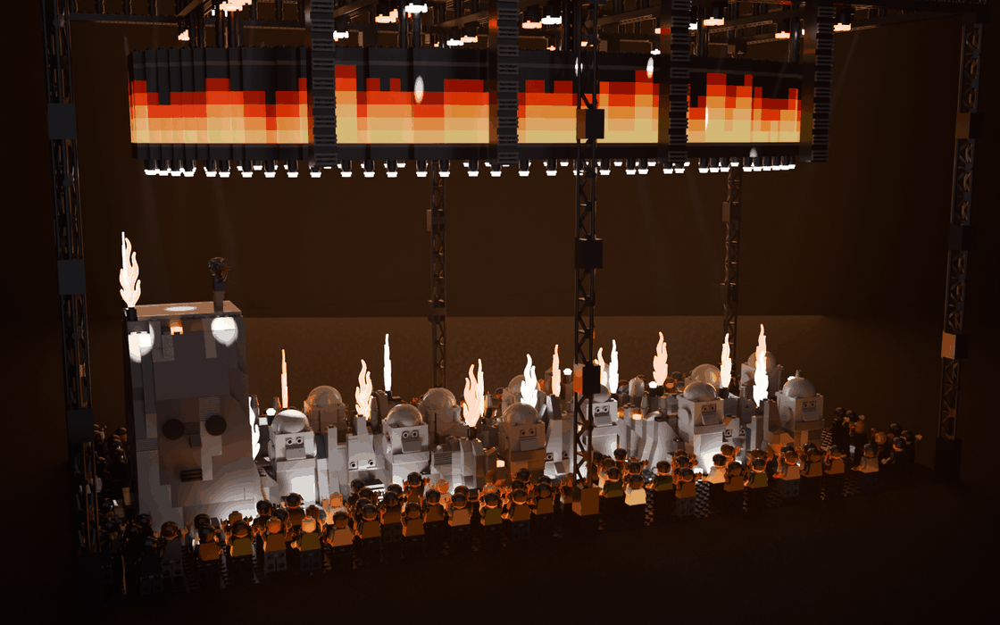
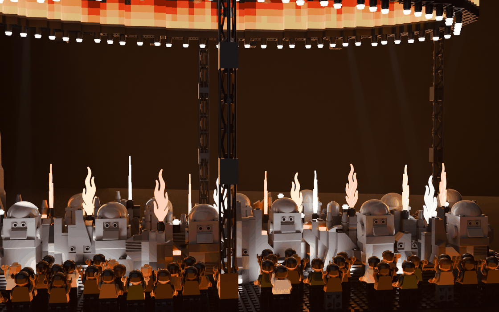
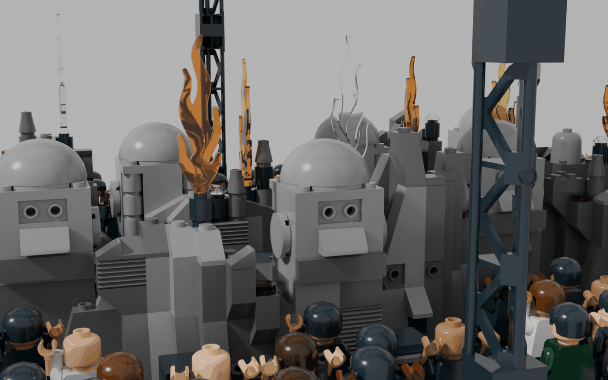
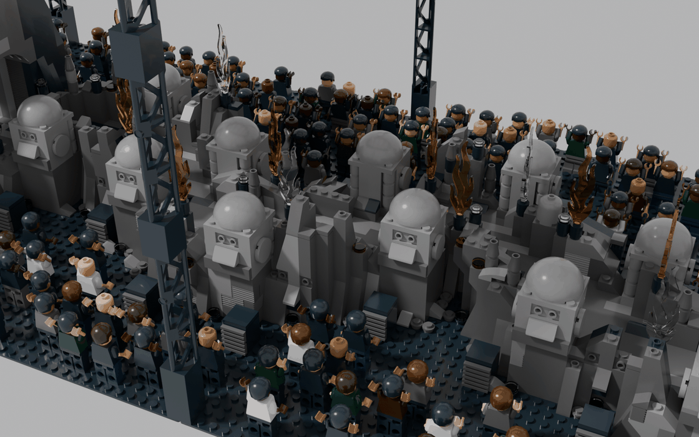

# Travis Scott – Circus Maximus Tour (UTOPIA-Bühne) als LEGO-MOC

Die Arena-Bühne der Circus-Maximus-Tour (Album *UTOPIA*, 2023–2025) auf **zwei Baseplates 48 × 48**
(96 × 48 Noppen, ca. 77 × 38 cm). Ein **langer, flacher Felspfad** windet sich durch die Halle, rundherum das Publikum.
Auf den Felsrändern sitzen **runde Steinköpfe mit gemeißelten Gesichtern** (Augenhöhlen, Nase, Mundrille, große Ohren),
alle schauen ins Publikum. In die Felswände sind weitere **Reliefgesichter** gehauen, **Felstreppen** führen auf
Felsgrate. Am einen Ende steht ein **hoher Felsblock mit Durchgang und Gesicht**, oben Travis Scott mit Mikrofon.
Flammen schießen aus den Felsen, darüber hängt ein **hoher ovaler 360°-Videoring mit Feuerwand** und einer Lampenreihe.



| Aus dem Publikum | Tageslicht |
|---|---|
|  |  |

| Felspfad mit Steinköpfen und Pyro | Steinkopf und Reliefgesicht aus der Nähe |
|---|---|
|  |  |

| Details: Felsspitzen, Glut, Geröll, Felsspots | Felsblock mit Durchgang und Gesicht |
|---|---|
|  |  |


## Vorlage und Recherche

- **Bühnenentwurf (Elsa Hanneke):** Creative Direction und Stage Design der Arena-Tour. Die
  [Projektseite](https://elsa.works/projects/travis-scott-circus-maximus-tour-arenas) zeigt Grundriss und Seitenansichten.
  - Die Bühne ist ein sehr langer, flacher Felspfad mit Ausbuchtungen.
  - Runde Köpfe sitzen an den Rändern, am einen Ende steht ein hoher Block mit Tür und Gesicht.
  - Dazu kommen Konzertfotos mit dem ovalen LED-Band, der Lampenreihe darunter, weiß angestrahlten Felsen und Flammen.
- **Probenfoto (RapTV, „The Making of …“):** grauer, kantiger Fels wie gebrochene Säulen, runde Köpfe mit großen Ohren
  und runden, gemeißelten Augen, Treppe zum Block.
- **Konzertberichte:**
  - [Magnet Magazine](https://magnetmagazine.com/2023/12/11/live-review-travis-scott-philadelphia-pa-dec-10-2023/) beschreibt die
    „craggy rock formation“ und mehr Feuer und Flash-Pots als bei Kiss.
  - [OnMilwaukee](https://onmilwaukee.com/articles/travis-scott-fiserv-forum-2024-review) beschreibt „faces cut into stone“ an
    den Bühnenseiten sowie Felsvorsprünge und „faux-volcanic ridges“ als Aussichtspunkte.
  - [Mix](https://www.mixonline.com/?p=144569) zeigt die Arena mit Ring und Felspfad.
- Referenzbilder liegen nicht im Repo.

### Was sich gegenüber der ersten Version geändert hat

| Vorher | Jetzt (nach der Recherche) |
|---|---|
| hohe, kantige „Grabstein“-Köpfe als Wand, die den Weg verdecken | 12 **runde Köpfe** (4 × 4 Noppen mit Kuppel) auf niedrigen Sockeln, Blick ins Publikum, Weg frei |
| Gesichter nur an den Köpfen | **gemeißelte Gesichter**: Augenhöhlen aus Headlight-Steinen, dazu 6 **Reliefgesichter** in den Außenwänden und ein großes Gesicht am Block |
| fast schwarzer, gleichmäßiger Fels | grauer Fels mit **senkrechten Streifen und Rillensteinen** wie gebrochene Säulen, 6 **Felsgrate** mit **Felstreppen**, 14 **Felsspitzen**, **Glut** in Spalten, **Geröll** am Fuß |
| schwarzer Laufweg | **Steinplatten** in Dunkelgrau mit helleren und dunklen Platten |
| 9 Flammen, rote Uplights | **16 Flammen**, **27 weiße Uplights**, **9 Felsspots** im Fels am Weg |
| flaches Ringband, 5 Lagen | **hohes Band mit 8 Lagen**, Flammenzungen im Bild, **75 Lampen** an der Unterkante |
| graue Traversen | **schwarze** Traversen und Türme (treten zurück) |
| 154 komplett schwarze Figuren | 169 Fans in dunkler Kleidung mit **verschiedenen Hauttönen**; Travis in schwarzem Shirt, hellen Shorts, wilde Haare, Mikrofon |
| nur Tageslicht-Renders | zusätzlich **Konzertlicht** (`render_konzert.py`) |

## Kennzahlen

- **7.434 Teile**, 209 Positionen (Teil × Farbe), davon 170 Minifiguren (169 Fans und Travis)
- **Grundfläche** 96 × 48 Noppen, **Höhe** ca. 46 cm
- **Weg** 6 Noppen breit, 3 Steine hoch; Felsränder 1–3 Steine, Grate bis 6 Steine über dem Weg; Treppen an beiden Enden
- **Köpfe und Block:** 12 runde Steinköpfe (je 31 Teile), Felsblock 18 Steine hoch mit Durchgang unter 11 Bögen
- **Felsdetails:**
  - 6 Reliefgesichter, 29 Treppenstufen auf die Grate, 14 Felsspitzen, 11 Glutstellen
  - 76 Geröllsteine, 59 Rillensteine
- **Videoring:** Oval 81 × 38 Noppen, 8 Lagen, an 20 Hängern, 75 Lampen an der Unterkante
- **Effekte:** 16 Pyro-Einheiten (Flammen und CO2), 27 Uplights, 9 Felsspots
- **Technik:** 27 Scheinwerfer, 8 PA-Hänge, 9 Bodenmonitore, 18 Subwoofer

## Aufbau (Submodelle)

1. **Grundplatten** – 2 × Baseplate 48 × 48 schwarz
2. **Felswände und Felsgrate** – Höhenfeld aus gewundenem Pfad, Rändern, Graten und Block.
   - Gebaut als Schale aus Steinen im Verband, mit Slopes an jeder Stufe, Überhängen auf umgedrehten Slopes und
     Cheese-/Curved-Kappen.
   - Farbe nach Lichtrichtung mit senkrechten Streifen; sichtbare Steine 1 × 2 stellenweise als Rillenstein (2877).
   - Auf den Oberseiten stehen **Felsspitzen** (Rundstein 1 × 1 + Kegel 1 × 1), **Felsspots** (Rundstein schwarz +
     Rundplatte Trans-Clear) und **Glut** (Rundfliese Trans-Orange).
   - **Felstreppen** sind 2 Noppen breit vom Weg auf die Grate geschnitten, die Stufen tragen glatte Fliesen.
3. **Laufweg** – Steinplatten aus Fliesen im Verband, Bodenmonitore am Rand. Darin ein **Lift** (Submodell 16): ein
   2 × 2-Schacht mit Hubsäule und schwarzer Klappe bündig im Weg – die echte Bühne hatte Lifts und versteckte Tunnel
4. **Plattform auf dem Block** – Fläche für den Performer
5. **Felsblock mit Durchgang** – Kuppelform, der Weg führt unter 11 Bögen 1 × 8 × 2 hindurch, Treppe an der Stirnseite
6. **Gesichter in den Felsen (SNOT)**
   - **Reliefgesichter** in den Außenwänden: Augenhöhlen aus Headlight-Steinen (4070), eine Nase aus einem
     auskragenden 45°-Slope, der Mund als schwarze Fliese auf einem Stein mit Seitennoppe.
   - **Am Block:** große, leere Augenhöhlen aus schwarzen Rundfliesen 2 × 2 und ein Gitter-Mund.
7. **Videoring** – 2 Noppen dick und 8 Lagen hoch, zwei Verbund-Plattenlagen. Das Bild ist eine Feuerwand mit
   Flammenzungen (Gelb → Orange → Rot → Schwarz). Unten hängt jede dritte Zelle eine Lampe
8. **Türme und Traversen-Raster** – 6 Gittertürme (je 4 × 95347), Außenrahmen plus 5 Quertraversen, schwarz
9. **Runde Steinköpfe** – siehe unten
10. **PA-Hänge**, 11. **Moving Heads**, 12. **Pyro und CO2** (Flamme 85959 in schwarzer Rundstein-Düse)
13. **Bodenlautsprecher, Uplights und Geröll am Felsfuß** (Rundplatten 1 × 1 und Cheese-Slopes)
14. **Fans** – 169 Minifiguren rund um die Bühne, Blick zur Bühne, viele mit erhobenen Armen
15. **Travis** – vorne auf dem Block, Mikrofon in der rechten Hand, linke Hand oben

### Die runden Steinköpfe

Jeder Kopf ist 4 × 4 Noppen groß und 120 LDU hoch (drei Steinlagen, eine Platte 4 × 4 und eine Kuppel 4 × 4). Er sitzt auf
einem Felssockel einen Stein über dem Weg und schaut nach außen ins Publikum.

| Lage | Vorne (Gesicht) | Seiten und hinten |
|---|---|---|
| 1 | Stein 1 × 4 mit Seitennoppen (30414) + dunkelgraue Fliese 1 × 4 = **gemeißelte Mundrille** | Stein 2 × 4, hinten runde Ecken (3062b) |
| 2 | Stein 1 × 2 mit Seitennoppen + Cheese-Slope 1 × 2, der nach unten auskragt = **Nase** | **Ohren:** Rundfliesen 2 × 2 mittig auf Steinen mit Seitennoppe (87087) |
| 3 | zwei Headlight-Steine (4070) = **Augenhöhlen**, die Noppe in der Vertiefung wirkt als Pupille | Stein 2 × 4 |
| Kopf | Platte 4 × 4, darauf Kuppel 4 × 4 (glatt 86500, jede dritte facettiert 30208 wie gesprungener Stein) | |

Neben und vor den Köpfen senkt der Generator den Fels ab, damit Ohren und Gesicht frei stehen.

## Angewandte Techniken

| Technik | Umsetzung |
|---|---|
| **Grundriss aus dem Bühnenentwurf** | Weg-Mittellinie aus dem Entwurf: gerade durch den Block, danach zwei überlagerte Wellen. Die Köpfe sitzen im Wechsel links und rechts wie im Grundriss |
| **Headlight-Steine als gemeißelte Augen** | Die runde Vertiefung des Steins 4070 wirkt als Augenhöhle, ganz ohne Druck. Glubschaugen (bedruckte Fliesen) sind bewusst ersetzt |
| **Gesichter per SNOT** | Mundrille und Nase sitzen an Seitennoppen. Die Nase ist ein Cheese-Slope, der mit seiner Unterseite an der Wand hängt (eigene Rotationsmatrix) |
| **Rundfliese auf einer Noppe** | Ohren und die großen Augenhöhlen am Block: Rundfliesen 2 × 2 sitzen mittig auf einer einzelnen Seitennoppe |
| **Rockwork mit Struktur** | Slopes an jeder Stufe, Überhänge, senkrechte Farbstreifen, Rillensteine, Spitzen und Geröll statt gleichmäßigem Rauschen |
| **Treppen ins Höhenfeld geschnitten** | Die Stufenhöhe wird im Höhenfeld gesetzt (Weg + 1, + 2, …) und von Slopes und Deko freigehalten |
| **Detailhierarchie** | Hellgrau nur an Köpfen und Lichtkanten, der Fels bleibt dunkelgrau, Farbe nur im Ring, in den Flammen und in der Glut |
| **Bögen als Tunnel** | Bögen 1 × 8 × 2 überspannen den Weg im Block, die Wände darüber sitzen auf ihren Noppen |
| **Stange in Hohlnoppe** | Flammen stecken mit ihrer Stange in der Hohlnoppe eines runden Steins – legale Verbindung |
| **Verbund-Plattenlagen** | Ring und Traversen bekommen Plattenlagen, die alle Steine zu einem Stück verbinden |
| **Konzertlicht im Render** | Die LED-Wand (Rot, Orange, Gelb, nur im Ring verwendet), Flammen, Glut und Lampen leuchten selbst. Dazu kommen weiße Kegel aus dem Raster und Uplights am Felsfuß im Dunst |

## Prüfung

Der Generator prüft nach jedem Lauf: **0 nicht verbundene Teile, 0 schwebende Teile, 0 Kollisionen**.

- **Hängende Teile** (Ring, Hänger, PA, Scheinwerfer, Lampen) halten mit Klemmkraft von oben.
- **SNOT-Teile** (Nasen, Münder, Ohren, Augenhöhlen am Block, Lautsprechergitter) sitzen an ihren Haltern.
- **Minifiguren** stehen mit den Beinen auf den Noppen.

## Neu erzeugen

```bash
python3 circus-maximus/generate_circus_maximus.py
```

Die wichtigsten Stellschrauben stehen oben im Generator:

- **Köpfe:** `HEAD_X` und `PED_H`
- **Felsgrate:** `RIDGES`, die Treppen entstehen automatisch an jedem Grat
- **Weg:** `PATH`, `zc()`, `half_width()`
- **Ring:** `RING_BOT`, `RING_H`, `screen_color()`

Renders erzeugen:

- **Tageslicht:**
  `blender -b -P tools/blender-render/render_cycles.py -- circus-maximus/circus_maximus_stage.mpd out/cm`
- **Konzertlicht:**
  `blender -b -P circus-maximus/render_konzert.py -- circus-maximus/circus_maximus_stage.mpd out/cm_konzert`
  - Optionen: `--glut` (Leuchtkraft), `--screen` (Ring), `--dunst` (Dichte)

## Video

`video/hyaena_video.py` präsentiert die Bühne zu *HYAENA* (Musik nicht im Repo) im orangen Konzertlicht:

1. **Vor dem Drop:** Totale über das Publikum, Fahrt an den Steinköpfen entlang, Felsblock, Kranfahrt zur Lift-Klappe.
2. **In der Pause vor dem Drop:** Blackout und POV aus dem dunklen Lift-Schacht unter der Bühne; das Licht im
   Klappenspalt flackert mit der Musik.
3. **Im Anlauf:** Die Klappe glüht, der Schacht zittert immer stärker.
4. **Auf dem Drop:** Die Klappe fliegt auf, Travis wird nach oben geschleudert (POV), Flammen und Strobe. Danach
   landet er mit einer Drehung auf der Klappe.
5. **Danach:** Schnitte alle zwei Beats, Flammen und Ring pulsieren, Travis hüpft auf dem Beat.

Drop, Pause und Tempo liest das Skript aus der Musik.

```bash
blender -b -P circus-maximus/video/hyaena_video.py -- "<HYAENA.mp3>" out/hyaena
```

Optionen: `--probe` (Standbilder), `--drop`, `--bpm`, `--vorlauf`, `--nachlauf`, `--ohne-fans`, `--res`, `--blend`.

## Hinweise

- **Fliegende Köpfe** (der riesige runde Kopf, der während der Show über dem Publikum schwebt) bleiben auf Wunsch weg.
- **Arena- und Stadionversion gemischt:** Der hohe Block mit Performer stammt aus der Stadionversion, Weg, Köpfe und Ring aus
  der Arena.
- **Keine bedruckten Teile:** Alle Gesichter sind gebaut (Headlight-Steine, Slopes, Fliesen), nicht gedruckt.
- **Vor der Bestellung prüfen:** Gitterträger 95347 in Schwarz und Flamme 85959 (Farbverfügbarkeit).
- **Minifiguren:**
  - Unbedruckte Köpfe 3626c in Hauttönen; Gesichter nach Wahl.
  - Torsos führt BrickLink je Farbkombination unter eigenen Nummern (973c…), die Beine 73200b-f1 unter 970c00.
- **Pyro-Licht:** In die Rundstein-Düsen passen kleine LEDs, dann leuchten die Flammen von unten.
