# Globe Stage – Konzertbühne mit Erdkugel-Kuppel (LEGO MOC)

Stadion-Konzertbühne im Minifig-Maßstab: eine große, glatt gerundete Erdkugel-Kuppel,
LED-Ring mit Nebel, Projektionsschirm und ein schmaler Truss-Ring mit Scheinwerfern,
getragen von 8 Truss-Türmen aus Gitterträgern. Vorlage ist die Konzeptskizze in
[`reference/konzept-skizze.png`](reference/konzept-skizze.png), abgeglichen mit
Konzertfotos der echten Bühne.


| Seite | Draufsicht |
|---|---|
| 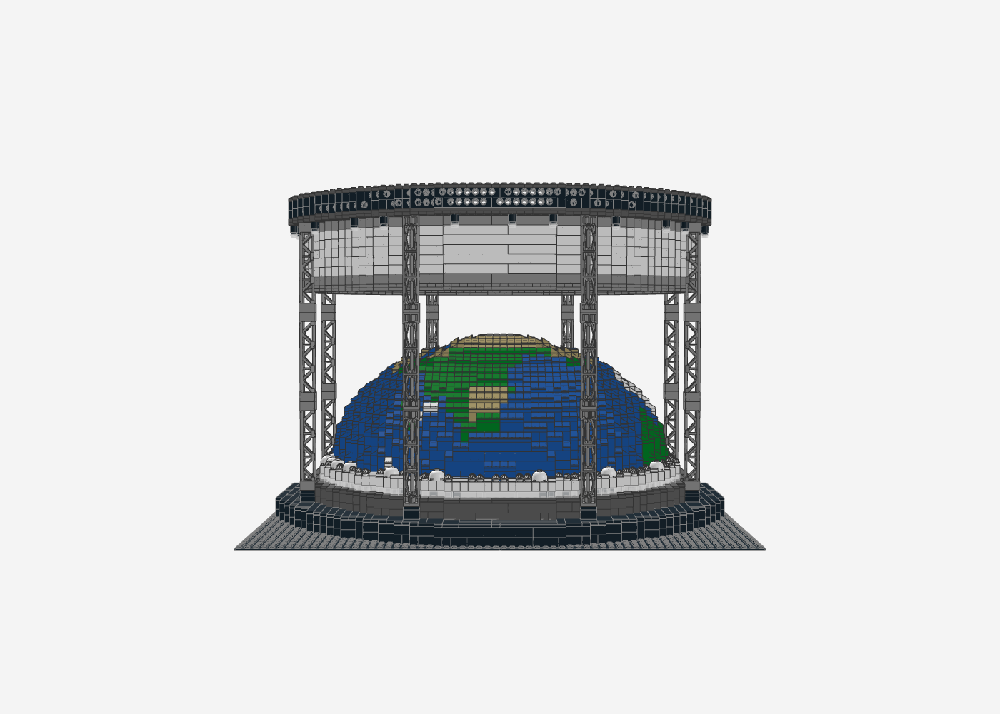 | 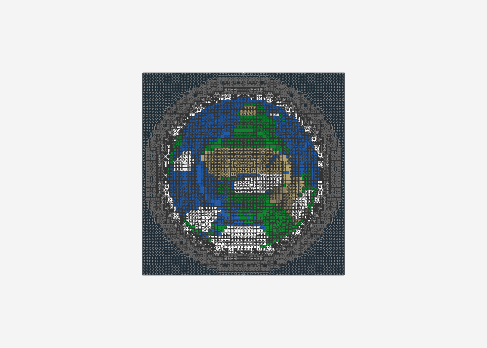 |

| Kuppel (ohne Aufbau) | Rückseite |
|---|---|
| 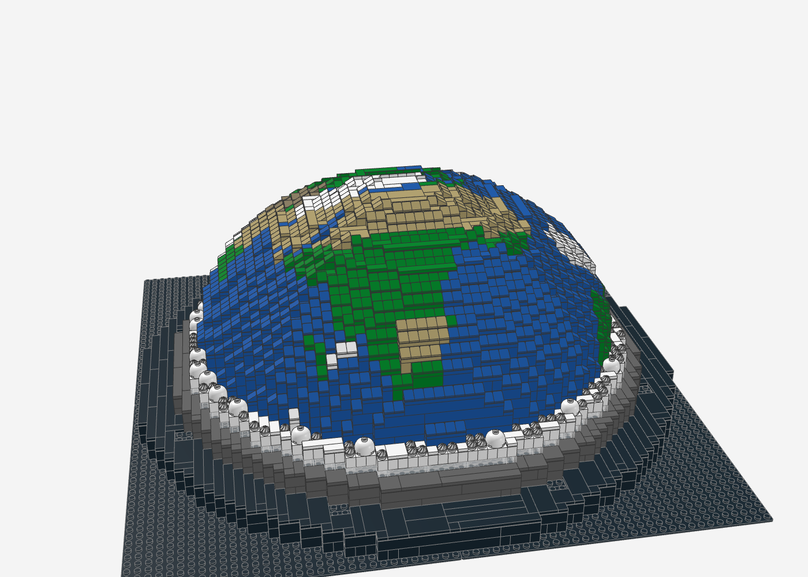 | 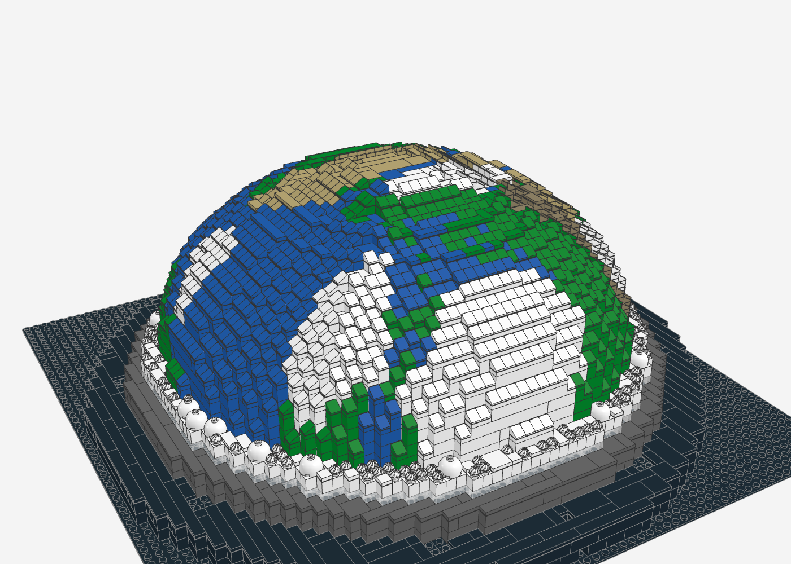 |

| Kuppel-Rundung (Nahaufnahme) | Truss & Scheinwerfer | Truss-Türme |
|---|---|---|
| 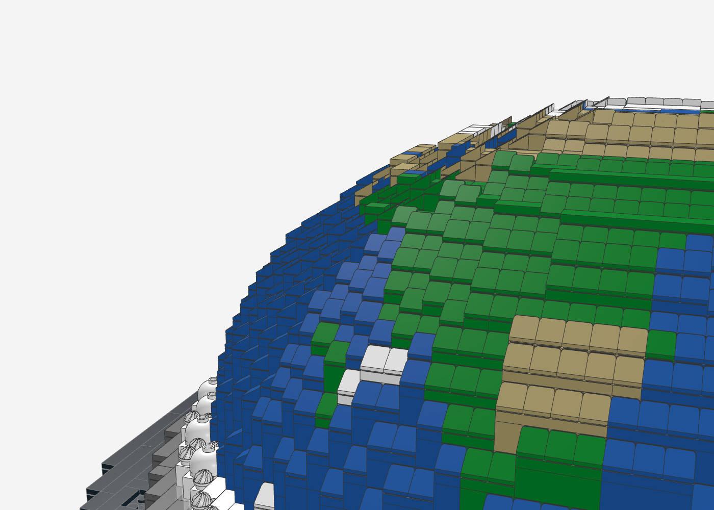 | 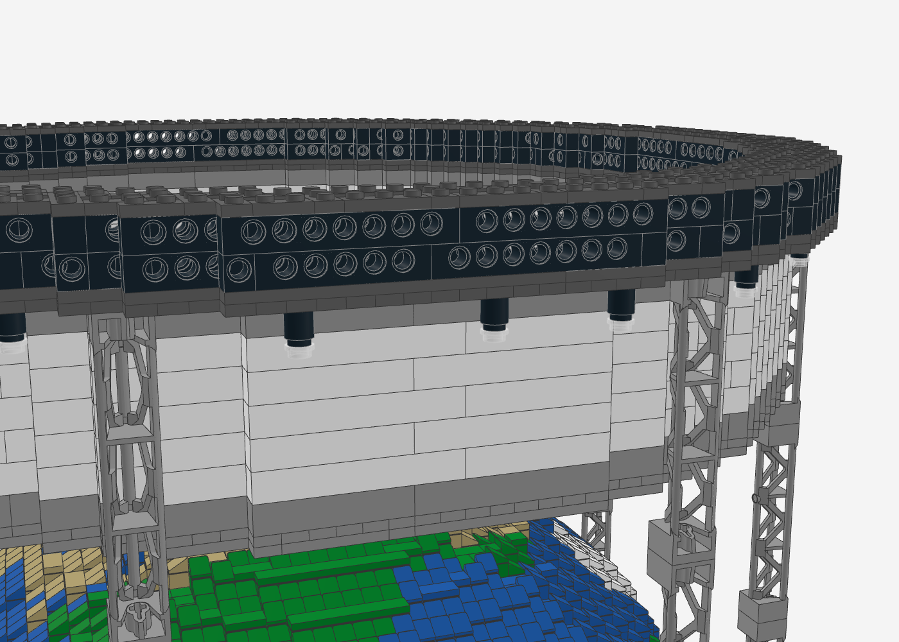 | 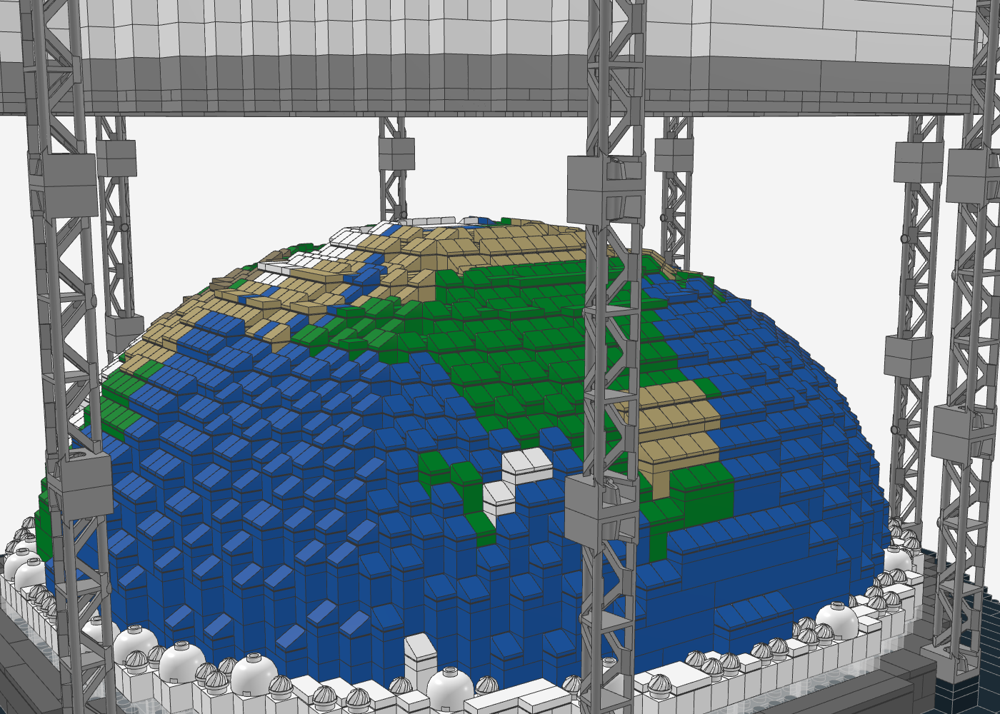 |

## Dateien

| Datei | Inhalt |
|---|---|
| `globe_stage.mpd` | Das Modell (LDraw Multi-Part, 14 Bauabschnitte als Submodelle) – in Stud.io, LeoCAD, LDView, BrickLink Studio öffnen |
| `globe_stage_bom.csv` | Stückliste (LDraw-ID, BrickLink-ID, Name, Farbe, Menge) |
| `globe_stage_bricklink.xml` | BrickLink Wanted List – direkt unter *Wanted → Upload* importierbar |
| `preview_nocage.mpd` | Vorschau ohne Schirm/Türme/Truss (zum Anschauen der Kuppel) |
| `generate_globe_stage.py` | Generator, der alle drei Dateien erzeugt |
| `renders/` | Renderings der aktuellen Version |

## Kennzahlen

- **7.822 Teile**, 191 Positionen (Teil × Farbe), keine Minifiguren
- **Echte Beleuchtung vorbereitet**: LED-Kanal im LED-Ring (Streifen ca. 1,2 m) und 24 Scheinwerfer mit LED, gemeinsame USB-Versorgung
- **Grundfläche** 64 × 64 Noppen (4 Baseplates 32 × 32, ca. 51 × 51 cm)
- **Höhe** ca. 44 Noppen (ca. 35 cm)
- **Kuppel** Ø 48 Noppen, 14 Lagen, Erd-Mosaik (orthografische Projektion auf Nordafrika/Europa, Afrika zeigt zur Front)
- **Truss-Ring** Ø 59 Noppen, ca. 3,5 Noppen breit, auf 8 Türmen aus je 3 Gitterträgern 95347

## Aufbau (Submodelle = Bauabschnitte)

1. **Arena-Boden** – 4 × Baseplate 32 × 32 schwarz
2. **Basis** Ø 64, 2 Lagen schwarz, Rand mit Fliesen
3. **Laufsteg** Ø 56, dunkelgrau, Fliesen-Oberfläche
4. **LED-Ring** Ø 52 – trans-klare Leuchtreihe mit LED-Kanal dahinter, darüber weiße Brückenlage (siehe „LED-Beleuchtung“)
5. **Kuppel unten** (Lagen 0–7) mit **Deck 1**: hohle Kuppel, auf Höhe von Lage 7 mit drei kreuzweisen Plattenlagen überspannt
6. **Kuppel Mitte** (Lagen 8–11) mit **Deck 2**
7. **Kuppel oben** (Lagen 12–13, massiv)
8. **Innenstützen** – 2 × 2-Säulen im Hohlraum unter den Decks
9. **Kuppel-Rundung**: ausschließlich 1 × 1-Teile (Cheese-Slopes, Platten, Fliesen) auf jeder Stufe, dazu eine kleine Kappe auf dem Plateau (siehe unten)
10. **Nebel** – 2 × 2-Kuppelsteine + „Swirl“-Platten auf dem LED-Ring
11. **Projektionsschirm** – 7 Lagen Wand mit Plattenrahmen unten, **hängt am Truss**
12. **Truss-Türme** – 8 Türme auf dem Basis-Rand: 2 × 2-Stein + 2 Platten 2 × 2 + 3 × Gitterträger 95347 (2 × 2 × 10), hellgrau wie Alu-Traversen
13. **Truss-Ring** Ø 59 – schmaler Plattenring, Technic-Lochsteine als Gitterträger, Obergurt mit Sprossen, liegt auf den Türmen
14. **Scheinwerfer** – 24 hängende Lampen unter dem Truss, jeweils mit LED (siehe „LED-Beleuchtung“)

## Kuppel-Rundung

Die Rundung ist bewusst nur aus 1 × 1-Teilen aufgebaut, ohne längliche Slopes.

Für jede Kuppellage und jede radiale Reihe misst der Generator, wie breit die freie Stufe
der Lage darunter ist. Dann füllt er jede Stufenzelle passend zur idealen Kuppellinie
(steigt über die Stufenbreite um eine Steinhöhe) auf:

| Sollhöhe der Zelle | Aufbau |
|---|---|
| hoch (direkt an der nächsten Lage) | 1 × 1-Platte + 1 × 1-Cheese-Slope (füllt die volle Steinhöhe) |
| mittel | 1 × 1-Cheese-Slope |
| niedrig (breite Terrassen außen) | 1 × 1-Fliese |

Auf dem Plateau sitzt eine kleine Kappe (1 Plattenlage, Rand mit Cheese-Slopes). Alle übrigen
offenen Noppen der Kuppel sind mit Fliesen in Erdfarbe abgedeckt. So entsteht eine
gleichmäßige „Schuppen“-Rundung wie bei einer glatten Kuppel.

Verbaut sind 1.468 Cheese-Slopes 1 × 1 (54200), 427 Platten 1 × 1 als Unterbau und die
Fliesen der Oberfläche.

## Truss-Türme

Der Truss-Ring steht auf 8 Türmen (Ground Support wie bei echten Bühnen), versetzt um 22,5°,
damit vorne mittig kein Turm vor der Kuppel steht. Jeder Turm steht mit 4 Noppen auf dem
Basis-Rand außerhalb des Laufstegs und liegt oben komplett unter dem Truss-Band:

| Höhe | Teil |
|---|---|
| unten | Stein 2 × 2 (3003) + 2 × Platte 2 × 2 (3022), schwarz – gleicht die Höhe aus |
| darüber | 3 × Gitterträger 2 × 2 × 10 (95347), hellgrau, Gitterfläche nach außen |
| oben | Noppen greifen in die untere Plattenlage des Truss-Rings |

Die Stapelhöhe (1 Stein + 2 Platten + 3 × 10 Steine) passt genau vom Basis-Rand bis unter den
Truss. Der Projektionsschirm hängt mit Klemmkraft unter dem Truss. Er hat unten nur noch einen
schmalen Plattenrahmen nach innen, damit er den Türmen nicht im Weg ist.

## LED-Beleuchtung

Beide Lichtquellen sind für echte LEDs vorbereitet und hängen an **einer** USB-Versorgung (5 V),
deren Kabel hinten durch den Kabeltunnel in der untersten Basis-Lage nach außen gehen.

### LED-Ring

Der LED-Ring ist für einen echten LED-Streifen vorbereitet:

| | |
|---|---|
| **Kanal** | ringsum direkt hinter der trans-klaren Reihe, 1 Noppe tief (8 mm), 1 Stein hoch (9,6 mm, über den Noppen ca. 7,9 mm frei) |
| **Länge** | ca. 1,2 m (Kanalmitte bei Ø ≈ 47 Noppen) |
| **Streifen** | 5-mm-COB-LED-Streifen, 5 V / USB, kalt- oder neutralweiß (COB = durchgehende Lichtlinie ohne Punkte, wie der Ring auf den Konzertfotos). Alternativ die Strip-Lights eines LEGO-Beleuchtungssets |
| **Montage** | Klebeseite an die weiße Innenwand des Kanals, Licht nach außen. Die trans-klaren Steine davor wirken als Diffusor |
| **Kabel** | hinten Mitte ein senkrechter Schacht vom Kanal bis zur Baseplate, von dort ein Tunnel in der untersten Basis-Lage nach außen (1 Noppe breit, 1 Stein hoch – für das Kabel, der Stecker bleibt außen) |

**Statik:** Die Lage über dem Kanal besteht aus radialen 1 × 4-Steinen. Jeder liegt außen
auf der trans-klaren Reihe und innen auf der Wand und überbrückt so den Kanal. Die Kuppel steht
unverändert darauf. Den Tunnel überbrücken quer liegende 1 × 3-Steine. Der Statik-Check prüft
beides mit.

**Einbau:** Streifen einlegen und Kabel durch Schacht und Tunnel führen, **bevor** die
obere LED-Ring-Lage (radiale 1 × 4-Steine) aufgesetzt wird. Der Streifen ist kein LEGO-Teil
und steht deshalb nicht in Stückliste und BrickLink-Liste.

| Kanal im Schnitt (obere Lage ausgeblendet) | Kanal nah | LED-Ring von außen | Kabeltunnel hinten |
|---|---|---|---|
| 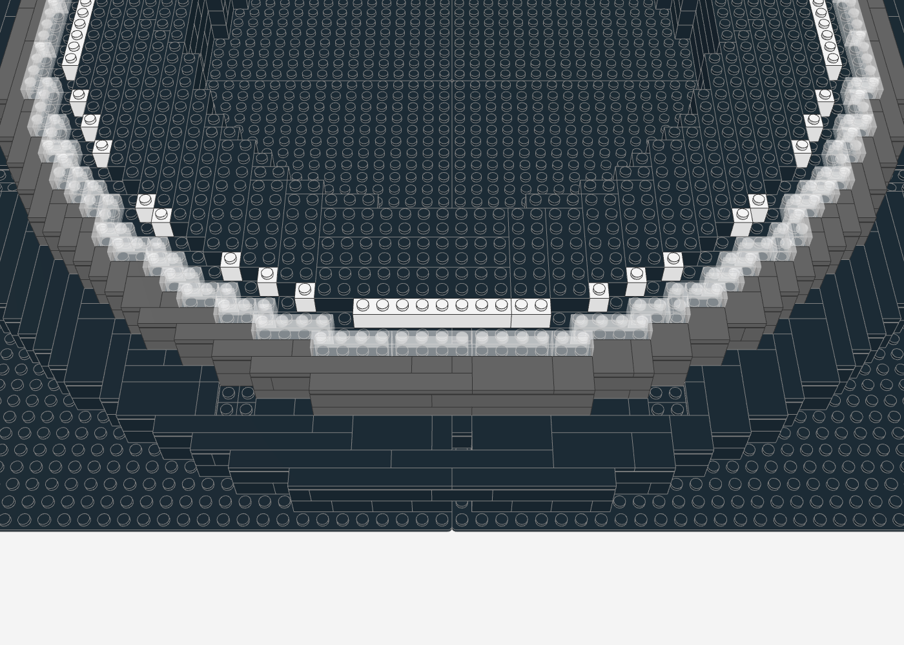 | 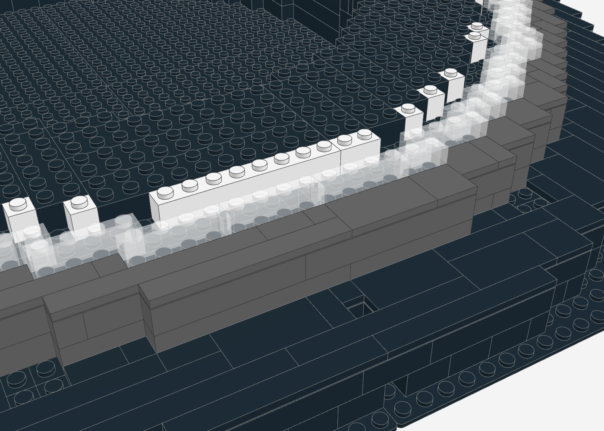 | 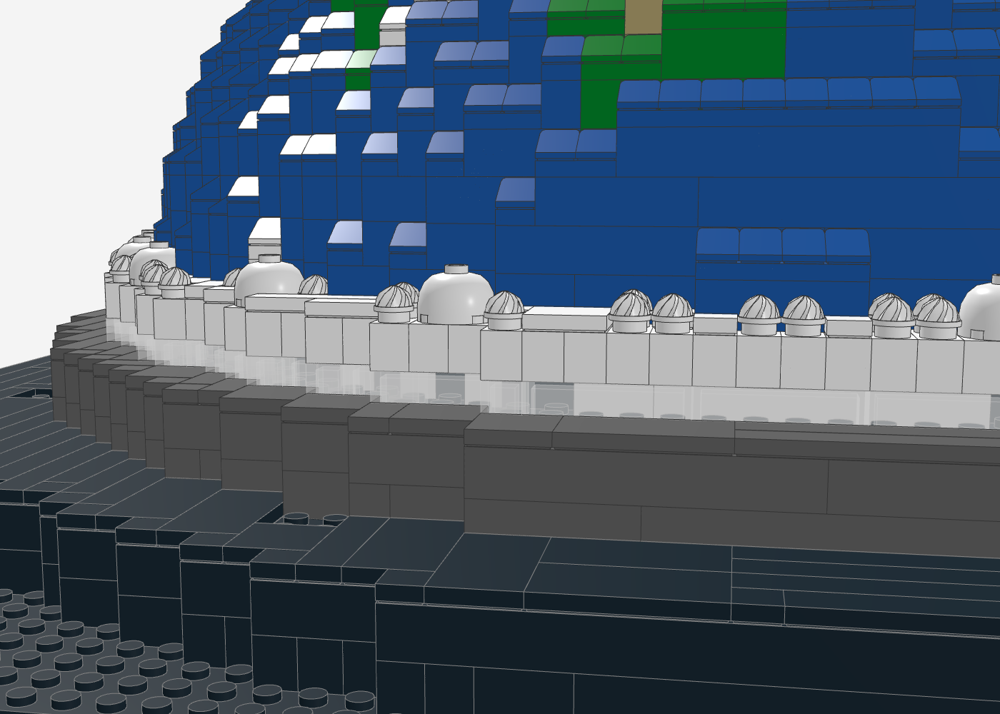 | 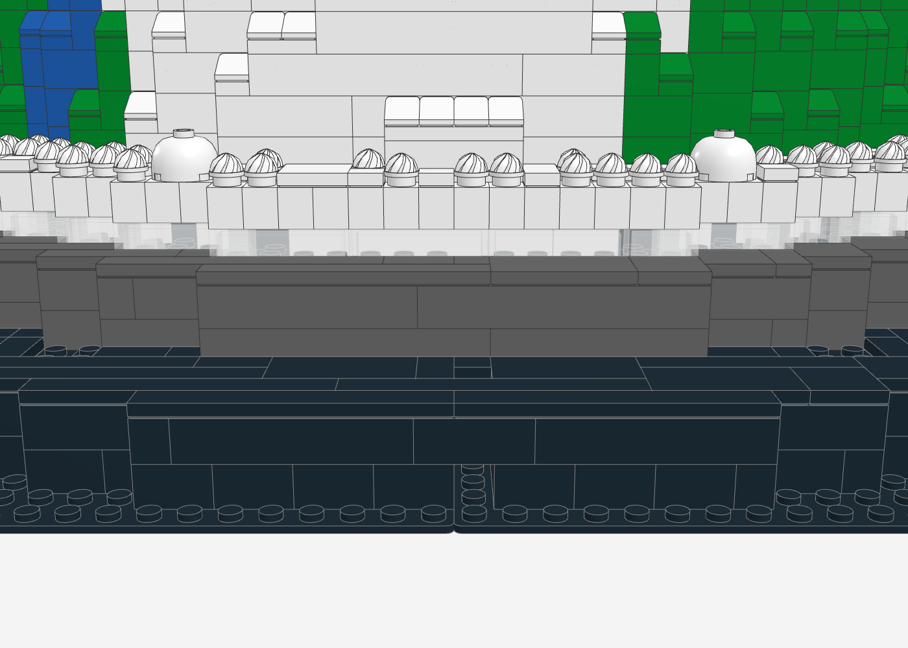 |

### Scheinwerfer am Truss

| | |
|---|---|
| **Lampe** | Gehäuse = schwarzer 1 × 1-Rundstein (hohl), darin eine kleine LED (z. B. „Dot Light“ aus einem LEGO-Beleuchtungsset, 5 V), Linse = trans-klare 1 × 1-Rundplatte darunter |
| **Draht an der Lampe** | direkt neben jeder Lampe ist ein 1 × 1-Loch durch beide Truss-Plattenlagen. Der Draht geht seitlich aus der Lampe (zwischen Gehäuse und Linse) und durch das Loch nach oben |
| **Truss-Kanal** | zwischen innerer und äußerer Technic-Wand verläuft ringsum ein ca. 1 Noppe breiter Hohlraum. Dort werden die 24 Drähte gesammelt (z. B. mit Verteiler-Platinen des Lichtsets) |
| **Sammelleitung** | neben einem der beiden hinteren Türme (x = +11, z = −26 Noppen) ist ein weiteres Loch durch beide Truss-Plattenlagen. Dort kommt die Sammelleitung aus dem Kanal und läuft am Gitterträger entlang nach unten, wie bei echten Bühnen |
| **Anschluss** | am Turmfuß läuft die Leitung unter den Fliesen des Basis-Rands (zwischen den Noppen ist Platz) bis zu einem Bodenloch hinten Mitte. Das Loch führt direkt in den Kabeltunnel, durch den auch das Kabel des LED-Streifens nach außen geht. Beide werden außen an dasselbe 5-V-USB-Netzteil angeschlossen (z. B. mit einem Y-Kabel) |

**Statik:** Die Löcher sind einzelne Zellen in zwei kreuzweise verbauten Plattenlagen; der
Ring bleibt durchgehend verbunden, die Turm-Zellen bleiben geschlossen. Das Bodenloch liegt
über dem Tunnel, die Steine daneben überbrücken den Tunnel weiter. Der Generator prüft neben
der Statik auch den Kabelweg: alle Löcher frei und neben Lampe bzw. Turm, Bodenloch offen bis
in den Tunnel, LED-Kanal und Schacht leer.

**Einbau:** LEDs und Drähte einsetzen, bevor die Technic-Wände und der Obergurt des Truss
aufgesetzt werden. Die Sammelleitung vor dem Verlegen der Fliesen auf dem Basis-Rand bis zum
Bodenloch führen.

| Truss-Kanal im Schnitt (Wände/Obergurt ausgeblendet) | Scheinwerfer von unten | Turmfuß mit Basis-Rand |
|---|---|---|
| 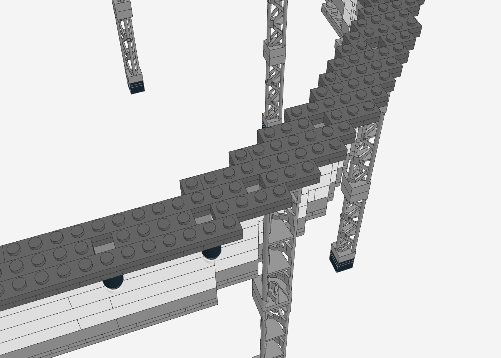 | 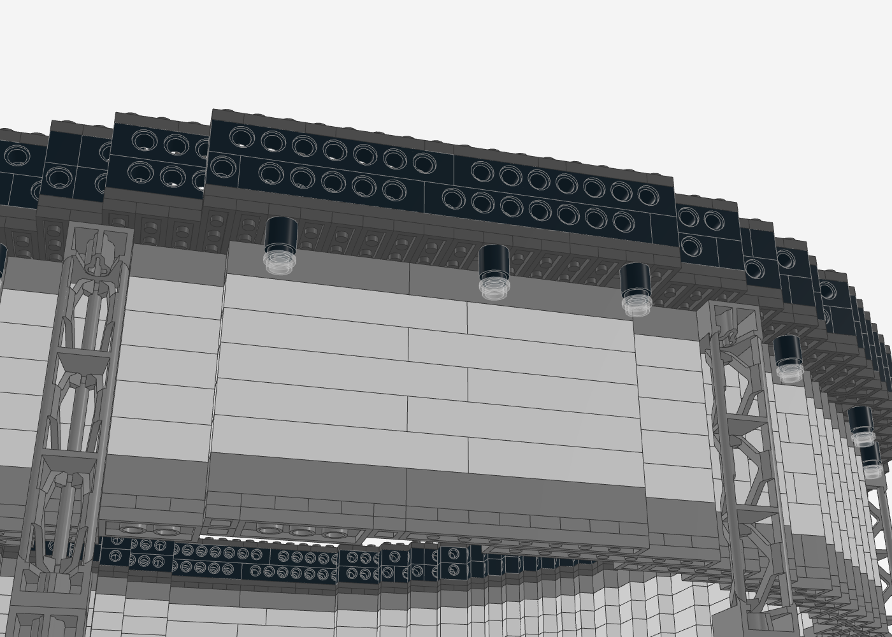 | 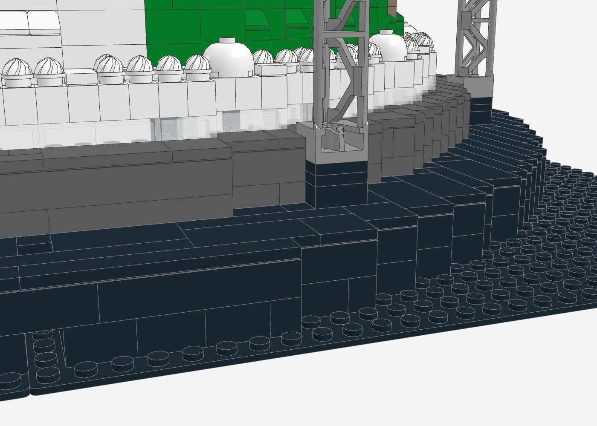 |

## Statik & Prüfung

Der Generator prüft das Modell nach jedem Lauf automatisch:

- **0 nicht verbundene Teile**: Jedes Teil hängt über Noppenverbindungen an der Baseplate.
- **0 schwebende Teile**: Jedes Teil sitzt auf mindestens einer Noppe. Die 127 Ausnahmen hängen mit Klemmkraft von oben: die unteren Plattenlagen von Schirmrahmen und Truss (kreuzweise verbaut) und die Scheinwerfer. Der Schirm als Ganzes hängt am Truss.
- **0 Kollisionen**: kein Volumen doppelt belegt
- Alle Steine liegen exakt im Noppenraster.

Die Renderings entstehen mit dem Headless-Renderer in [`../tools/ldraw-render`](../tools/ldraw-render)
(three.js LDrawLoader + Chromium, echte LDraw-Teilegeometrie).

## Neu erzeugen

```bash
pip install numpy global-land-mask     # Landmaske für das Erd-Mosaik
python3 globe-stage/generate_globe_stage.py
```

Alle Parameter (Kuppelprofil, Kartenmitte, Wolken, Turm- und Lampenpositionen, Farben) stehen im Skript.

## Hinweise & Grenzen

- **Schräge Spotlight-Strahlen** aus der Skizze lassen sich nicht aus Steinen bauen. Stattdessen hängen 24 Scheinwerfer mit echten LEDs unter dem Truss.
- **Projektionsbild** auf dem Schirm ist nicht enthalten. Möglich sind bedruckte Fliesen oder ein Sticker auf den weißen Schirmsteinen.
- **Kosten** grob geschätzt 500–750 € über BrickLink (Cheese-Slopes und 1 × 1-Platten sind günstig). Die größten Posten sind:
  - 4 schwarze 32 × 32-Baseplates
  - 24 Gitterträger 95347
  - die rund 1.470 Cheese-Slopes der Kuppel
  - die schwarzen Kernsteine der Kuppel
