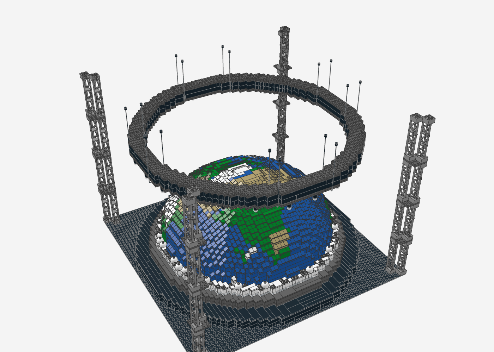
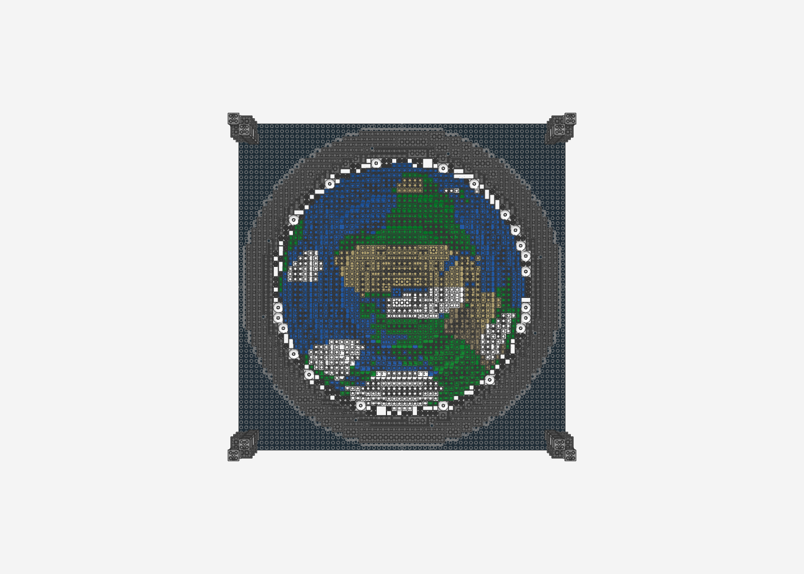
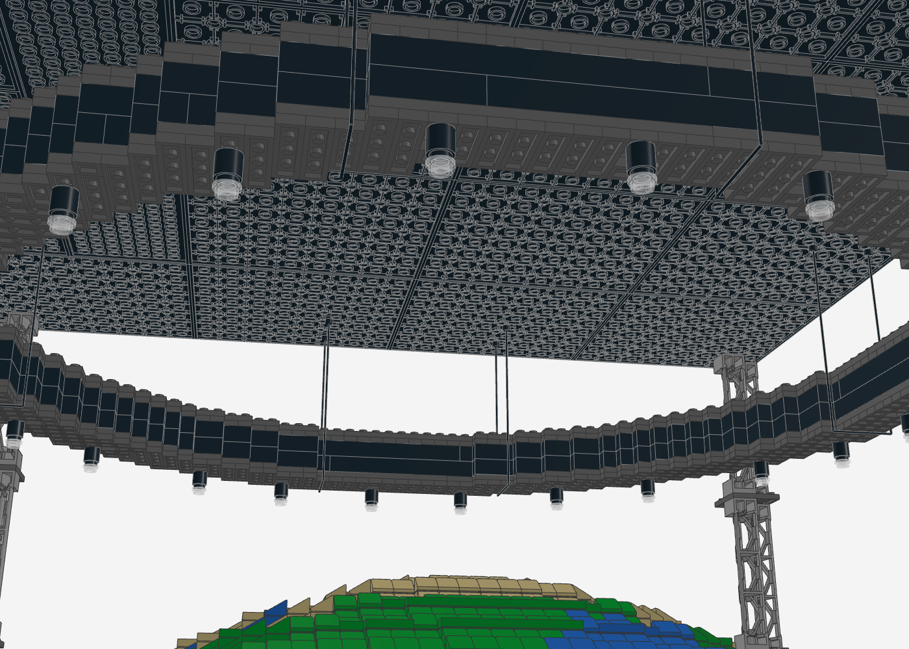
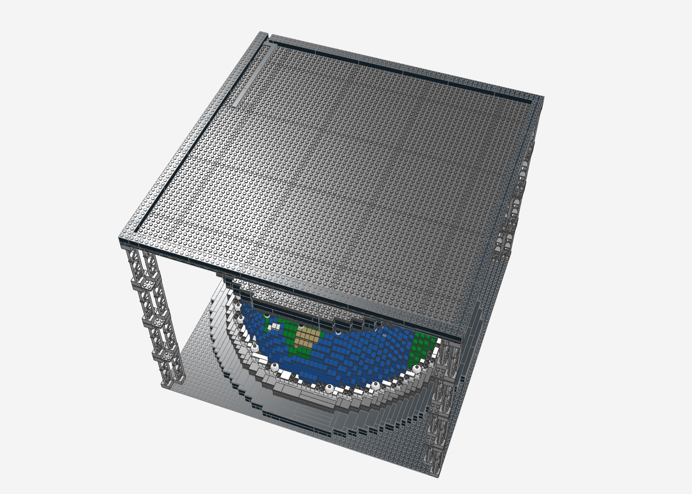
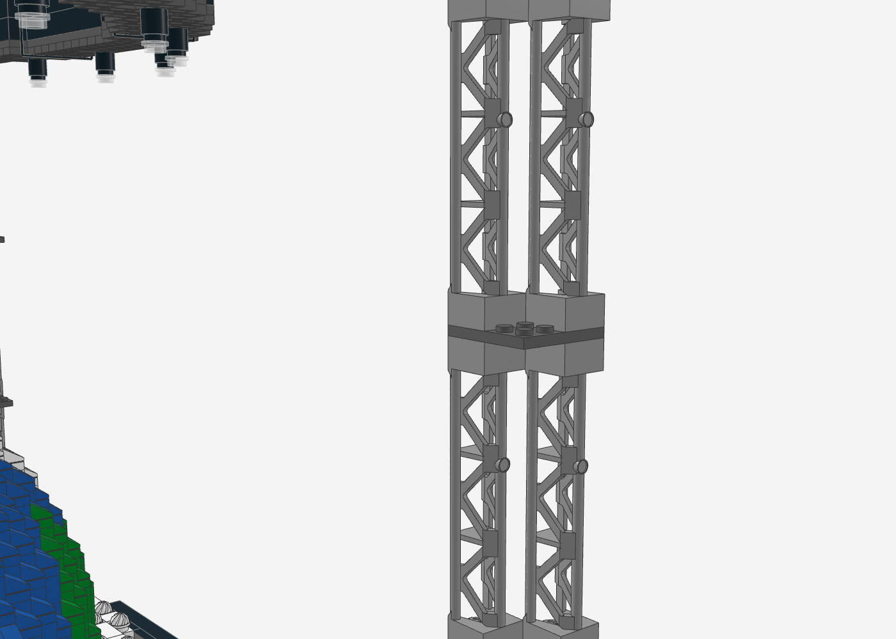
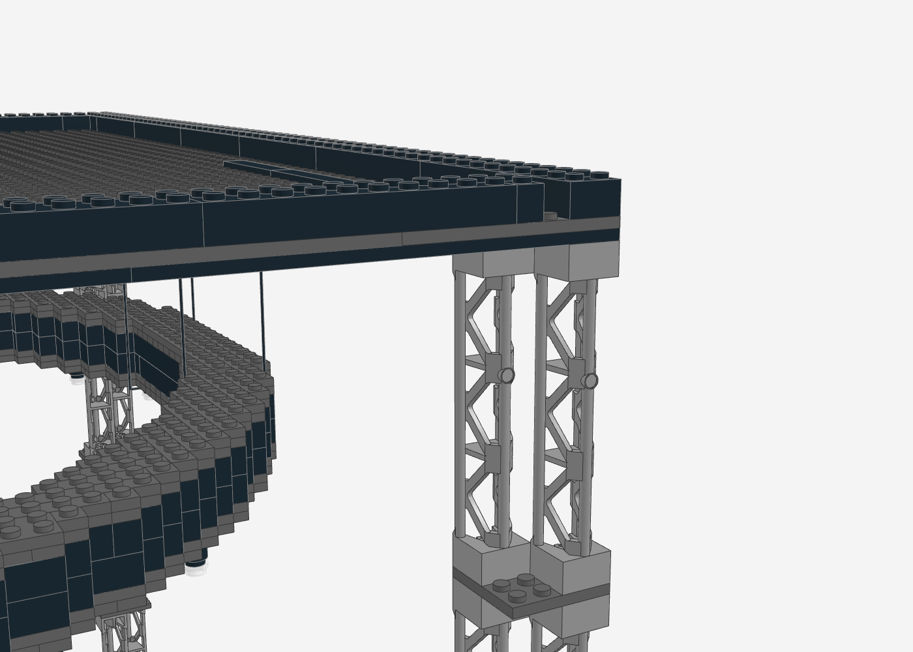

# Globe Stage – Konzertbühne mit Erdkugel-Kuppel (LEGO MOC)

Stadion-Konzertbühne im Minifig-Maßstab: eine große, glatt gerundete Erdkugel-Kuppel,
LED-Ring mit Nebel und ein schmaler Truss-Ring mit Scheinwerfern. Wie im Stadion hängt der
Truss an Seilen (LEGO-Schnur 63142) unter einem dünnen Dach, das nur auf vier schlanken
Ecktürmen am Rand der Baseplate steht – die Sicht auf die Kuppel bleibt frei. Vorlage ist die Konzeptskizze in
[`reference/konzept-skizze.png`](reference/konzept-skizze.png), abgeglichen mit
Konzertfotos der echten Bühne.


| Seite | Ohne Dach | Draufsicht ohne Dach |
|---|---|---|
|  |  |  |

| Kuppel (ohne Aufbau) | Rückseite |
|---|---|
|  |  |

| Kuppel-Rundung (Nahaufnahme) | Truss an den Seilen | Dach von unten |
|---|---|---|
|  |  |  |

## Dateien

| Datei | Inhalt |
|---|---|
| `globe_stage.mpd` | Das Modell (LDraw Multi-Part, 15 Bauabschnitte als Submodelle + Seil-Untermodell) – in Stud.io, LeoCAD, LDView, BrickLink Studio öffnen |
| `globe_stage_bom.csv` | Stückliste (LDraw-ID, BrickLink-ID, Name, Farbe, Menge) |
| `globe_stage_bricklink.xml` | BrickLink Wanted List – direkt unter *Wanted → Upload* importierbar |
| `preview_nocage.mpd` | Vorschau ohne Ecktürme, Dach, Truss und Scheinwerfer (zum Anschauen der Kuppel) |
| `generate_globe_stage.py` | Generator, der alle drei Dateien erzeugt |
| `renders/` | Renderings der aktuellen Version |

## Kennzahlen

- **7.255 Teile**, 182 Positionen (Teil × Farbe), keine Minifiguren
- **Echte Beleuchtung vorbereitet**: LED-Kanal im LED-Ring (Streifen ca. 1,2 m) und 24 Scheinwerfer mit LED, gemeinsame USB-Versorgung
- **Grundfläche** 64 × 64 Noppen (4 Baseplates 32 × 32, ca. 51 × 51 cm)
- **Höhe** ca. 41 cm (bis Oberkante Dach)
- **Kuppel** Ø 48 Noppen, 14 Lagen, Erd-Mosaik (orthografische Projektion auf Nordafrika/Europa, Afrika zeigt zur Front)
- **Truss-Ring** Ø 59 Noppen, ca. 3,5 Noppen breit, hängt an 8 Seilen 63142
- **Dach** 64 × 64 Noppen, nur 2 Plattenlagen + Attika, auf 4 Ecktürmen (je 2 Gitterträger 95347 diagonal pro Ebene)

## Aufbau (Submodelle = Bauabschnitte)

1. **Arena-Boden** – 4 × Baseplate 32 × 32 schwarz
2. **Basis** Ø 64, 2 Lagen schwarz, Rand mit Fliesen
3. **Laufsteg** Ø 56, dunkelgrau, Fliesen-Oberfläche
4. **LED-Ring** Ø 52 – trans-klare Leuchtreihe mit LED-Kanal dahinter, darüber weiße Brückenlage (siehe „LED-Beleuchtung“)
5. **Kuppel unten** (Lagen 0–7) mit **Deck 1**: hohle Kuppel, auf Höhe von Lage 7 mit drei kreuzweisen Plattenlagen überspannt
6. **Kuppel Mitte** (Lagen 8–11) mit **Deck 2**
7. **Kuppel oben** (Lagen 12–13, massiv)
8. **Innenstützen** – 2 × 2-Säulen im Hohlraum unter den Decks
9. **Kuppel-Rundung**: ausschließlich 1 × 1-Teile (Cheese-Slopes, Platten, Fliesen) auf jeder Stufe, dazu eine kleine Kappe auf dem Plateau (siehe unten)
10. **Nebel** – 2 × 2-Kuppelsteine + „Swirl“-Platten auf dem LED-Ring
12. **Ecktürme** – 4 Türme an den Ecken der Baseplate, je 4 Ebenen aus 2 Gitterträgern 95347 (2 × 2 × 10) auf der Diagonale, dazwischen Platten 4 × 4
13. **Truss-Ring** Ø 59 – schmaler Plattenring, zwei Wände aus normalen schwarzen Steinen (2 Lagen), Obergurt aus 2 Plattenlagen, liegt in den Seilschlingen
14. **Scheinwerfer** – 24 hängende Lampen unter dem Truss, jeweils mit LED (siehe „LED-Beleuchtung“)
15. **Seile** – 8 Schnüre 63142 (String with End Studs 30L) als Schlingen zwischen Decke und Truss
16. **Dach** 64 × 64 – Decke und Dachplatten (um 8 Noppen versetzt verlegt), umlaufende Attika 1 Stein hoch

## Kuppel-Rundung

Die Rundung ist bewusst nur aus 1 × 1-Teilen aufgebaut, ohne längliche Slopes.

Für jede Kuppellage und jede radiale Reihe misst der Generator, wie breit die freie Stufe
der Lage darunter ist. Dann füllt er jede Stufenzelle passend zur idealen Kuppellinie
(steigt über die Stufenbreite um eine Steinhöhe) auf:

| Sollhöhe der Zelle | Aufbau |
|---|---|
| hoch (direkt an der nächsten Lage) | 1 × 1-Platte + 1 × 1-Cheese-Slope (füllt die volle Steinhöhe) |
| mittel | 1 × 1-Cheese-Slope |
| niedrig (breite Terrassen außen) | 1 × 1-Fliese |

Auf dem Plateau sitzt eine kleine Kappe (1 Plattenlage, Rand mit Cheese-Slopes). Alle übrigen
offenen Noppen der Kuppel sind mit Fliesen in Erdfarbe abgedeckt. So entsteht eine
gleichmäßige „Schuppen“-Rundung wie bei einer glatten Kuppel.

Verbaut sind 1.468 Cheese-Slopes 1 × 1 (54200), 427 Platten 1 × 1 als Unterbau und die
Fliesen der Oberfläche.

## Dach, Ecktürme und Seil-Aufhängung

Wie bei der echten Bühne hängt der Truss-Ring von oben. Unter dem Ring steht nichts, nur die
vier Ecktürme ganz außen an der Baseplate:

| Bauteil | Aufbau |
|---|---|
| **Seile** | 8 × LEGO-Schnur 63142 (String with End Studs 30L, 24 cm; BrickLink `x127c30pb01`) als Schlinge: beide Endnoppen stecken unten in der Decke, das Seil läuft außen am Truss herunter, unter dem Truss durch und innen wieder hoch. Der Ring liegt in den Schlaufen – wie ein „Basket Hitch“ beim echten Rigging |
| **Hängehöhe** | ergibt sich aus der Seillänge: 576 LDU Schnur zwischen den Endnoppen, 80 LDU (4 Noppen) unter dem Truss, bleiben 248 LDU (ca. 10 cm) je Seite – der Generator setzt den Truss genau auf diese Höhe |
| **Ecktürme** | an jeder Ecke 4 Ebenen aus je 2 Gitterträgern 95347 auf der Diagonale (außen und innen), dazwischen Platten 4 × 4. Von der Bühne aus stehen die beiden Träger hintereinander und wirken wie einer |
| **Decke** | Plattenlage 64 × 64 (Platten 16 × 16 und 8 × 16, schwarz) |
| **Dachplatten** | zweite Plattenlage, um 8 Noppen versetzt verlegt, damit jede Fuge der Decke überbrückt ist |
| **Attika** | umlaufender Randträger, 2 Noppen breit, 1 Stein hoch – macht die Dachkanten zwischen den Türmen steif |

**Aufbau-Reihenfolge:** Basis, Kuppel und Ecktürme bauen. Die 8 Seile unten in die Decke stecken
(Positionen siehe Modell) und das Dach auf die Türme setzen. Dann den fertigen Truss-Ring mit
Scheinwerfern von unten in die Schlaufen einhängen: je ein Seil unter dem Ring durchziehen.

### Statik-Iterationen

Der Generator rechnet bei jedem Lauf eine grobe, konservative Statik-Abschätzung mit
(Noppen-Klemmkraft 1,5 N je Noppe, Fugen halbieren die Biegesteifigkeit). Verglichen wurden
drei Turm-Varianten – alle mit dünnem Dach und Seilen:

| | schlank 2 × 2 (1 Träger) | **diagonal (2 Träger), gewählt** | 4 × 4 (4 Träger, bisher) |
|---|---|---|---|
| Gitterträger gesamt | 16 | **32** | 64 |
| Kraft je Seil-Endnoppe | 0,32 N (21 %) | **0,32 N (21 %)** | 0,32 N (21 %) |
| Kippmoment je Trägerfuge | 48 Nmm | **192 Nmm** | 384 Nmm |
| seitliche Kraft am Dach bis zum Nachgeben | 1,0 N (≈ 100 g) | **3,9 N (≈ 400 g)** | 7,8 N (≈ 800 g) |
| Schiefstellung bis Instabilität | 24 mm | **96 mm** | 185 mm |
| Durchbiegung Dachrand | 0,97 mm | **0,88 mm** | 0,88 mm |
| Bewertung | kritisch – kippt bei leichtem Anstoßen | **OK** | OK |

Das dünne Dach (2 Plattenlagen + Attika statt Trägerrost) biegt sich unter Eigengewicht und
Truss weniger als 1 mm durch. Die Seile sind unkritisch: jede Endnoppe trägt ca. 0,3 N.
Der hängende Ring kann wie beim Original leicht pendeln, trifft dabei aber weder Kuppel noch Türme.

| Dach von oben | Eckturm (Detail) | Kabelausgang am Eckturm hinten rechts |
|---|---|---|
|  |  |  |

## LED-Beleuchtung

Beide Lichtquellen sind für echte LEDs vorbereitet und hängen an **einer** USB-Versorgung (5 V).
Beide Kabel kommen hinten aus dem Modell: das des LED-Streifens aus dem Kabeltunnel hinten Mitte,
das der Scheinwerfer am Eckturm hinten rechts.

### LED-Ring

Der LED-Ring ist für einen echten LED-Streifen vorbereitet:

| | |
|---|---|
| **Kanal** | ringsum direkt hinter der trans-klaren Reihe, 1 Noppe tief (8 mm), 1 Stein hoch (9,6 mm, über den Noppen ca. 7,9 mm frei) |
| **Länge** | ca. 1,2 m (Kanalmitte bei Ø ≈ 47 Noppen) |
| **Streifen** | 5-mm-COB-LED-Streifen, 5 V / USB, kalt- oder neutralweiß (COB = durchgehende Lichtlinie ohne Punkte, wie der Ring auf den Konzertfotos). Alternativ die Strip-Lights eines LEGO-Beleuchtungssets |
| **Montage** | Klebeseite an die weiße Innenwand des Kanals, Licht nach außen. Die trans-klaren Steine davor wirken als Diffusor |
| **Kabel** | hinten Mitte ein senkrechter Schacht vom Kanal bis zur Baseplate, von dort ein Tunnel in der untersten Basis-Lage nach außen (1 Noppe breit, 1 Stein hoch – für das Kabel, der Stecker bleibt außen) |

**Statik:** Die Lage über dem Kanal besteht aus radialen 1 × 4-Steinen. Jeder liegt außen
auf der trans-klaren Reihe und innen auf der Wand und überbrückt so den Kanal. Die Kuppel steht
unverändert darauf. Den Tunnel überbrücken quer liegende 1 × 3-Steine. Der Statik-Check prüft
beides mit.

**Einbau:** Streifen einlegen und Kabel durch Schacht und Tunnel führen, **bevor** die
obere LED-Ring-Lage (radiale 1 × 4-Steine) aufgesetzt wird. Der Streifen ist kein LEGO-Teil
und steht deshalb nicht in Stückliste und BrickLink-Liste.

| Kanal im Schnitt (obere Lage ausgeblendet) | Kanal nah | LED-Ring von außen | Kabeltunnel hinten |
|---|---|---|---|
|  |  |  |  |

### Scheinwerfer am Truss

| | |
|---|---|
| **Lampe** | Gehäuse = schwarzer 1 × 1-Rundstein (hohl), darin eine kleine LED (z. B. „Dot Light“ aus einem LEGO-Beleuchtungsset, 5 V), Linse = trans-klare 1 × 1-Rundplatte darunter |
| **Draht an der Lampe** | direkt neben jeder Lampe ist ein 1 × 1-Loch durch beide Truss-Plattenlagen. Der Draht geht seitlich aus der Lampe (zwischen Gehäuse und Linse) und durch das Loch nach oben |
| **Truss-Kanal** | zwischen innerer und äußerer Truss-Wand verläuft ringsum ein ca. 1 Noppe breiter Hohlraum. Dort werden die 24 Drähte gesammelt (z. B. mit Verteiler-Platinen des Lichtsets) |
| **Sammelleitung** | durch ein Loch im Obergurt (in der Seilreihe hinten rechts) auf den Truss und am äußeren Seil entlang nach oben |
| **Im Dach** | durch ein Loch in Decke und Dachplatten aufs Dach, dort unter einer Reihe schwarzer Fliesen („Kabelkanal“) bis zu einer Lücke in der Attika direkt neben dem Eckturm hinten rechts |
| **Anschluss** | am Eckturm entlang nach unten (im Gitter geführt oder mit kleinen Clips) und an der Ecke der Baseplate nach außen, wie die Kabel an echten Bühnentürmen |

**Statik:** Die Löcher sind einzelne Zellen in kreuzweise verbauten Plattenlagen; Truss und
Dach bleiben durchgehend verbunden. Der Generator prüft neben der Statik auch den Kabelweg:
Lampenlöcher frei, Obergurt-Loch über dem Kanal, Loch in Decke und Dachplatten frei,
Fliesen-Kabelkanal durchgehend bis zur Attika-Lücke neben dem Turm, LED-Kanal und Schacht leer.

**Einbau:** LEDs und Drähte einsetzen, bevor die Truss-Wände und der Obergurt aufgesetzt
werden. Die Sammelleitung vor dem Einhängen des Rings durch das Deckenloch aufs Dach führen und
die Fliesen des Kabelkanals erst danach aufsetzen.

| Truss-Kanal im Schnitt (Wände/Obergurt ausgeblendet) | Scheinwerfer von unten |
|---|---|
|  |  |

## Statik & Prüfung

Der Generator prüft das Modell nach jedem Lauf automatisch:

- **0 nicht verbundene Teile**: Jedes Teil hängt über Noppenverbindungen an der Baseplate.
- **0 schwebende Teile**: Jedes Teil sitzt auf mindestens einer Noppe. Die 232 Ausnahmen hängen mit Klemmkraft von oben: die Deckenplatten (an den Dachplatten), die Seil-Endnoppen (in der Decke), Teile der unteren Truss-Plattenlage (kreuzweise unter der zweiten Lage verbaut) und die Scheinwerfer. Der Truss als Ganzes liegt in den Seilschlingen – der Check wertet das als Verbindung.
- **Statik-Abschätzung**: Seilkräfte, Kippsicherheit der Ecktürme und Durchbiegung des Dachs (siehe „Statik-Iterationen“). Die Turm-Variante lässt sich mit `TOWER_STYLE=slim|diag|full` umschalten.
- **0 Kollisionen**: kein Volumen doppelt belegt
- Alle Steine liegen exakt im Noppenraster.

Die Renderings entstehen mit dem Headless-Renderer in [`../tools/ldraw-render`](../tools/ldraw-render)
(three.js LDrawLoader + Chromium, echte LDraw-Teilegeometrie).

## Neu erzeugen

```bash
pip install numpy global-land-mask     # Landmaske für das Erd-Mosaik
python3 globe-stage/generate_globe_stage.py
```

Alle Parameter (Kuppelprofil, Kartenmitte, Wolken, Seil- und Lampenpositionen, Turm-Variante, Farben) stehen im Skript.

## Hinweise & Grenzen

- **Schräge Spotlight-Strahlen** aus der Skizze lassen sich nicht aus Steinen bauen. Stattdessen hängen 24 Scheinwerfer mit echten LEDs unter dem Truss.
- **Seile im Modell:** LDraw hat keine fertige Datei für 63142. Das Seil ist im MPD als eigenes Untermodell `seil_63142.ldr` aus Primitiven nachgebildet (Endnoppen + dünne Schnur) und steht in Stückliste und BrickLink-Liste als `x127c30pb01`. In Stud.io erscheint es als Untermodell, nicht als Katalogteil.
- **Kosten** grob geschätzt 550–800 € über BrickLink (Cheese-Slopes und 1 × 1-Platten sind günstig). Die größten Posten sind:
  - 4 schwarze 32 × 32-Baseplates
  - 32 Gitterträger 95347
  - 22 Platten 16 × 16 und 23 Platten 8 × 16 für das Dach
  - die rund 1.470 Cheese-Slopes der Kuppel
  - die schwarzen Kernsteine der Kuppel
