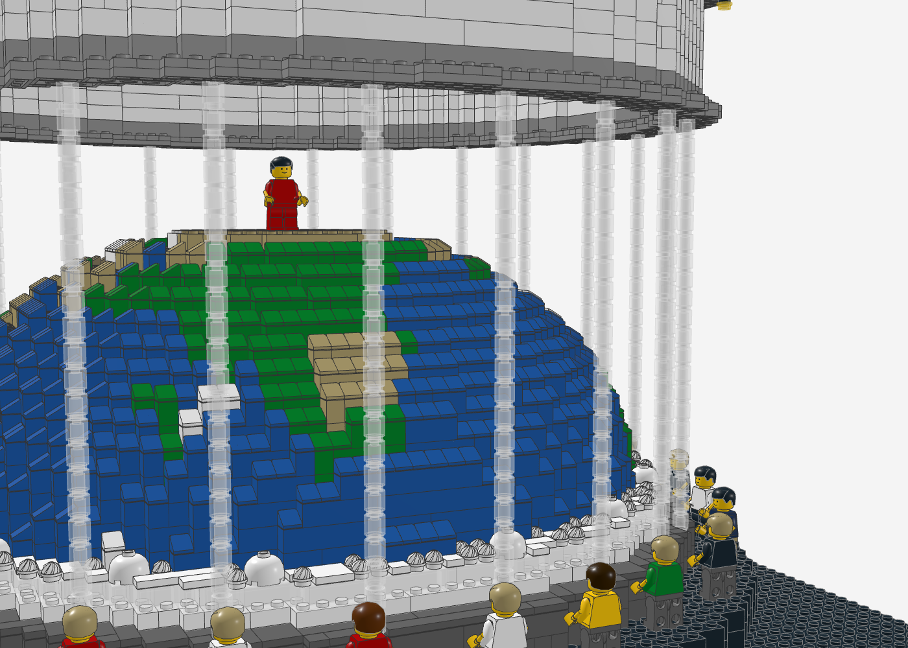
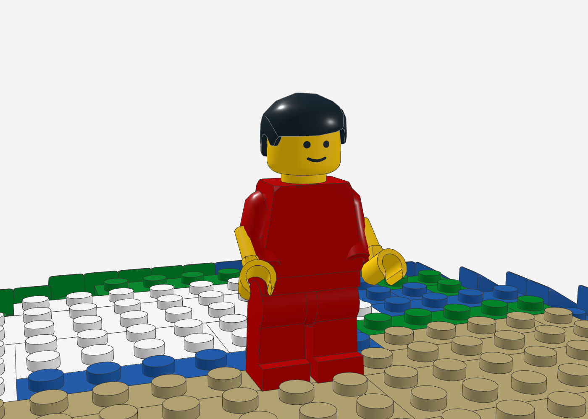

# Globe Stage – Konzertbühne mit Erdkugel-Kuppel (LEGO MOC)

Stadion-Konzertbühne im Minifig-Maßstab: eine große Erdkugel-Kuppel mit Performer
auf dem Scheitel, LED-Ring mit Nebel, Lichtvorhang aus trans-klaren Säulen,
Projektionsschirm und Truss-Ring mit Scheinwerfern. Vorlage ist die
Konzeptskizze in [`reference/konzept-skizze.png`](reference/konzept-skizze.png).


| Seite | Draufsicht |
|---|---|
|  |  |

| Kuppel (ohne Aufbau) | Rückseite |
|---|---|
|  |  |

| Truss & Scheinwerfer | Lichtvorhang | Performer |
|---|---|---|
|  |  |  |

## Dateien

| Datei | Inhalt |
|---|---|
| `globe_stage.mpd` | Das Modell (LDraw Multi-Part, 16 Bauabschnitte als Submodelle) – in Stud.io, LeoCAD, LDView, BrickLink Studio öffnen |
| `globe_stage_bom.csv` | Stückliste (LDraw-ID, BrickLink-ID, Name, Farbe, Menge) |
| `globe_stage_bricklink.xml` | BrickLink Wanted List – direkt unter *Wanted → Upload* importierbar |
| `preview_nocage.mpd` | Vorschau ohne Schirm/Säulen/Truss (zum Anschauen der Kuppel) |
| `generate_globe_stage.py` | Generator, der alle drei Dateien erzeugt |
| `renders/` | Renderings der aktuellen Version |

## Kennzahlen

- **7.353 Teile**, 173 Positionen (Teil × Farbe)
- **Grundfläche** 64 × 64 Noppen (4 Baseplates 32 × 32, ca. 51 × 51 cm)
- **Höhe** ca. 44 Noppen (ca. 35 cm)
- **Kuppel** Ø 48 Noppen, 14 Lagen, Erd-Mosaik (orthografische Projektion auf Nordafrika/Europa, Afrika zeigt zur Front)
- **Minifiguren** 1 Performer + 28 Zuschauer

## Aufbau (Submodelle = Bauabschnitte)

1. **Arena-Boden** – 4 × Baseplate 32 × 32 schwarz
2. **Basis** Ø 64, 2 Lagen schwarz (Laufring für das Publikum)
3. **Laufsteg** Ø 56, dunkelgrau, Fliesen-Oberfläche
4. **LED-Ring** Ø 52 – weiße Lage + trans-klare Lichtlage
5. **Kuppel unten** (Lagen 0–7) mit **Deck 1**: hohle Kuppel, auf Höhe von Lage 7 mit drei kreuzweisen Plattenlagen überspannt
6. **Kuppel Mitte** (Lagen 8–11) mit **Deck 2**
7. **Kuppel oben** (Lagen 12–13, massiv)
8. **Innenstützen** – 2 × 2-Säulen im Hohlraum unter den Decks
9. **Cheese-Slopes** an allen Stufenkanten der Kuppel (runden die Form ab)
10. **Nebel** – 2 × 2-Kuppelsteine + „Swirl“-Platten auf dem LED-Ring
11. **Projektionsschirm** – Rahmen aus 2 kreuzweisen Plattenlagen, darauf 7 Lagen Wand
12. **Lichtvorhang** – 24 Säulen aus trans-klaren 1 × 1-Rundsteinen (tragen Schirm + Truss)
13. **Truss-Ring** Ø 64 – Plattenring, Technic-Lochsteine als Gitterträger, Obergurt mit Sprossen
14. **Scheinwerfer** – 24 hängende Lampen unter dem Truss
15. **Performer**
16. **Publikum**

## Statik & Prüfung

Der Generator prüft das Modell nach jedem Lauf automatisch:

- **0 nicht verbundene Teile**: Jedes Teil hängt über Noppenverbindungen an der Baseplate.
- **0 schwebende Teile**: Jedes Teil sitzt auf mindestens einer Noppe. Die 203 Ausnahmen hängen mit Klemmkraft von oben: die unteren Plattenlagen von Schirmrahmen und Truss (kreuzweise verbaut) und die Scheinwerfer.
- **0 Kollisionen**: kein Volumen doppelt belegt
- Alle Steine liegen exakt im Noppenraster.

Die Renderings entstehen mit dem Headless-Renderer in [`../tools/ldraw-render`](../tools/ldraw-render)
(three.js LDrawLoader + Chromium, echte LDraw-Teilegeometrie).

## Neu erzeugen

```bash
pip install numpy global-land-mask     # Landmaske für das Erd-Mosaik
python3 globe-stage/generate_globe_stage.py
```

Alle Parameter (Kuppelprofil, Kartenmitte, Wolken, Säulenzahl, Farben) stehen oben im Skript.

## Hinweise & Grenzen

- **Schräge Spotlight-Strahlen** aus der Skizze lassen sich nicht sinnvoll aus Steinen bauen. Stattdessen hängen Scheinwerfer (trans-gelb) unter dem Truss.
- **Projektionsbild** auf dem Schirm ist nicht enthalten. Möglich sind bedruckte Fliesen oder ein Sticker auf den weißen Schirmsteinen.
- **Minifiguren** sind in der Stückliste in Einzelteile zerlegt. Auf BrickLink gibt es sie oft günstiger als fertige Figuren oder Torso-Assemblies.
- **Kosten** grob geschätzt 550–800 € über BrickLink. Die größten Posten sind:
  - 4 schwarze 32 × 32-Baseplates
  - ca. 530 trans-klare 1 × 1-Rundsteine
  - die schwarzen Kernsteine der Kuppel
  - die 29 Minifiguren
