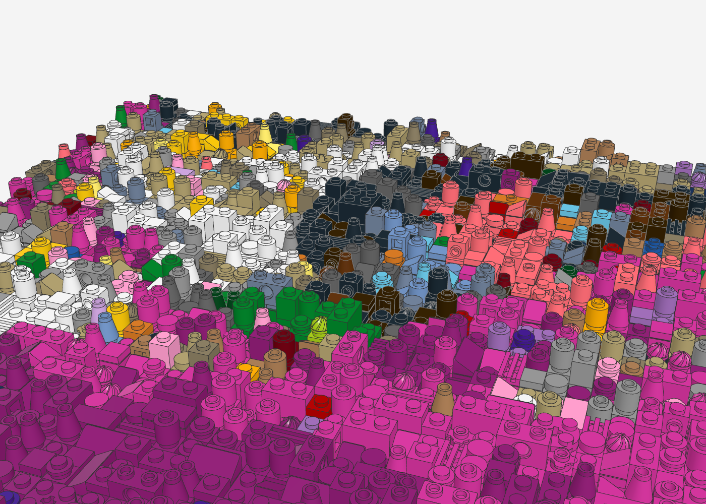

# Kanye West – Graduation als LEGO-Relief

Das Albumcover *Graduation* (2007, Artwork von Takashi Murakami) als Relief-Mosaik im Stil von LEGO-Wandkunst
(mbrick_art): **64 × 64 Noppen** (ca. 51 × 51 cm) auf 4 Baseplates 32 × 32, **11.119 Teile** in 30 Farben.
Jede Noppe ist ein Pixel, aber jedes Pixel ist ein anderes Teil in anderer Höhe – aus der Entfernung das Cover,
aus der Nähe eine wilde Textur aus Rundsteinen, Kegeln, Technic-Steinen, Gittern und Blüten.

| Frontal (wie an der Wand) | Schräg |
|---|---|
|  |  |

| Dropout-Bär im Himmel | Stadt unten rechts |
|---|---|
|  |  |

## Dateien

- `graduation_relief.mpd` – Modell (Noppen nach oben = zum Betrachter; zum Aufhängen hochkant drehen)
- `graduation_relief_bom.csv`, `graduation_relief_bricklink.xml` – Stückliste und BrickLink-Wanted-List
- `graduation_relief_vorschau.png` – flache Farbvorschau (1 Pixel = 1 Noppe)

## Neu erzeugen

```bash
python3 tools/relief/make_relief.py cover.jpg graduation-relief/graduation_relief --breite 64 --hoehe 64 --chaos 0.25 --konfetti 0.04 --seed 3
```

Das Cover-Bild selbst liegt nicht im Repo (Urheberrecht); das Skript braucht es als Eingabe.

## Hinweise

- **Farben:** Der Himmel nutzt Magenta, Dark Pink, Bright Pink, Lavender, Medium Lavender, Dark Purple und Coral.
  Einige davon sind bei bestimmten Teilen (z. B. Kegel, Blüte) selten – BrickLink-Verfügbarkeit prüfen oder dort auf
  Rundplatten ausweichen (`--seed` ändern verteilt die Teile neu).
- **Schrift** „Kanye West GRADUATION" ist bei 64 Noppen nicht lesbar; bei Bedarf eine größere Version (z. B. 96 × 96)
  erzeugen.
