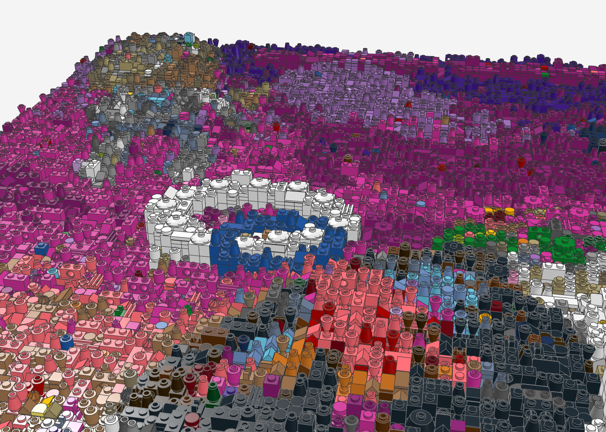
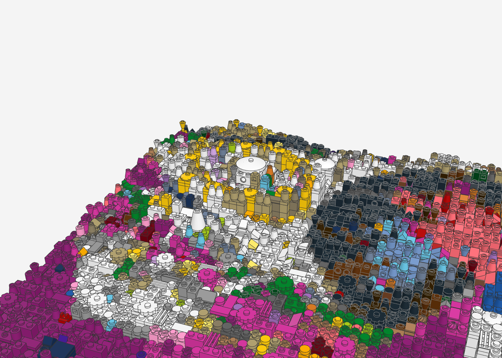
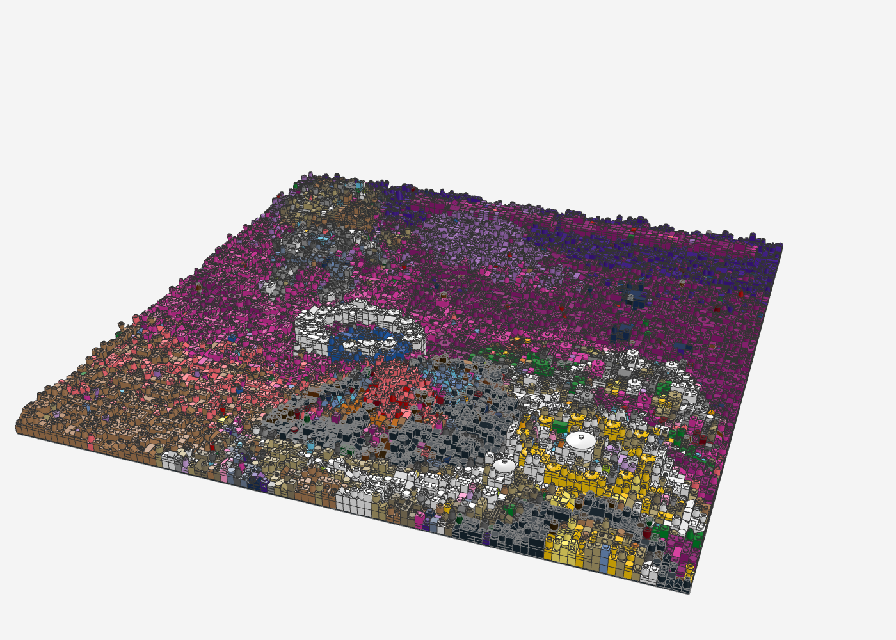
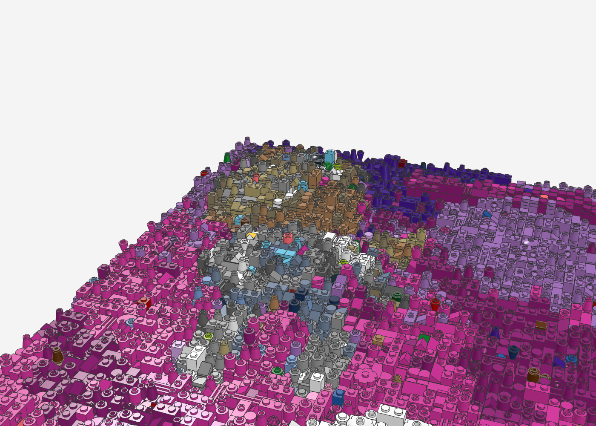
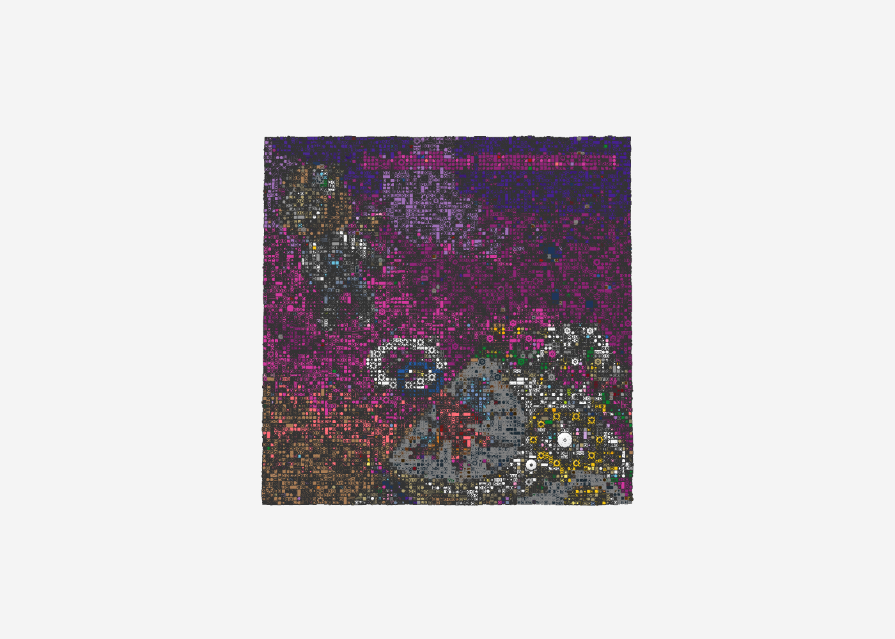
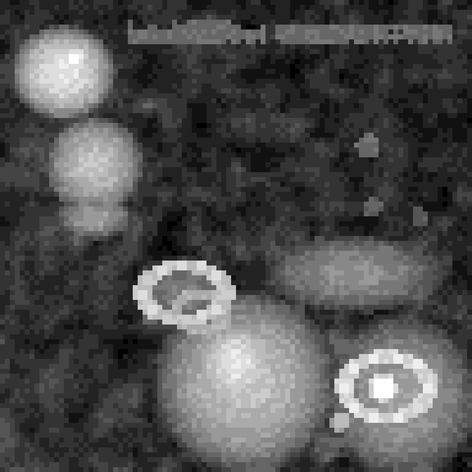

# Kanye West – Graduation als LEGO-Relief

Das Albumcover *Graduation* (2007, Artwork von Takashi Murakami) als Relief-Mosaik im Stil von LEGO-Wandkunst
(mbrick_art): **96 × 96 Noppen** (ca. 77 × 77 cm) auf 4 Baseplates 48 × 48, **28.210 Teile** in 30 Farben, bis ca. 5 cm tief.
Jede Noppe ist ein Pixel, aber jedes Pixel ist ein anderes Teil in anderer Höhe – aus der Entfernung das Cover,
aus der Nähe eine wilde Textur aus Rundsteinen, Kegeln, Technic-Steinen, Gittern und Blüten.

| Heiligenschein-Ring mit Satellitenschüsseln | Radar-Auge und gelber Augenring |
|---|---|
|  |  |

| Schräg: das Relief in der Tiefe | Dropout-Bär |
|---|---|
|  |  |

| Frontal (wie an der Wand) | Höhenkarte (hell = hoch) |
|---|---|
|  |  |

## 3D-Relief und Spezialteile

Die Motive treten bis zu **15 Platten (ca. 5 cm)** aus dem Bild, der Himmel liegt flach mit leichtem Wolken-Relief.
Die Zonen stehen in [`zonen.json`](zonen.json):

| Bildteil | Höhe | Besondere Teile |
|---|---|---|
| Dropout-Bär (Kopf, Jacke, Beine) | Kuppeln bis 13 Platten | Auge als **Schüssel 2 × 2** (4740) in Schwarz |
| Heiligenschein-Ring | 11 Platten auf einem Sockel | weißer Ring, besetzt mit **Satellitenschüsseln 2 × 2** |
| Blauer Ring | 10 Platten | Rundplatten und Kegel in Blau |
| Raumschiff mit Sternexplosion | Kuppel bis 13 Platten | Explosion aus **Kegeln, Doppel-Slopes, umgedrehten Kegeln** – stachelig |
| Murakami-Figur | Kuppel bis 9 Platten | **Radar-Schüssel 4 × 4** (3960) als Auge, gelber Augenring mit Schüsseln, kleines Auge als **Schüssel 3 × 3** |
| Blumenband | 8 Platten | **Blumen 2 × 2** (98262), Blütenplatten, Rundfliesen |
| Doktorhüte | 5–6 Platten | **Fliesen 2 × 2** in Dunkelblau |
| Titel | 6 Platten | glatte Fliesen – die Buchstabenfläche hebt sich vom genoppten Himmel ab |

Insgesamt **40 verschiedene Teilesorten**, 41 Spezialteile.

## Dateien

- `graduation_relief.mpd` – Modell (Noppen nach oben = zum Betrachter; zum Aufhängen hochkant drehen)
- `graduation_relief_bom.csv`, `graduation_relief_bricklink.xml` – Stückliste und BrickLink-Wanted-List
- `graduation_relief_vorschau.png` – flache Farbvorschau (1 Pixel = 1 Noppe)

## Neu erzeugen

```bash
python3 tools/relief/make_relief.py cover.jpg graduation-relief/graduation_relief --breite 96 --hoehe 96 --chaos 0.22 --konfetti 0.035 --seed 3 \
    --tiefe 2 --wolken 4 --zonen graduation-relief/zonen.json
```

Das Cover-Bild selbst liegt nicht im Repo (Urheberrecht); das Skript braucht es als Eingabe.

## Hinweise

- **Farben:** Der Himmel nutzt Magenta, Dark Pink, Bright Pink, Lavender, Medium Lavender, Dark Purple und Coral.
  Einige davon sind bei bestimmten Teilen (z. B. Kegel, Blüte) selten – BrickLink-Verfügbarkeit prüfen oder dort auf
  Rundplatten ausweichen (`--seed` ändern verteilt die Teile neu).
- **Schrift:** Auch bei 96 Noppen ist „Kanye West GRADUATION" nur ein helles Band – die Buchstaben sind im Cover kleiner als
  2 Noppen. Lesbar wird sie nur als eigens gesetzter Schriftzug (z. B. SNOT-Fliesen) oder mit einem hochauflösenden Cover
  ab ca. 128 Noppen Breite.
