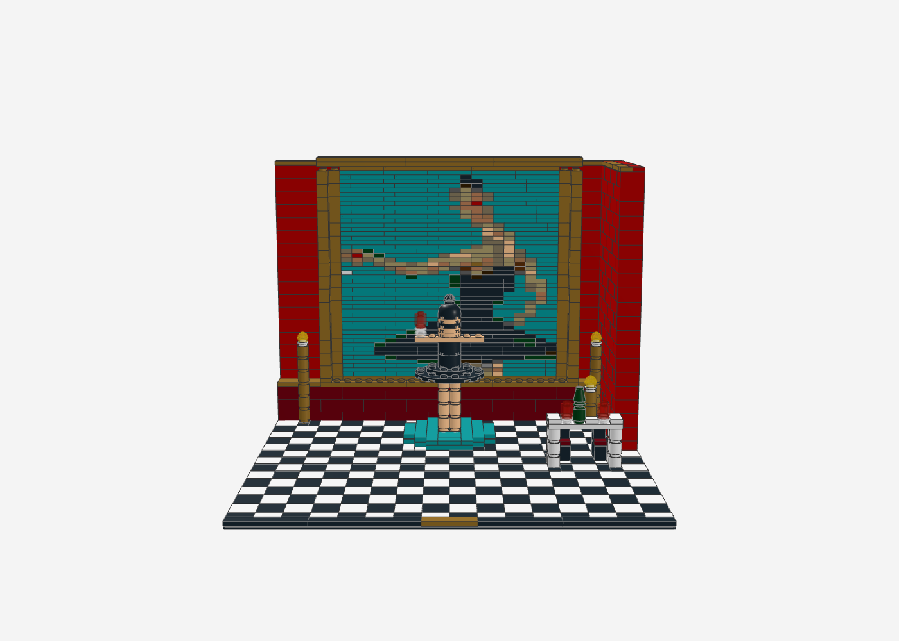
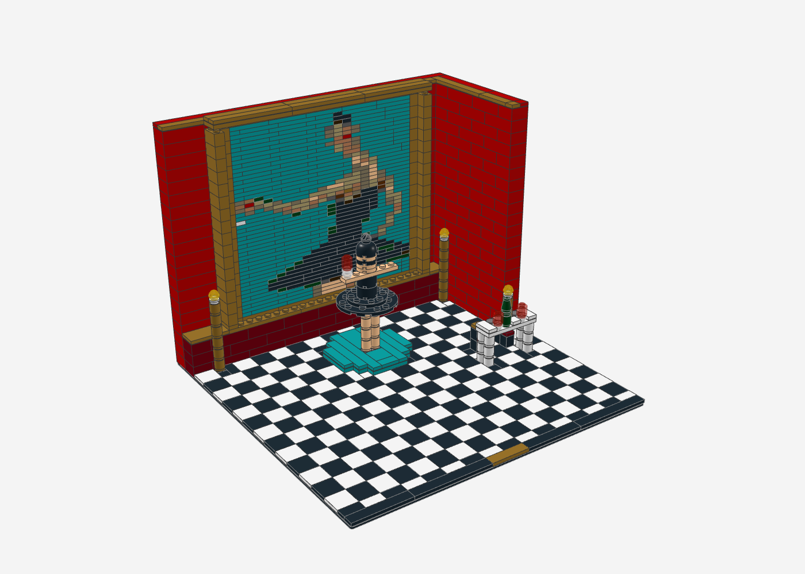
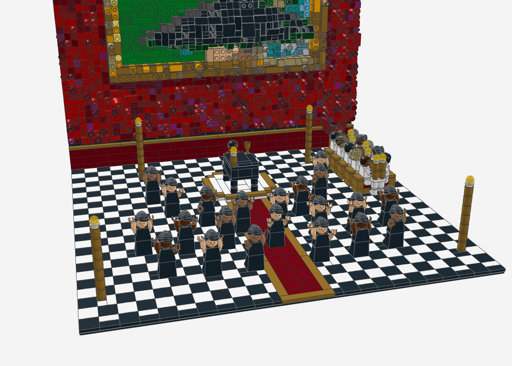
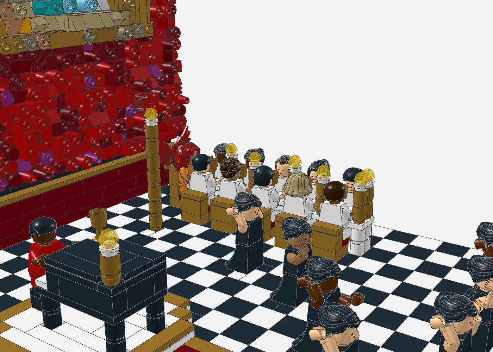

# MBDTF-Diorama „Runaway“

Ein großes Szenen-Set zu Kanye Wests *My Beautiful Dark Twisted Fantasy*. Die **Rückwand ist ein 3D-Relief**
(48 × 48 Noppen): das rote Tuch des Covers, darin das **Ballerina-Gemälde im erhabenen Goldrahmen** – mit
Pinselstrichen, Glotzaugen, Rouge und echtem Weinglas. Davor spielt die **Runaway-Szene mit Minifiguren**:
Kanye im roten Anzug am schwarzen Flügel auf einem weißen Podest, **21 Ballerinen** in drei Gruppen, die lange
weiße **Dinnertafel** mit zehn Gästen in Weiß und am Kopfende der **Phoenix** mit roten Federflügeln.

| Kennzahl | Wert |
|---|---|
| Teile | 7.813 (Relief 6.010, Szene 1.803) |
| Positionen (Teil + Farbe) | 381 |
| Grundfläche | Baseplate 48 × 48 (ca. 38 × 38 cm) |
| Höhe | 45 Steine (ca. 43 cm) |
| Minifiguren | 33: Kanye, Phoenix, 21 Ballerinen, 10 Gäste |
| Prüfung | 0 lose, 0 schwebende Teile, 0 Kollisionen, nichts ragt ins Relief |

| Frontal | 3/4-Ansicht |
|---|---|
|  |  |
| **Ballerinen und Podest** | **Kanye am Flügel, Dinnertafel, Phoenix** |
|  |  |

## Aufbau (Submodelle in der `.mpd`)

| Submodell | Inhalt und Technik |
|---|---|
| `wand_relief` | **Relief-Mosaik** (Chaos-Pixel-Art, `make_relief.py`) auf 9 Platten 16 × 16, **hochkant** eingebaut: Noppen zeigen zum Betrachter. Rotes Tuch aus Rot/Dunkelrot/Magenta mit wechselnden Abschlussteilen; Goldrahmen 10 Platten erhaben mit Glanzkante; Gemälde (30 × 30) mit Pinselstrichen, Licht und Schatten, Tutu als Kuppel mit Rüschen-Slopes, Augen aus Rundplatten mit offener Noppe, Weinglas |
| `wand` | Tragwand (1 Noppe tief, Läuferverband) mit **96 SNOT-Steinen 87087** – deren Seitennoppen halten die Relief-Platten. Die Reihen liegen dort, wo sich Stein-Raster (24) und Noppen-Raster (20) treffen (alle 5 Steine). Dunkelroter Sockel mit Goldleiste |
| `podest` | rundes weißes Podest mit Goldrand; **schwarzer Flügel** mit weißer Tastatur, Kerzenleuchter und Goldkelch; Klavierbank |
| `kanye` | Minifigur im roten Anzug, sitzend, Hände an der Tastatur |
| `ballerinen` | 21 Minifiguren: Dutt (99240), schwarzes Trikot, glockenförmiges Tutu (Hüfte mit Rock 36036), Arme in Hauttönen, verschiedene Posen (Arme hoch, zur Seite, vorne) |
| `tafel` | lange weiße Tafel mit Tischtuch aus Fliesen, Goldkelchen, Tellern, Kerzenleuchtern; goldene Stühle mit roten Polstern |
| `gaeste` | 10 sitzende Gäste ganz in Weiß (verschiedene Hauttöne und Frisuren); **Phoenix** in Orange mit roten Haaren und zwei **Federflügeln** (11100) in Clips an der Stuhllehne |
| `boden` | Schachbrett aus 2 × 2-Fliesen, **roter Läufer** mit Goldkanten zum Podest, schwarze Kante mit goldenem Schild |
| `leuchter` | vier goldene Standleuchter mit Kerze und Flamme |

Blickrichtung: von vorne (+z). Das Relief ist seitenrichtig (Glas links wie im Cover).

## Dateien

- `mbdtf_diorama.mpd` – Modell (Stud.io, LDView, BrickLink Studio)
- `mbdtf_diorama_bricklink.xml` – Teileliste (Reiter „Upload BrickLink XML format"), `mbdtf_diorama_bom.csv`
- `generate_mbdtf_diorama.py` – Generator mit Selbstprüfung
- `wand_relief.*`, `zonen_wand.json` – das Wandrelief (Vorschau, Höhenkarte, Stückliste)

## Neu erzeugen

Das Cover liegt nicht im Repo. Für das Wandbild wird das Gemälde aus dem Cover auf 30 × 30 vergrößert und auf das
rote Tuch gesetzt (Zonen in `zonen_wand.json` sind die MBDTF-Zonen, auf diese Lage umgerechnet):

```bash
python3 tools/relief/make_relief.py wandbild.png mbdtf-diorama/wand_relief --breite 48 --hoehe 48 --chaos 0.25 \
  --konfetti 0.02 --seed 5 --tiefe 1 --wolken 2 --zonen mbdtf-diorama/zonen_wand.json \
  --farben-plus 3,151,92,78,297 --licht 1 --formfolge
python3 mbdtf-diorama/generate_mbdtf_diorama.py
```

## Hinweise

- **Minifiguren** sind aus Einzelteilen aufgebaut (Kopf, Torso 973, Arme 3818/3819, Hände 3820, Beine 970c00 bzw.
  Hüfte mit Rock 36036, Haare). Köpfe stehen in der Stückliste als unbedruckte 3626c – Gesichter nach Wunsch wählen
  (im Render: Standard-Grinsen bzw. Frauengesicht). Kanye und die Gäste sitzen (gleiches Beinteil, angewinkelt).
- Die Tutus sind lange, glockenförmige Röcke (romantisches Tutu) – ein kurzes Teller-Tutu gibt es nicht als
  Einzelteil in der LDraw-Bibliothek.
- Möglicherweise seltene Kombinationen: Minifig-Arme/-Hände in Light Nougat/Medium Nougat, 36036 in Schwarz,
  11100 in Rot, 15470 in Trans-Yellow – vor dem Kauf auf BrickLink prüfen.
- Die Federflügel stecken nur optisch passend in den Clips (Winkel geschätzt), bitte beim Bauen ausrichten.
