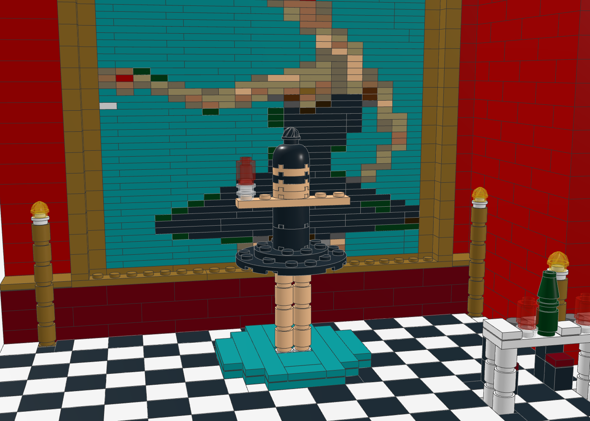

# MBDTF-Diorama „The Ballerina Room“

Ein Szenen-Set zu Kanye Wests *My Beautiful Dark Twisted Fantasy*: ein rotes Zimmer wie das rote Cover, an der Wand
das **Ballerina-Gemälde im gestuften Goldrahmen** – und davor steigt die **Ballerina als 3D-Figur aus dem Bild**,
mit schwarzem Tutu, Maske und Rotweinglas in der ausgestreckten Hand. Rechts steht die weiße Dinnertafel aus dem
Kurzfilm *Runaway*, links und rechts vom Bild goldene Standleuchter. Keine Minifiguren, alles gebaut.

| Kennzahl | Wert |
|---|---|
| Teile | 1.112 |
| Positionen (Teil + Farbe) | 92 |
| Grundfläche | 1 Baseplate 32 × 32 (ca. 26 × 26 cm) |
| Höhe | 20 Steine + Krone (ca. 20 cm) |
| Prüfung | 0 lose, 0 schwebende Teile, 0 Kollisionen |

| Frontal | 3/4-Ansicht |
|---|---|
|  |  |
| **Ballerina vor dem Gemälde** | **Runaway-Tafel** |
|  |  |

## Aufbau (Submodelle in der `.mpd`)

| Submodell | Inhalt und Technik |
|---|---|
| `boden` | Baseplate, Schachbrettboden aus schwarzen/weißen 2×2-Fliesen, vorne schwarze Kante mit goldenem Schild |
| `wand` | Rück- und Seitenwand 2 Noppen dick in Rot, **Läuferverband** (2×4-Steine, Ecke wechselt je Lage), dunkelroter Sockel mit Goldleiste, Krone aus Goldfliesen |
| `rahmen` | Goldrahmen mit **Tiefenstufe**: äußere Säulen und Leisten 2 Noppen tief, innere Stufe 1 Noppe – das Bild liegt vertieft |
| `gemaelde` | Das Ballerina-Gemälde als **Pixelbild aus 20 × 48 Platten** (1×1 bis 1×4) – man sieht die Plattenkanten, wie Pinselstriche; Zeilen versetzt für Verbund |
| `podest` | rundes Podest in Dark Turquoise (Farbe des Gemälde-Hintergrunds), Platten kreuzweise verlegt, Fliesen oben |
| `ballerina` | Spitzenschuhe, Beine aus 1×1-Rundsteinen, **Tutu aus runden Platten 6×6 + 4×4**, Trikot aus 2×2-Rundsteinen, Arme als 1×6-Platte, Gesicht mit schwarzer **Maske**, Haar als Kuppel mit Dutt (Swirl-Platte), **Weinglas** (Trans-Clear-Stiel, Trans-Red-Wein) |
| `tafel` | weiße Tafel mit Tischtuch aus Fliesen, Kerzenleuchter, Weingläser, Weinflasche, Silberteller, zwei Stühle; Standleuchter mit Flamme (Swirl-Platte Trans-Yellow) |

Blickrichtung: von vorne (+z). Die Ballerina hält das Glas auf derselben Seite wie im Gemälde.

## Dateien

- `mbdtf_diorama.mpd` – Modell (Stud.io, LDView, BrickLink Studio)
- `mbdtf_diorama_bricklink.xml` – Teileliste zum Hochladen (Reiter „Upload BrickLink XML format")
- `mbdtf_diorama_bom.csv` – Stückliste
- `gemaelde.json` – gerastertes Gemälde (20 × 48 LDraw-Farben)
- `generate_mbdtf_diorama.py` – Generator mit Selbstprüfung

## Neu erzeugen

```bash
python3 mbdtf-diorama/generate_mbdtf_diorama.py            # nutzt gemaelde.json
python3 mbdtf-diorama/generate_mbdtf_diorama.py cover.png  # Gemälde neu aus dem Cover rastern (Cover nicht im Repo)
```

## Hinweise

- Möglicherweise seltene Farbe/Teil-Kombinationen (vor dem Kauf auf BrickLink prüfen): 2×2-Rundstein (3941) und
  Rundplatte 2×2 (4032) in **Light Nougat**, Rundplatte 6×6 (11213) in Schwarz, Swirl-Platte 15470 in Trans-Yellow.
  Ausweichfarbe für Haut: Nougat oder Tan.
- Die Ballerina ist bewusst stilisiert (Säulen-Figur im Maßstab des Bildes); das Gemälde zeigt die Details.
