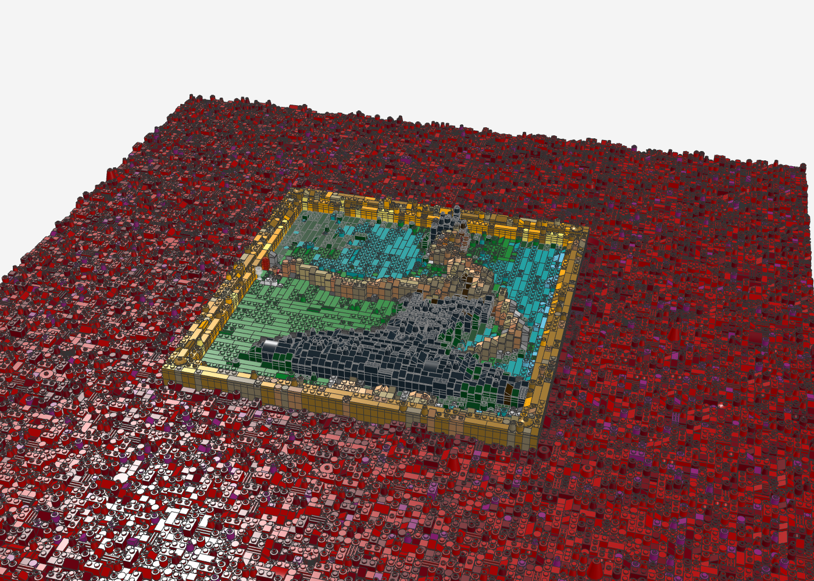
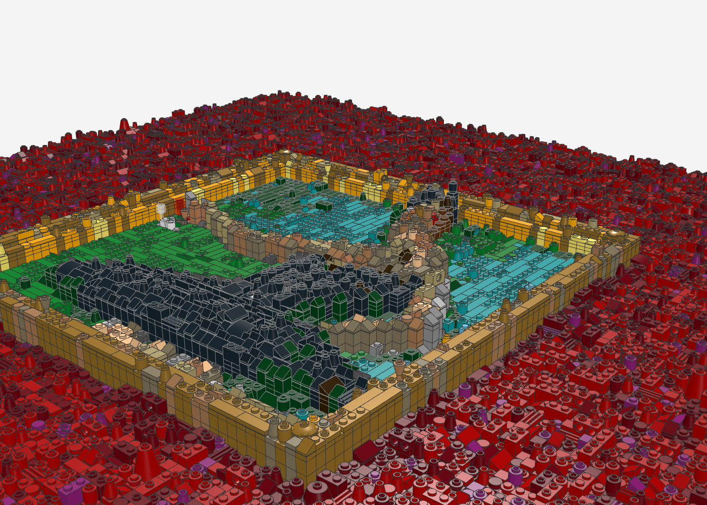
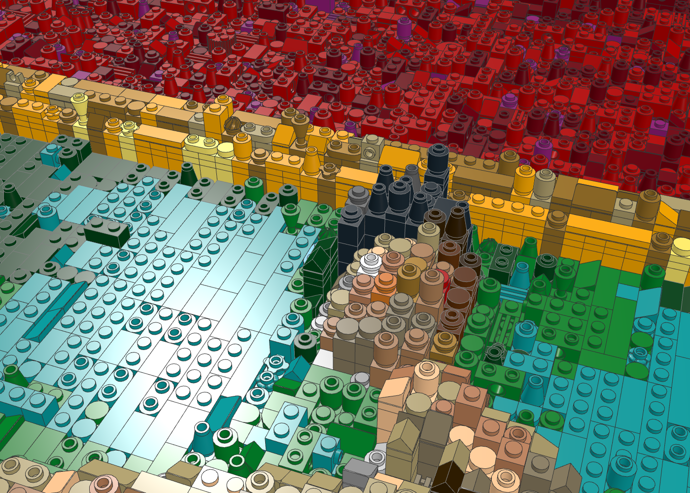
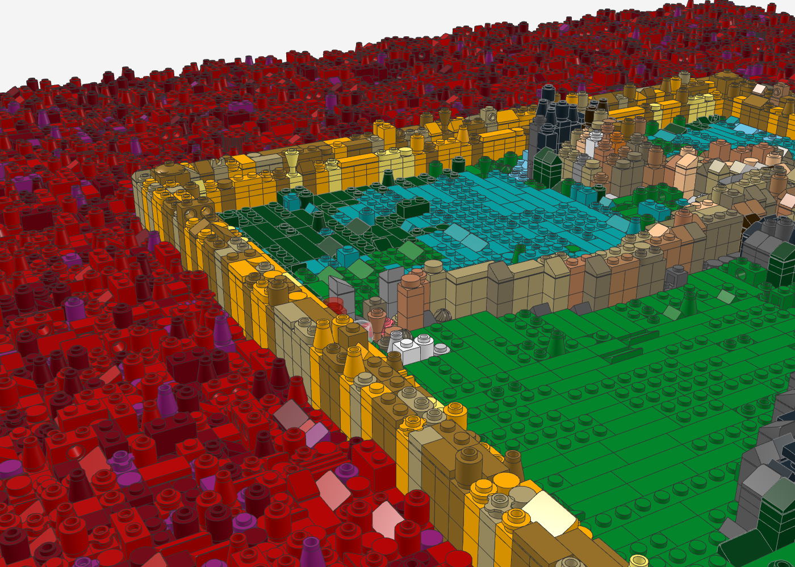
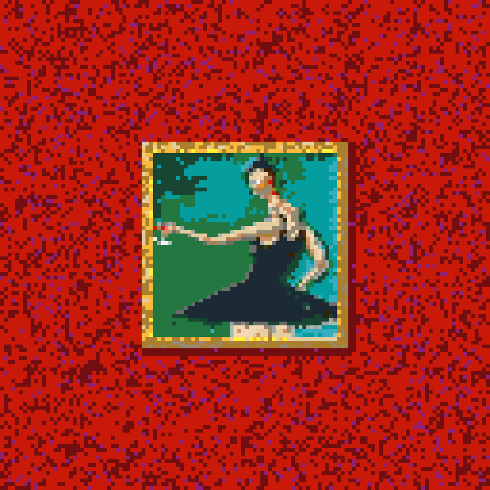
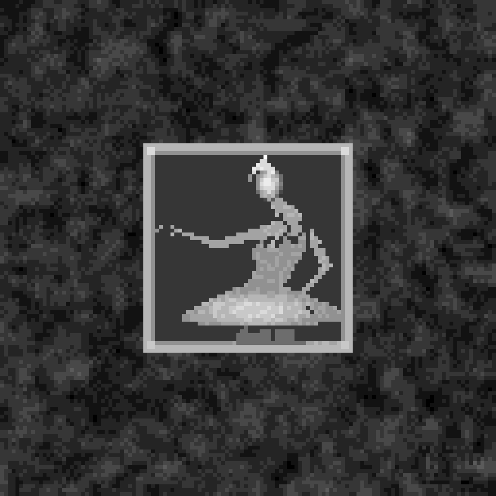

# Kanye West – My Beautiful Dark Twisted Fantasy als LEGO-Relief

Das Albumcover *My Beautiful Dark Twisted Fantasy* (2010, Gemälde von George Condo) als 3D-Relief-Mosaik im Stil von
LEGO-Wandkunst: **128 × 128 Noppen** (ca. 102 × 102 cm) auf 16 Baseplates 32 × 32, **40.412 Teile** in 26 Farben,
43 Teilesorten, bis ca. 4,5 cm tief. Gegenstück zum [Graduation-Relief](../graduation-relief/).

| Das Gemälde im Goldrahmen | Ballerina (Nähe) |
|---|---|
|  |  |

| Gesicht: Glotzaugen, Rouge, Nase, Mund | Echtes Weinglas in der Hand |
|---|---|
|  |  |


| Farbvorschau (1 Pixel = 1 Noppe) | Höhenkarte (hell = hoch) |
|---|---|
|  |  |

## Idee: ein Bild im Bild – in echter Tiefe

Das Cover ist ein kleines, gerahmtes Gemälde auf einem großen roten Stoff. Genau so ist das Relief gebaut
([`zonen.json`](zonen.json)):

| Bildteil | Höhe | Umsetzung |
|---|---|---|
| Rotes Stofffeld | 0–5 Platten | Rot mit Dunkelrot und etwas Magenta gemischt, Wolken-Rauschen als Stofffalten, bunte Teile als Konfetti |
| Goldrahmen | 9 Platten | ringsum erhaben wie ein echter Bilderrahmen; Pearl Gold mit Glanzlichtern in Bright Light Orange und Tan, glatte Fliesen und Viertelkreise als Profil |
| Leinwand | 3 Platten | **vertieft** im Rahmen: Türkis, Grün, Sandgrün |
| Kleid und Tutu | 8–10 Platten | nur die schwarzen Pixel (Farbmaske) treten heraus; Tutu als Kuppel aus Kegeln, umgedrehten Kegeln und Slopes – wirkt wie Rüschen |
| Haut (Arme, Schulter, Beine) | 9 Platten | Rundsteine und Rundplatten in Nougat-Tönen – die Figur steht als Silhouette vor der Leinwand |
| Kopf mit Haarknoten | 11–12 Platten | höchster Punkt des Bildes |
| **Weinglas** | 7 Platten | ein echtes **Minifig-Weinglas** (33061) in Trans-Clear steht in ihrer Hand |

## Detailgrad

Das Relief ist 128 Noppen breit – das Gemälde im Rahmen misst damit rund 53 × 53 Noppen (vorher 40). Dadurch werden
Kopf, Träger des Kleides, Tutu-Rüschen und die Hand mit dem Glas deutlich feiner. Leinwand und Figur sind „sauber"
(ohne Zufallsfarben), nur der rote Stoff trägt Konfetti. Der Parental-Advisory-Aufkleber ist entfernt, an seiner
Stelle liegt Stoff.

## Wie ein Maler gebaut

| Technik | Umsetzung |
|---|---|
| **Pinselstriche** | Die Leinwand ist nicht gepixelt, sondern aus langen 1 × 2–1 × 4-Fliesen und -Platten in Strichrichtung gelegt: links senkrecht, unten waagerecht, rechts senkrecht – wie die sichtbaren Pinselzüge im Gemälde. Ausgestreckter Arm waagerecht, angewinkelter Arm und Beine senkrecht |
| **Licht und Schatten** | Licht von links oben: zugewandte Flächen eine Farbstufe heller, abgewandte eine Stufe dunkler (gleicher Farbton), als Dithering verteilt wie Farbauftrag. Schwarz bleibt schwarz, der rote Stoff bekommt nur Schatten – dadurch wirft der Rahmen einen **Schlagschatten** nach rechts unten |
| **Formfolge** | Cheese- und Doppel-Slopes zeigen mit dem Gefälle der Form nach: Kopf, Arme und Tutu wirken gerundet statt gestuft |
| **Konturlinie** | Der Umriss der Figur besteht aus Slopes, die nach außen abfallen – wie eine gemalte Kontur |
| **Gemalter Goldrahmen** | Zwei Stufen (äußeres Profil 10 Platten, innere Glanzkante 8), oben/links hell, unten/rechts dunkler; Leisten in Längsrichtung; vier Rosetten aus goldenen Schüsseln in den Ecken |
| **Saubere Figur** | Im Motiv keine Zufallsfarben – nur die Hintergründe bekommen Konfetti |
| **Handgesetzte Details** | Glotzaugen aus weißen Rundplatten mit offener Noppe (die Öffnung ist die Pupille), orangefarbenes Rouge, Nase als Cheese-Slope, roter Mund, dunkler Haarknoten als höchster Punkt, Rotwein-Tropfen im Glas |

## Dateien

- `mbdtf_relief.mpd` – Modell (Noppen nach oben = zum Betrachter; zum Aufhängen hochkant drehen)
- `mbdtf_relief.ldr` – einfache LDraw-Datei; für BrickLink besser die XML nehmen
- `mbdtf_relief_bricklink.xml` – Wanted List (Reiter „Upload BrickLink XML format")
- `mbdtf_relief_bom.csv` – Stückliste

## Neu erzeugen

```bash
python3 tools/relief/make_relief.py cover.jpg mbdtf-relief/mbdtf_relief --breite 128 --hoehe 128 --chaos 0.3 \
  --konfetti 0.03 --seed 5 --tiefe 2 --wolken 3 --zonen mbdtf-relief/zonen.json --farben-plus 3,151,92,78,297 \
  --licht 1 --formfolge
```

Das Cover-Bild liegt aus Urheberrechtsgründen nicht im Repo.

## Hinweise

- **Weinglas:** Das Minifig-Weinglas steht mit seinem Fuß auf der Noppe darunter. Im Render ist nur Lage und
  Ausrichtung geprüft, nicht der Halt – beim Bauen testen; hält es nicht fest, kann man es in die Hand einer
  Minifigur-Hand-Clip-Platte stecken oder weglassen.
- **Gesicht:** Das Gesicht ist im Original nur etwa 4 × 5 Noppen groß – die Gesichtszüge sind deshalb einzelne,
  bewusst gesetzte Teile statt Pixel.
- **Pearl Gold** ist bei manchen Teilen (Viertelkreis-Fliese, Rundfliese 2 × 2) selten – die BrickLink-Liste zeigt es an.
