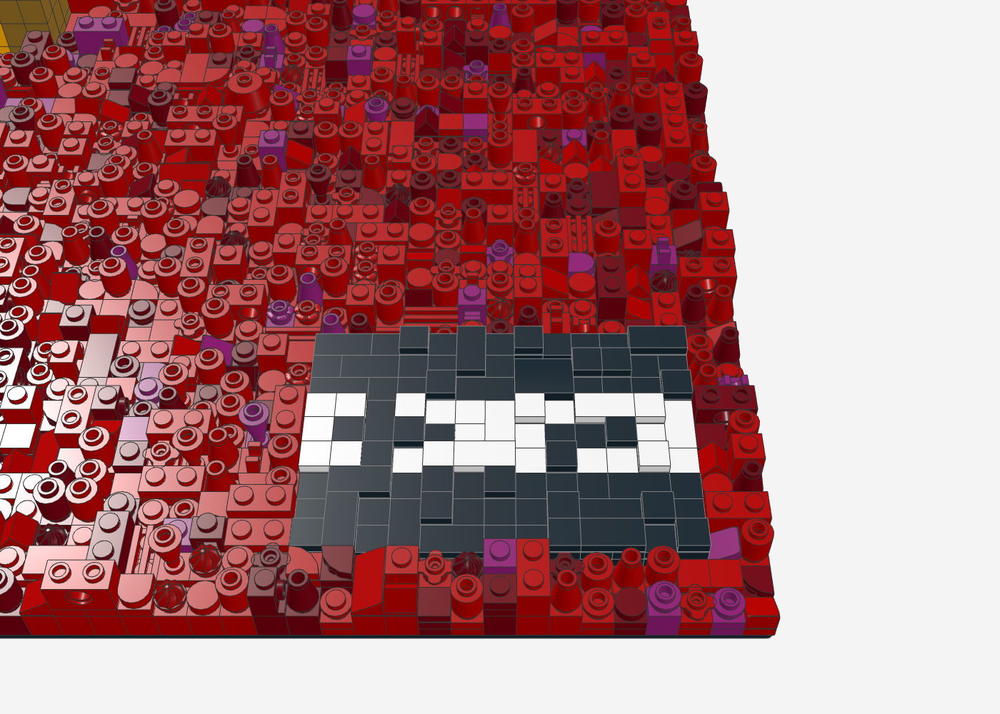
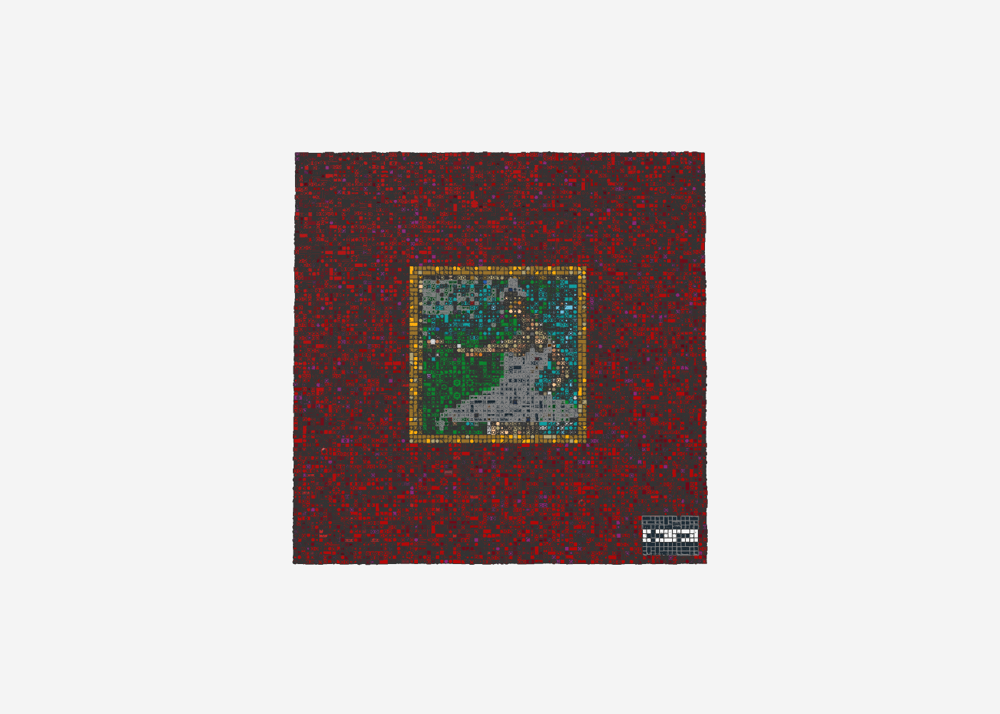

# Kanye West – My Beautiful Dark Twisted Fantasy als LEGO-Relief

Das Albumcover *My Beautiful Dark Twisted Fantasy* (2010, Gemälde von George Condo) als 3D-Relief-Mosaik im Stil von
LEGO-Wandkunst: **96 × 96 Noppen** (ca. 77 × 77 cm) auf 4 Baseplates 48 × 48, **23.188 Teile** in 28 Farben,
37 Teilesorten, bis ca. 4,5 cm tief. Gegenstück zum [Graduation-Relief](../graduation-relief/).

| Das Gemälde im Goldrahmen | Ballerina (Nähe) |
|---|---|
|  |  |

| Echtes Weinglas in der Hand | Parental-Advisory-Aufkleber | Frontal |
|---|---|---|
|  |  |  |

| Farbvorschau (1 Pixel = 1 Noppe) | Höhenkarte (hell = hoch) |
|---|---|
|  |  |

## Idee: ein Bild im Bild – in echter Tiefe

Das Cover ist ein kleines, gerahmtes Gemälde auf einem großen roten Stoff. Genau so ist das Relief gebaut
([`zonen.json`](zonen.json)):

| Bildteil | Höhe | Umsetzung |
|---|---|---|
| Rotes Stofffeld | 0–5 Platten | Rot mit Dunkelrot und etwas Magenta gemischt, Wolken-Rauschen als Stofffalten, bunte Teile als Konfetti |
| Goldrahmen | 9 Platten | ringsum erhaben wie ein echter Bilderrahmen; Pearl Gold mit Glanzlichtern in Bright Light Orange und Tan, glatte Fliesen und Viertelkreise als Profil |
| Leinwand | 3 Platten | **vertieft** im Rahmen: Türkis, Grün, Sandgrün |
| Kleid und Tutu | 8–10 Platten | nur die schwarzen Pixel (Farbmaske) treten heraus; Tutu als Kuppel aus Kegeln, umgedrehten Kegeln und Slopes – wirkt wie Rüschen |
| Haut (Arme, Schulter, Beine) | 9 Platten | Rundsteine und Rundplatten in Nougat-Tönen – die Figur steht als Silhouette vor der Leinwand |
| Kopf mit Haarknoten | 11–12 Platten | höchster Punkt des Bildes |
| **Weinglas** | 7 Platten | ein echtes **Minifig-Weinglas** (33061) in Trans-Clear steht in ihrer Hand |
| Parental Advisory | 3 Platten | glatte schwarze und weiße Fliesen als Aufkleber auf dem Stoff |

## Dateien

- `mbdtf_relief.mpd` – Modell (Noppen nach oben = zum Betrachter; zum Aufhängen hochkant drehen)
- `mbdtf_relief.ldr` – einfache LDraw-Datei; für BrickLink besser die XML nehmen
- `mbdtf_relief_bricklink.xml` – Wanted List (Reiter „Upload BrickLink XML format")
- `mbdtf_relief_bom.csv` – Stückliste

## Neu erzeugen

```bash
python3 tools/relief/make_relief.py cover.jpg mbdtf-relief/mbdtf_relief --breite 96 --hoehe 96 --chaos 0.3 \
  --konfetti 0.03 --seed 5 --tiefe 2 --wolken 3 --zonen mbdtf-relief/zonen.json --farben-plus 3,151,92,78,297
```

Das Cover-Bild liegt aus Urheberrechtsgründen nicht im Repo.

## Hinweise

- **Weinglas:** Das Minifig-Weinglas steckt mit seinem Fuß auf der Noppe darunter. Wenn es wackelt, einen Tropfen
  Klemmkraft mit einer Rundplatte 1 × 1 darunter ausgleichen.
- **Gesicht:** Das Gesicht der Figur ist im Original nur wenige Pixel groß – im Relief ist es ein runder Kopf mit
  Hautton und dunklem Haarknoten, keine Gesichtszüge.
- **Pearl Gold** ist bei manchen Teilen (Viertelkreis-Fliese, Rundfliese 2 × 2) selten – die BrickLink-Liste zeigt es an.
