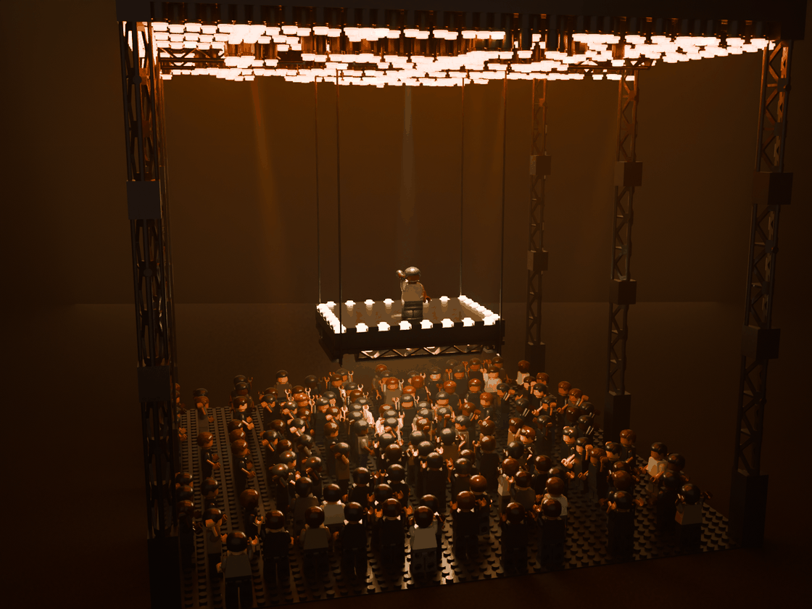
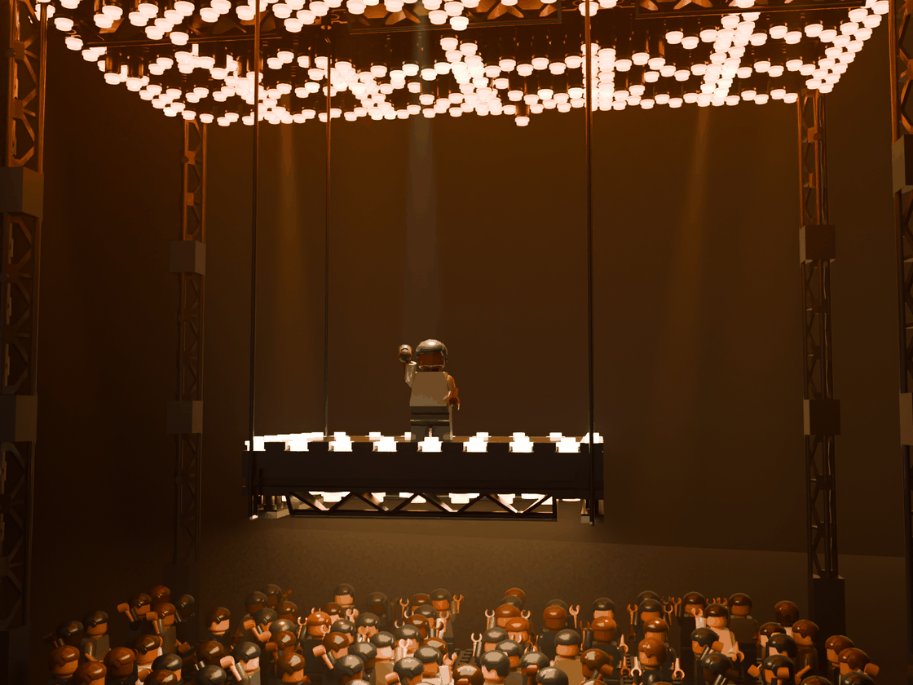
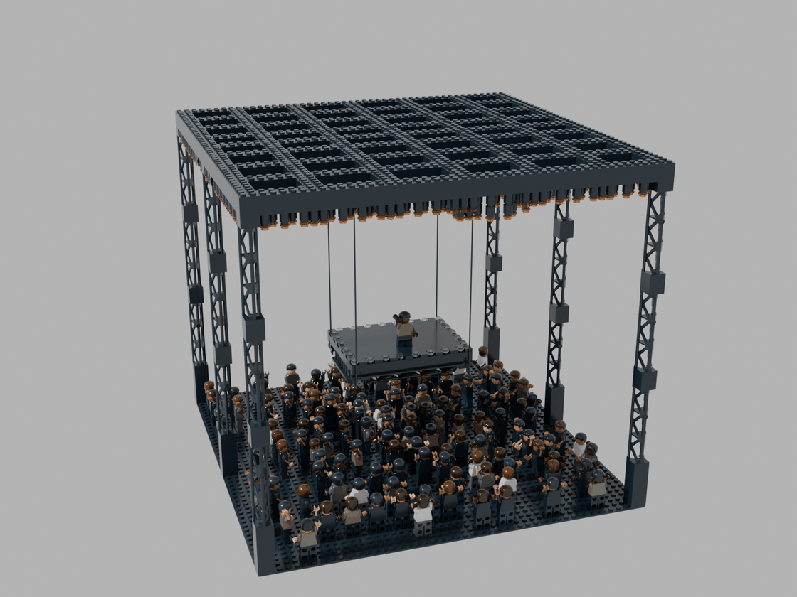
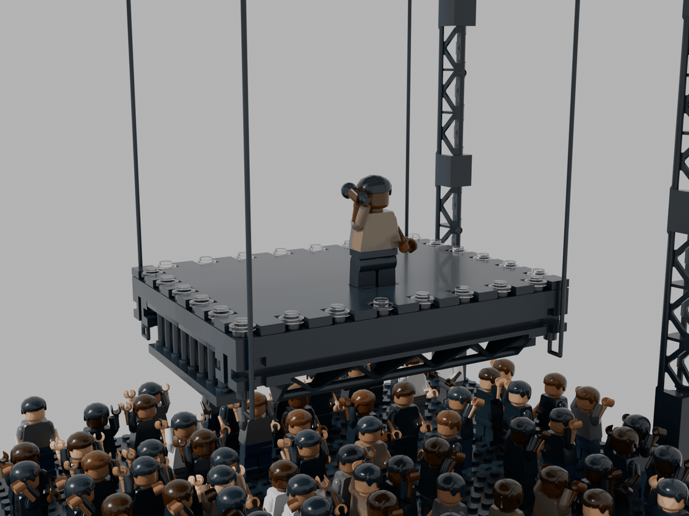
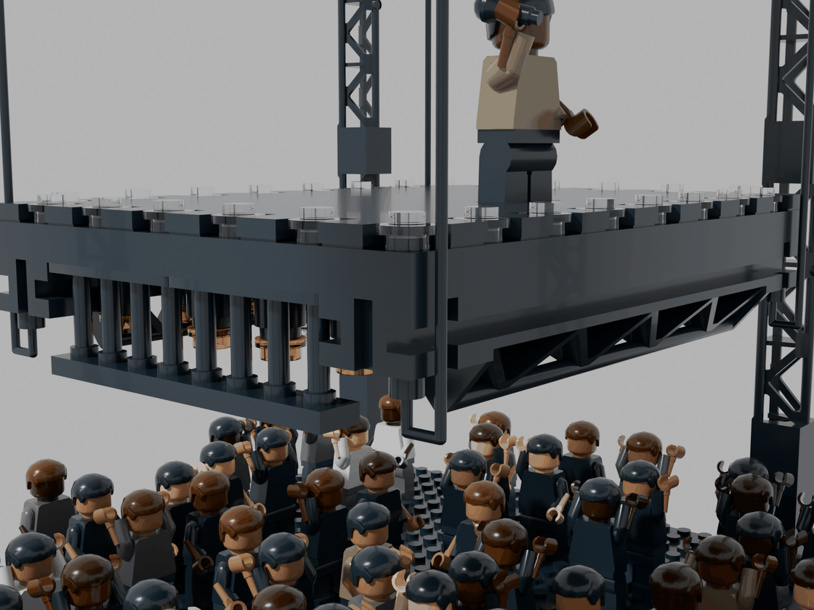
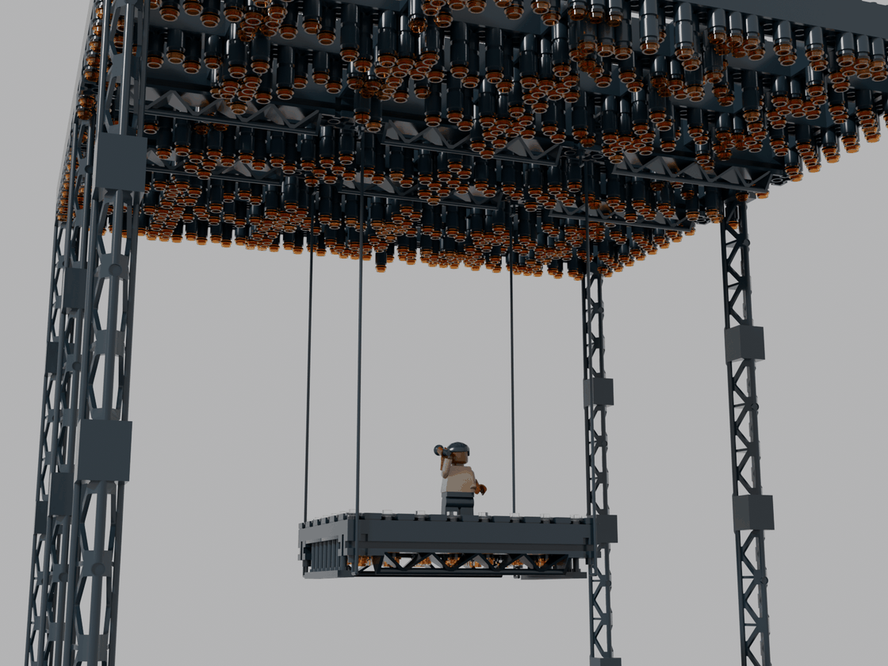
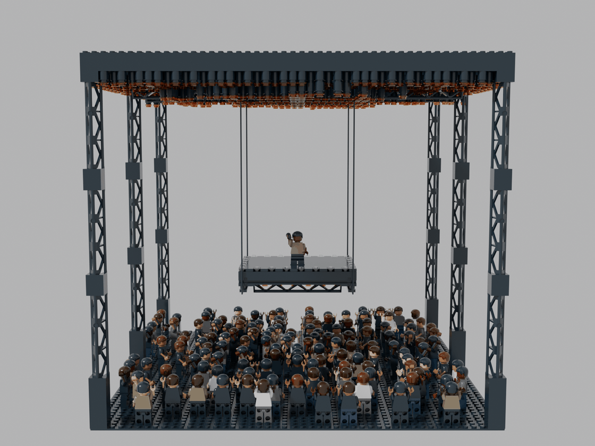

# Saint Pablo Tour – Kanye West, 2016 (LEGO MOC)

Die schwebende Bühne der *Life of Pablo*-Tour im Minifig-Maßstab auf einer **Baseplate 48 × 48** (ca. 38 × 38 cm,
34 cm hoch). Kanye steht allein auf einer kleinen Plattform, die an **vier Seilen** über dem Publikum hängt. Darüber
schwebt ein riesiges **Lichtraster mit 582 hängenden Leuchten**, darunter tobt der Moshpit aus 133 Fans.



| Aus dem Publikum | Tageslicht |
|---|---|
|  |  |

| Plattform mit Kanye | Seil im J-Bogen am Träger | Lichtraster von unten |
|---|---|---|
|  |  |  |



## Vorlage

- **Die Tour (2016):** Statt einer festen Bühne hing eine Plattform von etwa **16 × 20 ft** rund **15 ft** über dem
  Publikum an Motoren unter dem Licht-Rig, an den Rändern und unten mit PAR-Lampen besetzt. Darüber hing ein
  riesiges Lichtraster aus Hunderten Leuchten, meist in Orange und im Nebel. Kanye stand allein darauf, die Fans
  darunter im Stehbereich (Berichte zur Tour, u. a. Rolling Stone, und Konzertfotos).
- **Umgesetzt:** Plattform 16 × 12 Noppen (im Minifig-Maßstab ca. 19 × 14 ft), Unterkante 247 LDU (ca. 10 cm,
  ca. 4,5 m) über dem Boden, schwarzer Gitterträger als Rand, Raster aus Leuchten, schwarze Türme. Referenzbilder
  liegen nicht im Repo.

## Kennzahlen

- **3.105 Teile**, 67 Positionen (Teil × Farbe)
  - davon 1.451 Teile in den Leuchten (Rundstein 1 × 1 plus Rundplatte 1 × 1)
  - davon 1.073 Teile in 134 Minifiguren (8 Teile je Figur plus Mikrofon)
- **Grundfläche** 48 × 48 Noppen, **Höhe** 34 cm
- **Abstände:** Rasterunterkante 33 cm über dem Boden, Plattform 21 cm darunter, Deck 12,6 cm über dem Boden

## Aufbau (Submodelle)

1. **Grundplatte** – Baseplate 48 × 48 in Schwarz (Arena-Boden)
2. **Türme** – 6 Gittertürme aus je drei Trägern 2 × 2 × 10 (95347) auf einem Sockel aus 4 Steinen 2 × 2. Vier
   stehen an den Ecken, zwei in der Mitte der Seiten, damit die Front frei bleibt
3. **Lichtraster** – Gitter aus 2 Noppen breiten Balken im Abstand von 5–8 Noppen, aufgebaut aus zwei Plattenlagen
   im Verband und einer Steinlage obenauf (40 LDU hoch). Über der Plattform hängen sechs **Gitterträger 2 × 16**
   (30518) als Hauptträger unter dem Raster
4. **Hängende Leuchten** – 582 Leuchten im Zickzack entlang aller Balken, je 1–3 Rundsteine 1 × 1 (3062b) mit einer
   Rundplatte 1 × 1 in **Trans-Orange** (einzelne Trans-Yellow). In der Mitte hängen sie tiefer
5. **Seile** – 4 × Schnur mit Endnoppen 30L (63142) an den Ecken der Plattform
6. **Plattform** – zwei Plattenlagen im Verband, schwarze Fliesen und eine Reihe **Randleuchten** (Rundplatten
   Trans-Clear) als leuchtender Umriss
   - Darunter an den Längsseiten zwei Gitterträger 30518, an den Stirnseiten Zäune 1 × 4 × 2 (15332)
   - Innen hängen **PAR-Lampen** und Downlights
7. **Kanye** – Dark-Tan-Oberteil, schwarze Hose, Mikrofon (90370) in der erhobenen rechten Hand. Er steht direkt auf
   den Noppen der oberen Deckplatte, die Fliesen liegen um seine Füße
8. **Publikum** – 133 Minifiguren in dunkler Kleidung (Schwarz, Dunkelgrau, Jeansblau, einzelne weiße und
   Dark-Tan-Shirts) mit verschiedenen Hauttönen. Alle schauen zur Plattform, viele recken die Arme hoch. Direkt
   unter der Bühne stehen sie am dichtesten

## Angewandte Techniken

| Technik | Umsetzung |
|---|---|
| **Feste Seillänge als Maß** | Die Schnur 63142 ist 576 LDU lang. Daraus berechnet der Generator die Höhe der Plattform unter dem Raster (524 LDU zwischen den Endnoppen) – nichts ist gedehnt oder durchgehängt |
| **Seil im J-Bogen** | Der obere Knopf steckt von unten im Endblock eines Rig-Trägers. Die Schnur läuft außen an der Plattform vorbei und biegt unten zurück, sodass der untere Knopf **von unten** im Endblock des Plattform-Trägers steckt. Die Plattform liegt damit auf den Knöpfen auf, statt an Noppen zu ziehen |
| **Gitterträger als Doppelfunktion** | 30518 ist Rand-Optik (Dreiecksfachwerk) und Anschlag zugleich: Er hängt mit 32 Noppen im Deck, seine Endblöcke nehmen die Seilknöpfe auf |
| **Lastpfad** | Seil → Rig-Träger → Raster (3 Lagen im Verband) → Türme → Grundplatte. Die Steinlage obenauf macht die Balken steif genug für 46 Noppen Spannweite |
| **Hängende Leuchten** | Rundsteine 1 × 1 mit Hohlnoppe stecken von unten im Raster und nehmen die nächste Lampe auf; legal und beliebig lang |
| **Flächige Fußauflage** | Kanye steht auf den Noppen zwischen den Fliesen, damit kein Sockel aus dem Deck ragt |
| **Farbe** | Schwarz für alles Technische, Licht nur in Trans-Orange, Gelb und Klar. Die Glut entsteht erst im Konzertlicht – wie bei der Tour |

## Prüfung

Der Generator prüft nach jedem Lauf: **0 nicht verbundene Teile, 0 schwebende Teile, 0 Kollisionen.**

- **Seile:** Sie verbinden Rig und Plattform; im Check stehen sie als ausdrückliche Verbindung.
- **Steg des Gitterträgers:** Der untere Teil (bis 45 LDU) hat ein eigenes Kollisionsvolumen, damit nichts hineinragt.
- **Minifiguren:** Ihre Beine dienen als Platzhalter für die ganze Figurenhöhe.

## Neu erzeugen

```bash
python3 saint-pablo/generate_saint_pablo.py
```

Plattform (`PX0` … `PZ1`), Türme (`TOWERS`, `N_BASE`), Rasterbalken (`XBEAM_Z`, `ZBEAM_X`), Seil (`ROPE_FREE`,
`BEND`, `JOG`) und Publikum stehen im Saint-Pablo-Teil des Skripts.

Renders erzeugen:

- **Tageslicht:**
  `blender -b -P tools/blender-render/render_cycles.py -- saint-pablo/saint_pablo.mpd out/pablo`
- **Konzertlicht:** dunkle Halle, leuchtende Lampen, Dunst, Spot auf Kanye.
  `blender -b -P saint-pablo/render_konzert.py -- saint-pablo/saint_pablo.mpd out/konzert`
  - Optionen: `--glut` (Leuchtkraft), `--dunst` (Dichte), `--views` (Ansichten wie in `render_cycles.py`)

## Hinweise

- **Gewicht und Spannweite:** Das Raster trägt rund 1.450 Leuchtenteile und die Plattform. Es überspannt 46 Noppen
  zwischen den Türmen. Mit der Steinlage hält es; ein echter Bau sollte das Raster erst auf die Türme setzen und
  dann die Leuchten einhängen. Für Transport das Raster abnehmen (es steckt nur auf den Turmnoppen).
- **Seil 63142:** Die Schnur mit Endnoppen 30L heißt bei BrickLink je nach Ausführung unterschiedlich. Die ID in der
  Stückliste vor der Bestellung prüfen; schwarz ist nötig.
- **Seltene Farben prüfen:** 30518 und 95347 in Schwarz. Unbedruckte Köpfe 3626c in den Hauttönen sind Platzhalter
  (Gesichter nach Wahl). Torsos führt BrickLink je Farbkombination unter eigenen Nummern (973c…).
- **Keine Lizenzdrucke:** Kanye ist eine unbedruckte Figur, Merch-Drucke sind nicht nachgebildet.
- **Maßstab:** Minifig-Maßstab (ca. 1 : 45). Das echte Raster war noch größer als die Arena-Fläche hier; es ist auf
  die Grundplatte begrenzt.
