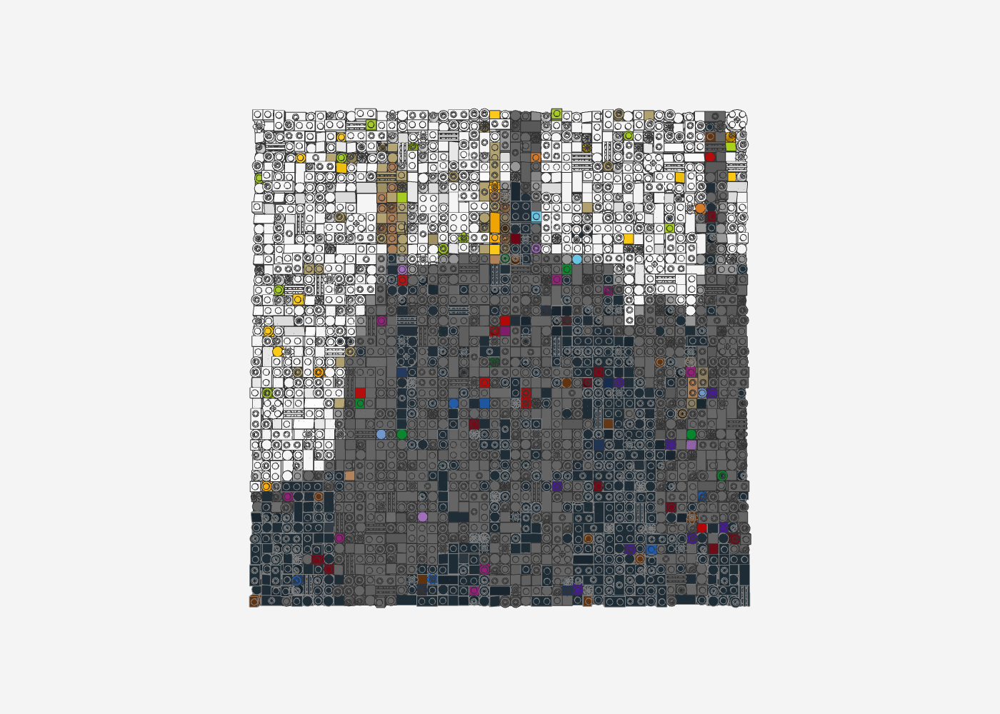
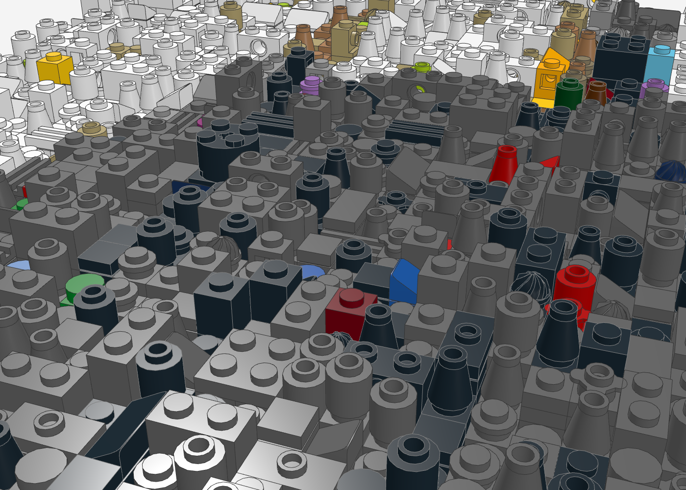
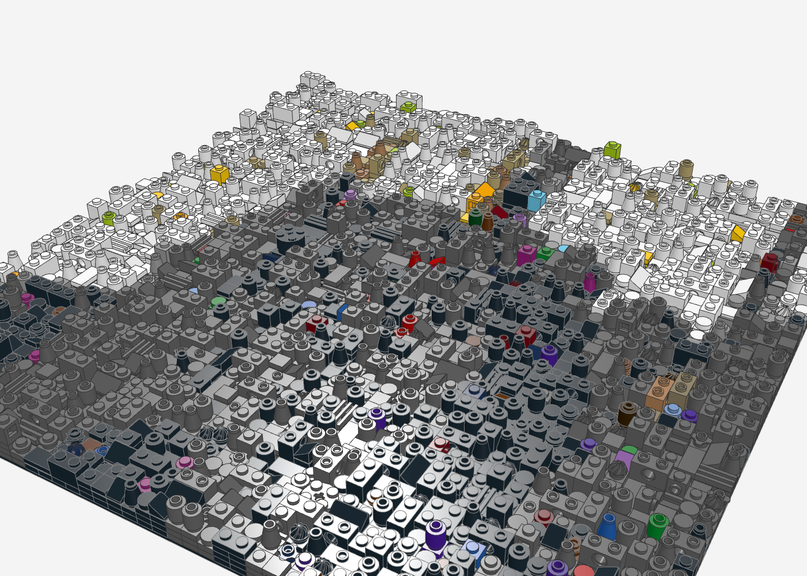

# Relief-Mosaik („Chaos-Pixel-Art")

Macht aus einem Bild ein LEGO-Wandbild im Stil von [mbrick_art](https://www.tiktok.com/@mbrick_art/video/7288804014462897440):
1 Noppe = 1 Pixel, aber jede Zelle hat ein anderes Abschlussteil (Rundstein, Kegel, Rundplatte, Fliese, Technic-Stein,
Gitter, Cheese-Slope, Blüte …) und eine andere Höhe. Aus der Entfernung erkennt man das Motiv, aus der Nähe eine lebendige
Textur mit bunten Konfetti-Farben.

```bash
python3 tools/relief/make_relief.py bild.jpg ausgabe/name --breite 48 --hoehe 48 --chaos 0.35 --konfetti 0.05 --tiefe 3
```

| Option | Wirkung |
|---|---|
| `--breite`, `--hoehe` | Größe in Noppen (Grundplatten 48 × 48 werden automatisch gesetzt) |
| `--chaos` | Anteil Zellen mit der zweitnächsten Farbe – Farbmischung statt glatter Flächen |
| `--konfetti` | Anteil bunter Akzentfarben mit gleicher Helligkeit (Lila, Lime, Pink, Azur …) |
| `--tiefe` | maximale Plattenlagen unter dem Abschlussteil (Relief-Tiefe) |
| `--farben` | eingeschränkte Palette als LDraw-Codes, z. B. `0,15,71,72,4,25` |
| `--seed` | andere Zufallsverteilung der Teile |

Ausgabe: `name.mpd`, `name_bom.csv`, `name_bricklink.xml`, `name_vorschau.png` (flache Farbvorschau).

## Demo

Aus einem Render der Circus-Maximus-Bühne (48 × 48 Noppen, 6.212 Teile):

| Frontal (wie an der Wand) | Nah: Tiefe und Konfetti |
|---|---|
|  |  |


