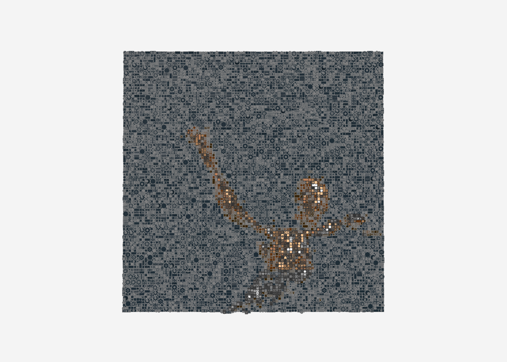
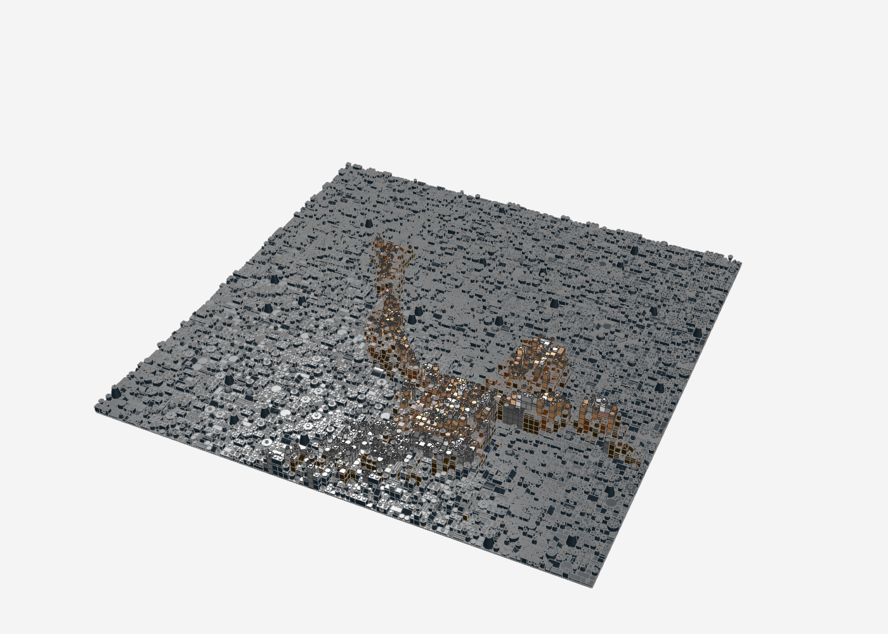
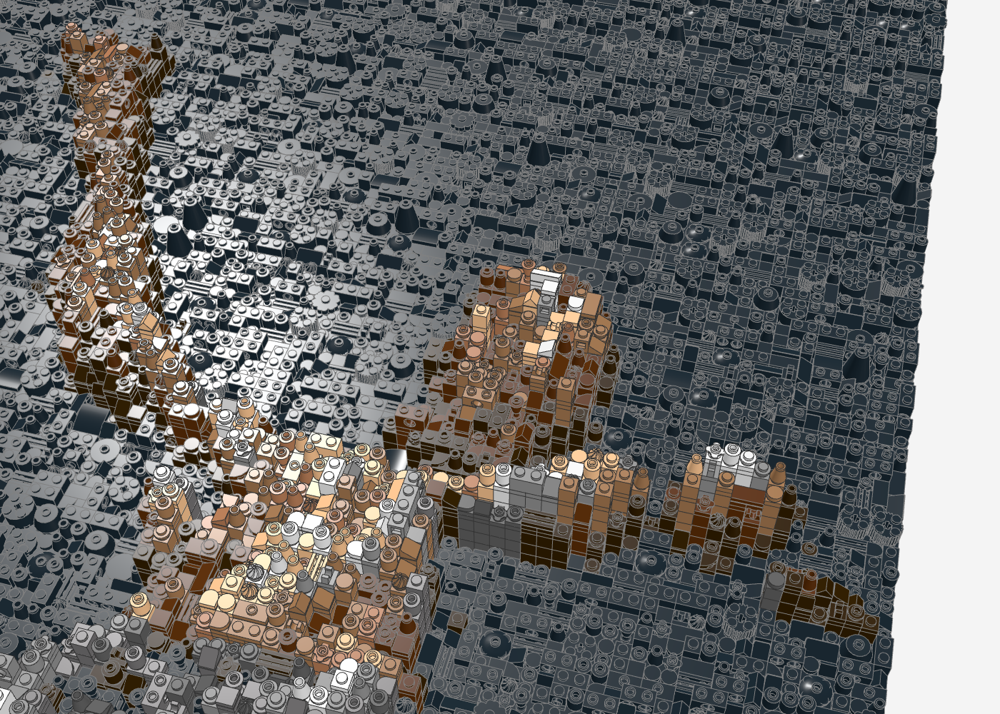
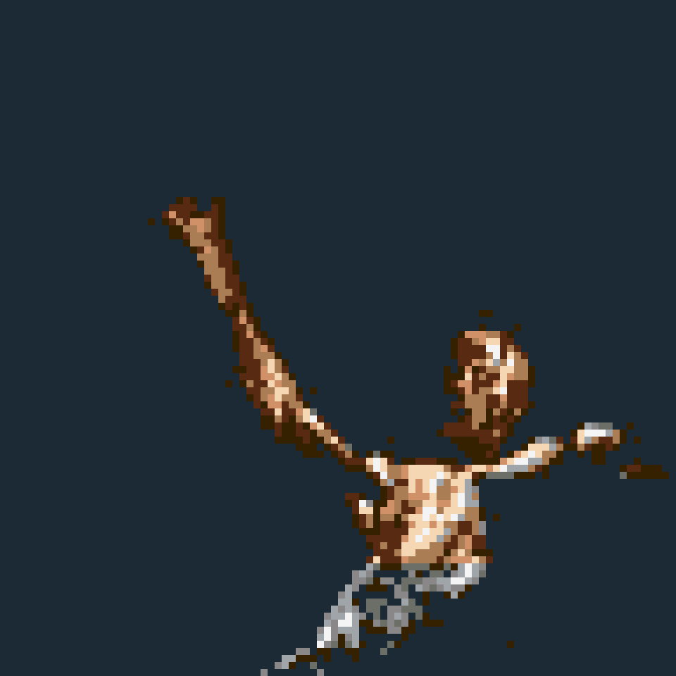
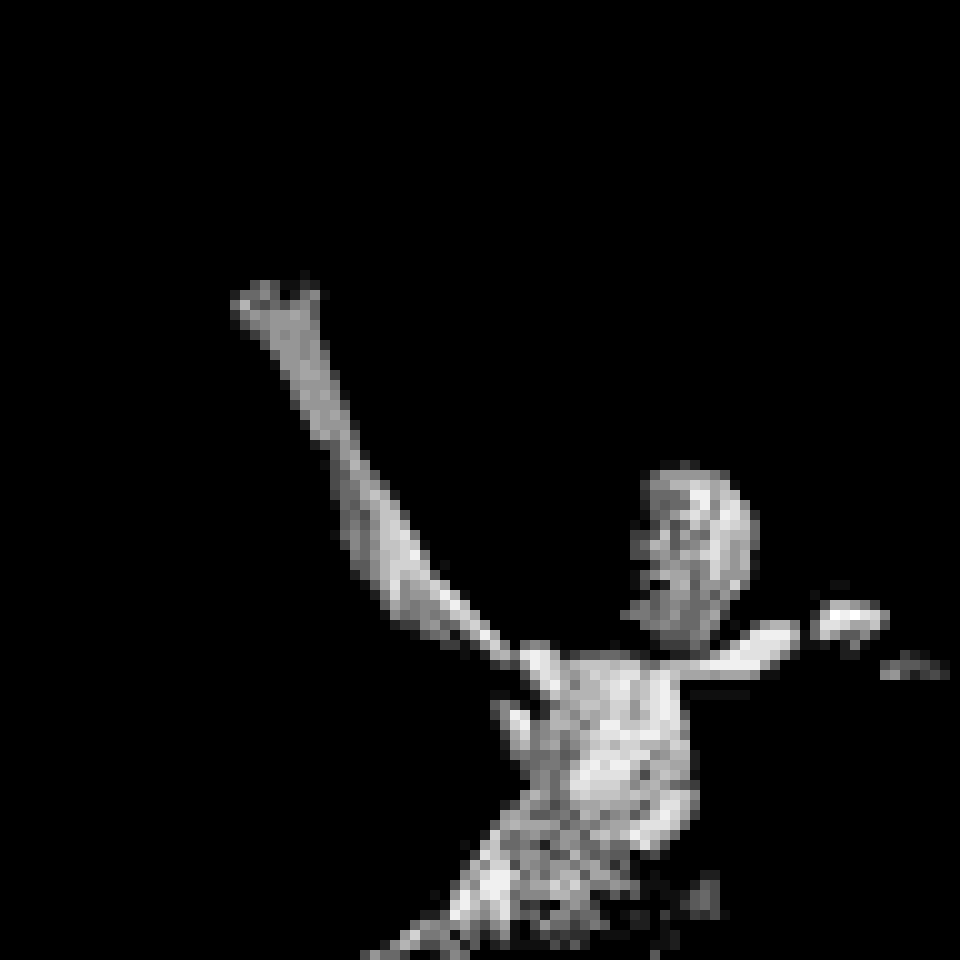

# UTOPIA-Relief (96 × 96)

Travis Scotts *UTOPIA*-Cover als 3D-Relief-Mosaik: **96 × 96 Noppen (ca. 77 × 77 cm)** auf 4 Baseplates 48 × 48.
Die angeleuchtete Figur tritt bis zu **17 Platten** aus dem flachen schwarzen Grund heraus: je heller die Stelle im
Foto, desto höher der Stapel. So entsteht echte Plastik – Schultern, Brust und Faust stehen am weitesten vor.

| Kennzahl | Wert |
|---|---|
| Teile | 10.993 |
| Positionen (Teil + Farbe) | 210 |
| Haut | Dark Brown, Reddish Brown, Medium Nougat, Nougat, Light Nougat, White (Glanzlichter/Schweiß) |
| Hose | Black, Dark Bluish Gray, Flat Silver, Light Bluish Gray, White (Silberglanz) |
| max. Höhe | 17 Platten |

| Frontal | Schräg | Nah (Kopf, Oberkörper, Arm) |
|---|---|---|
|  |  |  |

Vorschau:  · Höhenkarte: 

## Details

- **Muskeln**: lokaler Kontrast (Unscharf-Maskieren) vor dem Farbabgleich – Bauchmuskeln, Rippen und Bizeps werden
  als Hell-Dunkel-Wechsel und als Höhenstufen sichtbar.
- **Sechs Hauttöne** statt vier, Glanzlichter auf Brust und Schulter in Light Nougat/White.
- **Hose** eigene Grau-/Silberrampe (Flat Silver) für den metallischen Glanz.
- **Unterarm**: im Foto fast schwarz (nur Streiflicht an den Kanten) – als dunkle Brauntöne ergänzt, damit der
  erhobene Arm durchgehend bis zur Faust reicht.
- **Boden** rechts unten (im Foto schwach aufgehellt) bleibt schwarz, damit sich die Figur klar abhebt.

## Dateien

- `utopia_96x96.mpd` – Modell (Stud.io, LDView) · `utopia_96x96_bricklink.xml` – Teileliste für BrickLink
  (Reiter „Upload BrickLink XML format") · `utopia_96x96_bom.csv` – Stückliste
- `utopia_64x64.*` – kleinere, einfachere Variante (4.802 Teile, ca. 51 cm)
- `vorbereiten.py` – bereitet das Cover vor (Aufhellen, Kontrast, Farbrampen)

## Neu erzeugen

Das Cover liegt aus Urheberrechtsgründen nicht im Repo.

```bash
python3 utopia-relief/vorbereiten.py cover.png hell.png
python3 tools/relief/make_relief.py hell.png utopia-relief/utopia_96x96 --breite 96 --hoehe 96 --chaos 0.12 \
  --konfetti 0 --seed 7 --tiefe 1 --hell-hoehe 16 --farben 0,308,70,84,92,78,15,72,179,71 \
  --farben-plus 308,92,78,179 --licht 1 --formfolge
```

`--hell-hoehe N` (in `make_relief.py`): Höhe folgt der Helligkeit, hellste Stelle = N Platten – für Fotos
mit Figur vor schwarzem Grund.
