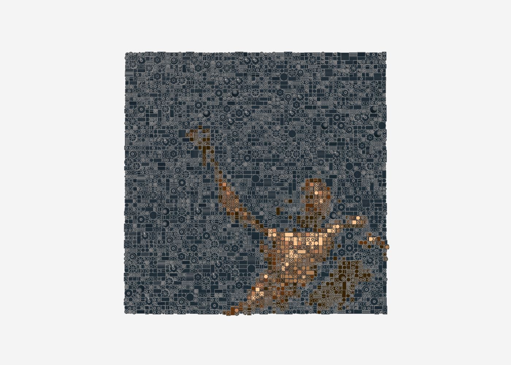
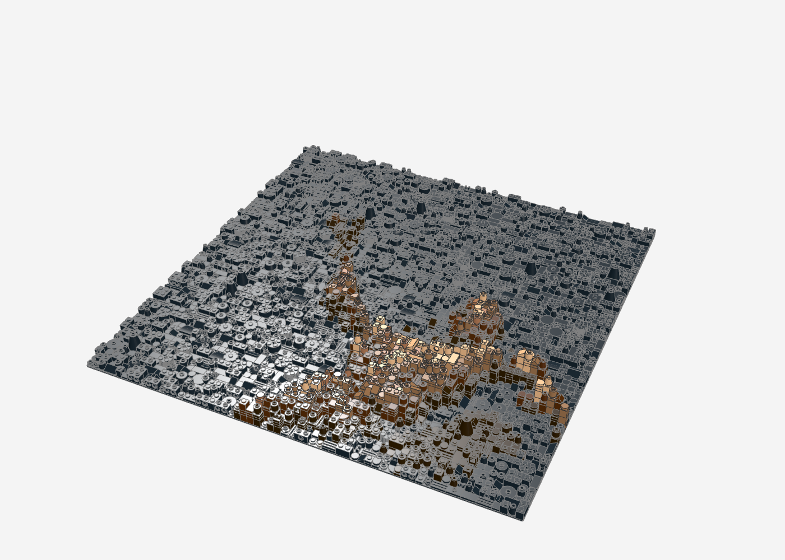
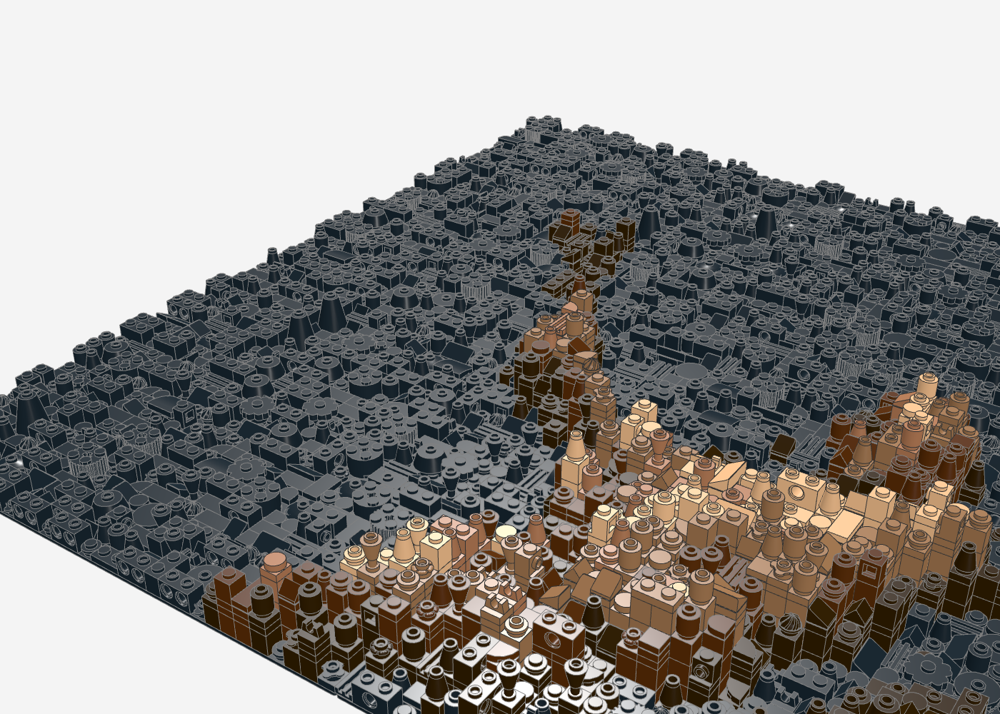
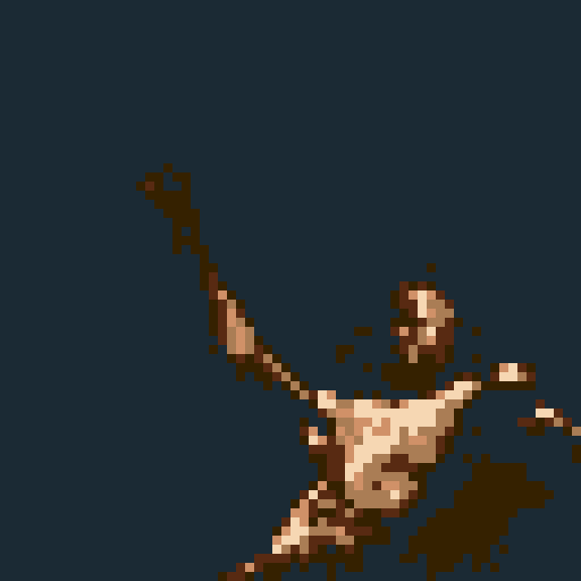
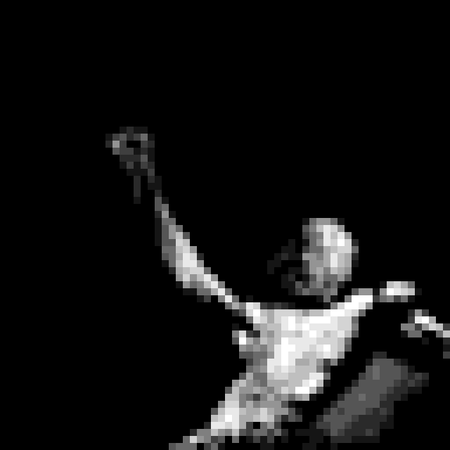

# UTOPIA-Relief (64 × 64)

Travis Scotts *UTOPIA*-Cover als 3D-Relief-Mosaik: 64 × 64 Noppen (ca. 51 × 51 cm) auf 4 Baseplates 32 × 32.
Die angeleuchtete Figur (Arm, Kopf, Oberkörper) tritt bis zu **12 Platten** aus dem flachen schwarzen Hintergrund
heraus: je heller die Stelle im Foto, desto höher der Stapel. Die Haut ist in sechs warmen Tönen modelliert.

| Kennzahl | Wert |
|---|---|
| Teile | 4.802 |
| Positionen (Teil + Farbe) | 142 |
| Farben | Black, Dark Brown, Reddish Brown, Medium Nougat, Nougat, Light Nougat |
| max. Höhe | 12 Platten |

| Frontal | Schräg | Nah |
|---|---|---|
|  |  |  |

Vorschau (Farben flach):  · Höhenkarte: 

## Dateien

- `utopia_64x64.mpd` – Modell (Stud.io, LDView, BrickLink Studio)
- `utopia_64x64_bricklink.xml` – Teileliste zum Hochladen bei BrickLink (Reiter „Upload BrickLink XML format")
- `utopia_64x64_bom.csv` – Stückliste

## Neu erzeugen

Das Cover liegt aus Urheberrechtsgründen nicht im Repo. Weil es ein sehr dunkles Low-Key-Foto ist (90 % der Pixel
unter Helligkeit 11), wird es vorher auf eine Hautton-Rampe gelegt:

```python
from PIL import Image; import numpy as np
a = np.asarray(Image.open("cover.png").convert("RGB")).astype(float); l = a.mean(2)
t = np.clip((l - 9) / (130 - 9), 0, 1) ** 0.5
st = [0, .12, .28, .46, .66, .88]
cols = np.array([(0,0,0), (53,33,0), (88,42,18), (170,125,85), (208,145,104), (246,215,179)], float)
Image.fromarray(np.stack([np.interp(t, st, cols[:, k]) for k in range(3)], 2).astype("uint8")).save("hell.png")
```

```bash
python3 tools/relief/make_relief.py hell.png utopia-relief/utopia_64x64 --breite 64 --hoehe 64 --chaos 0.2 \
  --konfetti 0 --seed 7 --tiefe 1 --hell-hoehe 12 --farben 0,308,70,84,92,78 --farben-plus 308,92,78 --licht 1 --formfolge
```

`--hell-hoehe N` (neu in `make_relief.py`): Höhe folgt der Helligkeit, hellste Stelle = N Platten – für Fotos
mit Figur vor schwarzem Grund.
