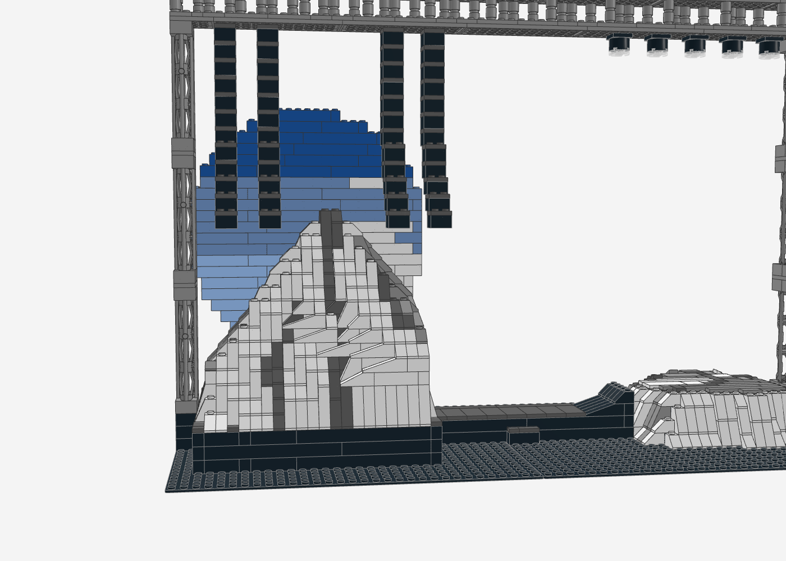

# Yeezus Stage – Mount Yeezus (LEGO MOC)

Nachbau der Yeezus-Tour-Bühne auf **zwei Baseplates 32 × 32** (64 × 32 Noppen, ca. 51 × 26 cm):
Mount Yeezus als zerklüfteter weißer Fels-Berg mit Pyramidenspitze, Simsen und Rissen, Laufsteg mit
Rampe zur Lower Stage (Felsplateau), runder Screen mit Himmel hinter dem Berg und eine Traverse mit
Line-Arrays und Moving Heads. Vorlage waren die Ansichtszeichnungen (Elevation) und Konzertfotos.


| Von vorne | Blick wie auf dem Konzertfoto |
|---|---|
|  |  |

| Mount Yeezus | Lower Stage | Rückseite |
|---|---|---|
|  |  |  |

## Kennzahlen

- **1.593 Teile**, 115 Positionen (Teil × Farbe), keine Minifiguren
- **Grundfläche** 64 × 32 Noppen (2 Baseplates), **Höhe** ca. 36 cm
- **Mount Yeezus** 20 Steine hoch, Gipfelplattform 2 × 2
- Von vorne gesehen steht der Berg links und die Lower Stage rechts, wie in der Zeichnung „The Yeezus Tour_Elevation“

## Aufbau (Submodelle)

1. **Grundplatten** – 2 × Baseplate 32 × 32 schwarz
2. **Bühnenpodest** – schwarzer Block 22 × 21 Noppen, 3 Steine hoch, Kante mit dunkelgrauen Fliesen
3. **Mount Yeezus** – Höhenfeld aus einer Pyramidenspitze und drei Felsmassen (ergibt die Simse für den Chor), Risse als dunkelgraue Kerben
4. **Laufsteg mit Rampe** – 5 Noppen breit, mit Stufe vorne und Rampe zur Lower Stage
5. **Lower Stage** – Felsplateau mit unregelmäßigem Rand und steilen Felswänden
6. **Runder Screen** – Ø 26 Noppen, hinten schwarze Rückwand, vorne Himmel mit Wolken und hellem Licht
7. **Türme und Traverse** – je Seite 2 Gitterträger-Stapel 95347 (3 × 10 Steine), Traverse 64 × 4 Noppen mit Pfosten im Zickzack
8. **Line-Arrays** – 4 Stränge über den Bergflanken, die unten J-förmig nach vorne auslaufen; ihre Länge passt der Generator an die Bergoberfläche an
9. **Moving Heads** – 5 Scheinwerfer über der Lower Stage

## Wie der Berg entsteht

- **Höhenfeld:** Der Generator setzt den Berg aus einer Pyramide (Spitze) und drei gekappten Felsmassen
  zusammen. Das Maximum ergibt die Oberfläche, Risslinien senken die Oberfläche um einen Stein ab.
- **Schale statt Vollbau:** Jede Lage ist außen 2 Noppen dick massiv. Offene Flächen im Inneren sind
  Plattendecks auf 2 × 2-Pfeilern. Die Stütz-Propagation sorgt dafür, dass alles eine Auflage hat.
- **Slopes an jeder Stufenkante,** passend zu Stufenbreite und -höhe:

  | Stufe | Teil |
  |---|---|
  | 1 Noppe breit, 1 Stein hoch | Slope 45° 2 × 1 (3040b) |
  | 2 / 3 Noppen breit | Slope 33° 3 × 1 (4286) / 18° 4 × 1 (60477) |
  | 2 / 3 Steine hoch (steile Wand) | Slope 65° 2 × 1 × 2 (60481) / 75° 2 × 1 × 3 (4460b) |

- **Farben:** Die Felsflächen sind nach der Lichtrichtung schattiert, zugewandte Flächen weiß, abgewandte
  hellgrau. Flecken kommen aus einer glatten Rauschfunktion, Risse sind dunkelgrau. Das Innere ist schwarz.

## Prüfung

Der Generator prüft nach jedem Lauf:
- **0 nicht verbundene Teile:** Alles hängt an den Baseplates.
- **0 schwebende Teile:** Die 11 Ausnahmen hängen mit Klemmkraft von oben, nämlich Line-Arrays, Moving Heads und Teile der unteren Traversenlage.
- **0 Kollisionen.**
- **Traverse als ein Stück:** Die zwei Plattenlagen verbindet ein Verbund-Algorithmus, und das wird geprüft.

Die Line-Arrays enden mindestens 2 Steine über der Bergoberfläche.

## Neu erzeugen

```bash
python3 yeezus-stage/generate_yeezus_stage.py
```

Die Parameter für Berg (Flächen, Massen, Risse), Lower Stage, Screen, Traverse und Line-Arrays stehen im Skript.

## Hinweise

- **Chor und Performer:** Die Figuren sind nicht enthalten. Auf den Simsen und der Gipfelplattform ist Platz für Minifiguren in weißen Roben.
- **Lichtkegel:** Die Lichtkegel der Moving Heads (rot/gelb in der Zeichnung) lassen sich nicht sinnvoll aus Steinen bauen.
  Die Scheinwerfer haben trans-klare Linsen. Wie bei der Globe Stage könnten dort echte LEDs sitzen.
- **Geneigte Traverse:** In der Zeichnung hängt die Traverse schräg über dem Berg. Im Modell ist sie waagerecht, weil geneigte Verbindungen mit Noppen nicht stabil gehen.
