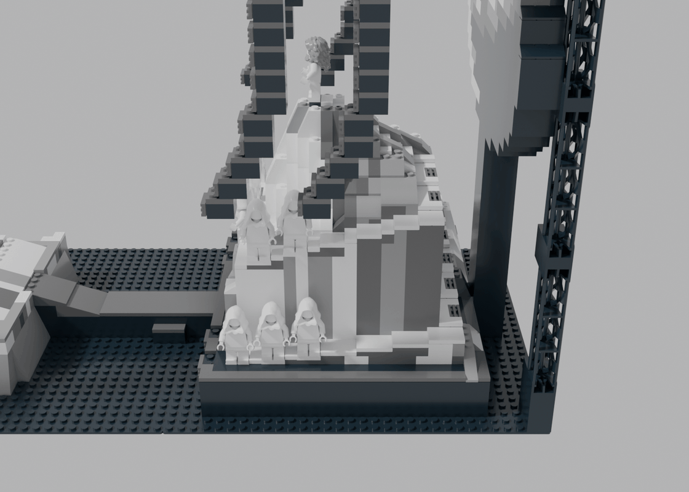
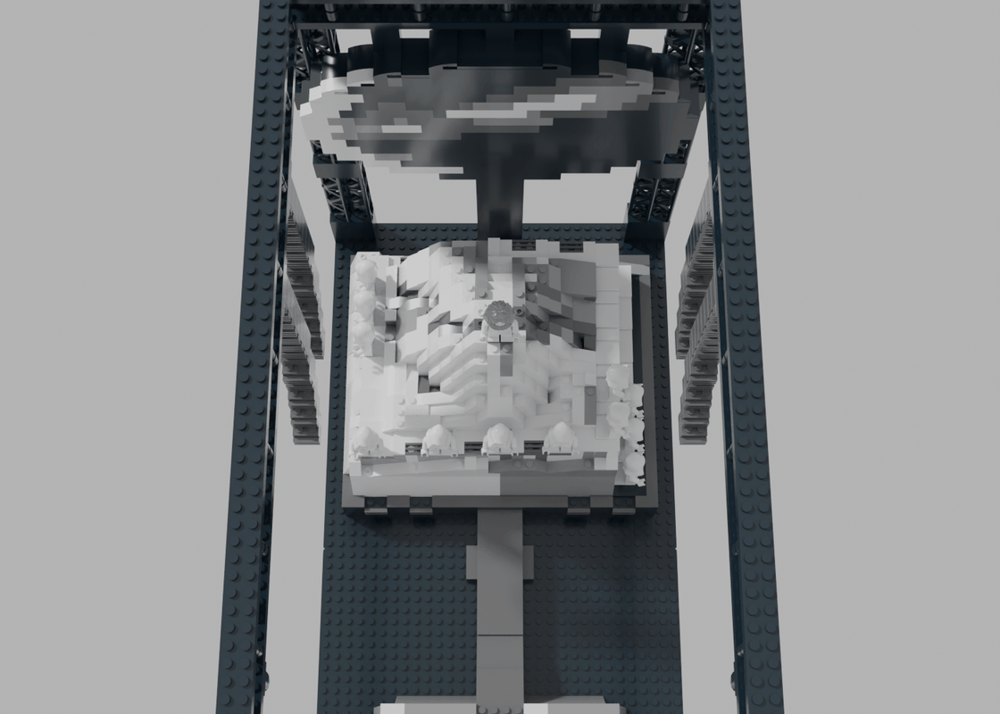
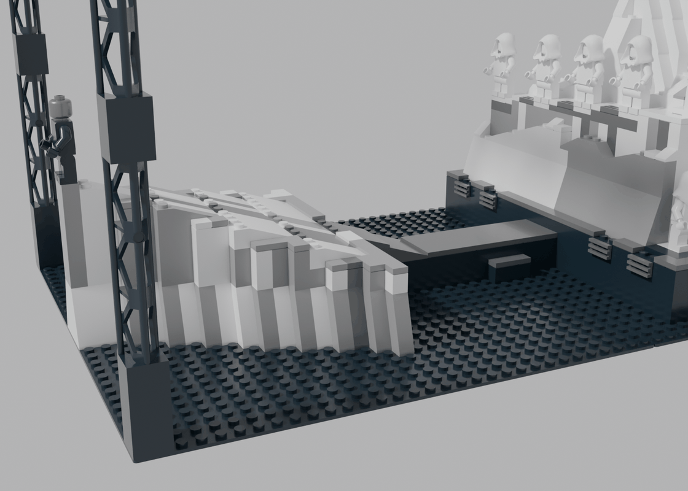
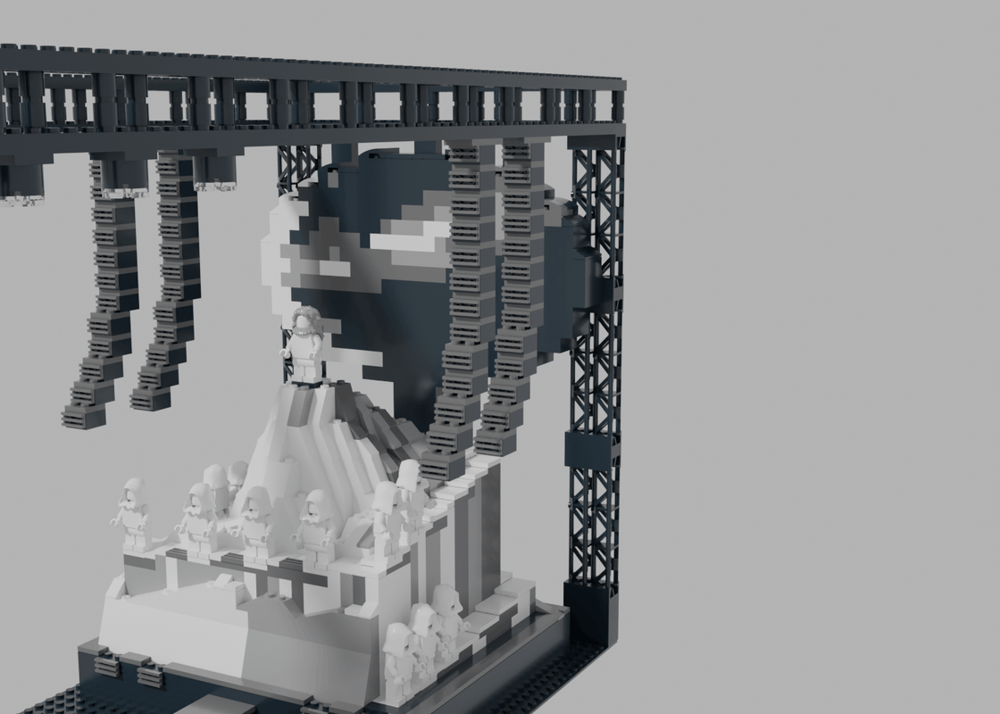
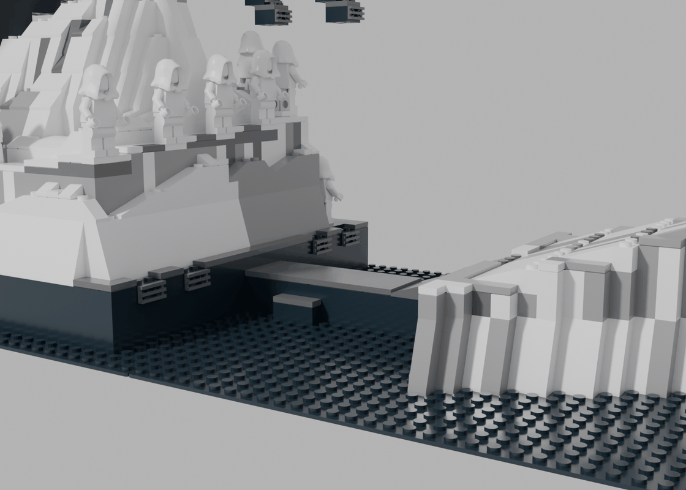
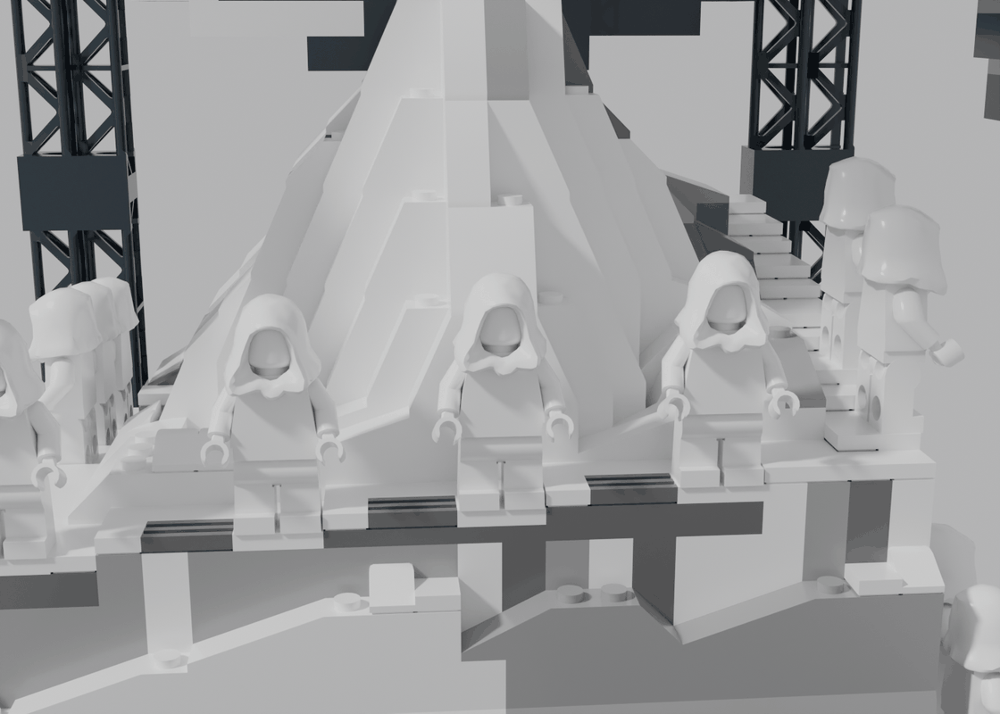
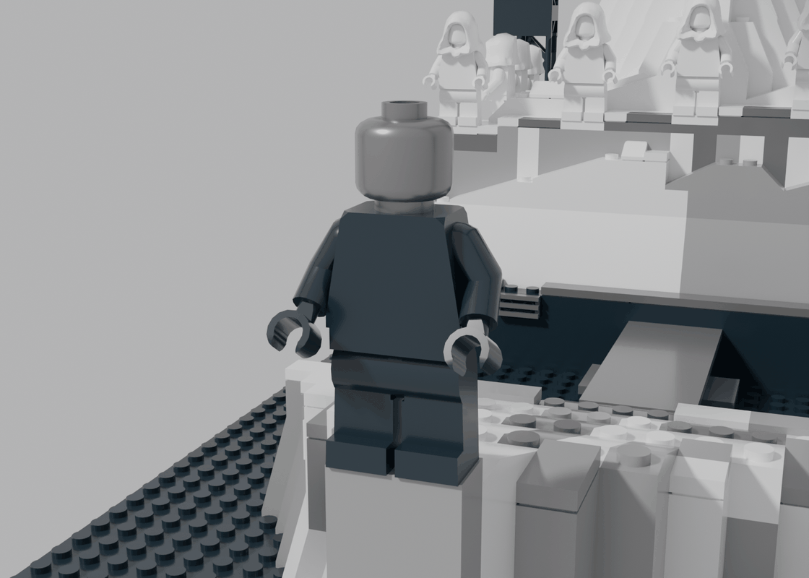

# Yeezus Stage – Mount Yeezus (LEGO MOC)

Nachbau der Yeezus-Tour-Bühne auf **zwei Baseplates 32 × 32** (64 × 32 Noppen, ca. 51 × 26 cm):
Mount Yeezus als weiße Fels-Pyramide mit scharfem Grat nach vorne. Ein Wendelweg windet sich vom
Bühnenboden bis auf den Gipfel. Darüber hängt der Screen als breite Ellipse mit Sturmhimmel. Ein Laufsteg führt über
eine Rampe auf die Center Stage im Publikum, einen dreieckigen Felskeil, der zur Spitze hin ansteigt. Darüber hängen Line-Arrays und Moving Heads an einem
Traversen-Rechteck. Vorlage waren die Ansichtszeichnungen (Elevation) und die Konzertfotos.


## Ausrichtung

Das Modell ist auf die **Publikumssicht** der Konzertfotos ausgerichtet:

- **Vorne:** die Center Stage (Keil) im Publikum. Der Laufsteg führt zum Berg, darüber hängt mittig der Screen.
- **Screen:** Er zeigt zum Publikum. Die Pyramidenspitze ragt in seine untere Hälfte.
- **Seitenansicht:** Die Ansichtszeichnung „The Yeezus Tour_Elevation“ ist die Seitenansicht. So gesehen steht der Berg links und die Center Stage rechts.

| Publikumssicht (wie auf den Fotos) | Seitenansicht (wie die Elevation-Zeichnung) |
|---|---|
|  |  |

| Screen über dem Gipfel | Mount Yeezus | Center Stage: Keil mit Riefen |
|---|---|---|
|  |  |  |

| Wendelweg (von rechts): zwei Umläufe mit Stufen | Wendelweg von oben | Rampe und Keil: eine durchgehende Schräge |
|---|---|---|
|  |  |  |

| Line-Arrays mit SNOT-Gittern | Bühnenkante: Front-Fills und Dielen | Rückseite |
|---|---|---|
|  |  |  |

| Chor: Tänzerinnen in Weiß auf dem Sims | Kanye auf der Spitze der Center Stage |
|---|---|
|  |  |

## Abgleich mit den Tourfotos

Die Bühne wurde gegen Fotos und Berichte der Yeezus-Tour abgeglichen
([Wikipedia](https://en.wikipedia.org/wiki/The_Yeezus_Tour), [Wikimedia Commons, CC BY-SA 3.0](https://commons.wikimedia.org/wiki/File:Yeezus_Tour_Stage.jpg),
[Complex](https://www.complex.com/music/a/edwin-ortiz/kanye-west-yeezus-concert-review), [FACT](https://factmag.com/2013/10/21/kanye-wests-tour-features-a-mountain-and-a-jesus-impersonator-and-looks-incredible)):
ein rund 15 m hoher, gestufter Berg mit Simsen für die Tänzerinnen, darüber ein runder LED-Screen von etwa 18 m
Durchmesser und ein etwa 9 m langer Laufsteg zu einer dreieckigen Center Stage, die hochgefahren werden konnte.
Daraufhin wurde die flache Lower Stage durch den ansteigenden Keil ersetzt und der Screen breiter und über den Gipfel
gesetzt. Referenzfotos liegen nicht im Repo.

## Kennzahlen

- **2.329 Teile**, 114 Positionen (Teil × Farbe), davon 56 Teile für 14 Minifiguren (eigene Baugruppe, lässt sich weglassen), rein unbunt (Schwarz, Grau, Weiß)
- **Grundfläche** 64 × 32 Noppen (2 Baseplates hintereinander), **Höhe** ca. 36 cm
- **Mount Yeezus** 19 Steine hoch, Grat zum Publikum mit gleichmäßig 65° Steigung, Gipfelplattform 2 × 2
- **Wendelweg** 111 Stationen (2 Noppen breit), steigt in 47 Absätzen vom Bühnenboden bis auf den Gipfel
- **Screen** Ellipse 30 × 15 (Noppen × Lagen), breiter als der Berg, über dem Gipfel
- **Center Stage** dreieckiger Keil, 20 Noppen breit an der Rampe, 2 Noppen an der Spitze, steigt von 4 auf 8 Steine

## Aufbau (Submodelle)

1. **Grundplatten** – 2 × Baseplate 32 × 32 schwarz
2. **Bühnenpodest** – schwarzer Block 24 × 28 Noppen, 3 Steine hoch, Kante mit dunkelgrauen Fliesen, vorne 4 Front-Fill-Lautsprecher (SNOT-Gitter)
3. **Mount Yeezus** – wie auf den Fotos: unten ein Sockel mit senkrecht geriefelten Felswänden, darauf eine spitze Pyramide. Nach vorne zeigt ein scharfer Grat. Er steigt vom Sims bis zur Spitze gleichmäßig mit 2 Steinen pro Noppe an und besteht durchgehend aus 65°-Slopes, damit die Steigung der Klippe klar zu sehen ist. Nach hinten fällt ein langer, flacher Rücken ab (wie in der Ansichtszeichnung), die Flanken tragen Risse als dunkelgraue Kerben
4. **Laufsteg mit Rampe** – 4 Noppen breit, exakt auf der Mittelachse von Berg und Screen, Belag aus versetzt verlegten Dielen (Fliesen 1 × 2 / 1 × 4), Stufen beidseitig. Die Rampe besteht aus zwei hintereinander gesetzten 18°-Slopes 4 × 1 und geht ohne Absatz in die Schräge der Center Stage über
5. **Center Stage (Keil)** – wie auf den Tourfotos ein dreieckiger Felskeil im Publikum: Die Grundseite liegt an der Rampe, die Oberfläche steigt alle 4 Noppen um 1 Stein bis zur 2 Noppen schmalen Spitze, auf der der Künstler steht. Die Flanken sind senkrecht und geriefelt (Streifen in Weiß, Hellgrau, Dunkelgrau), der Fuß liegt im Schatten, Risse laufen über die Oberseite
6. **Wendelweg** – Spiralpfad, auf dem der Künstler den Berg hinauf- und hinuntergehen kann:
   - **Unterer Umlauf:** Er beginnt vorne rechts auf Bühnenhöhe und läuft außen rechts, hinten und links um den Berg.
   - **Sims:** Danach führt er vorne als Sims vor dem Grat entlang (Platz für den Chor).
   - **Oberer Umlauf:** Rechts und hinten geht es eine Ebene höher weiter.
   - **Gipfeltreppe:** Zum Schluss führt eine Treppe über den flachen Rücken bis auf den Gipfel.

   Jede Stufe ist 1 Platte hoch: dunkelgraue Platten als Setzstufe, weiße Fliesen als Trittfläche. Im Außenrand sitzen Bodenleuchten (dunkelgraue Gitter-Fliesen) wie auf den Fotos
7. **Screen** – auf den Fotos hängt eine riesige runde Scheibe schräg über dem Berg; von vorne wirkt sie wie eine breite Ellipse, deren unteren Rand die Gipfelspitze gerade berührt. Im Modell ist das eine Ellipse aus einer Steinwand (3 Noppen tief, hinten schwarz, Umriss oben mit gebogenen und Cheese-Slopes gerundet), 30 Noppen breit – breiter als der Berg. Vorne ein dunkler Sturmhimmel: heller Sichelrand links, Wolkenband oben rechts. Getragen wird sie von einer schmalen Säule, die von vorne genau hinter dem Gipfel verschwindet, und von drei Aufhängungen an der hinteren Traverse (Mitte, links, rechts)
8. **Ecktürme und Traversen-Rechteck** – schwarz (Gitterträger, Verbindungsplatten, Traverse und Pfosten); vorne je 1, hinten (hinter dem Screen) je 2 Gitterträger-Stapel 95347; oben läuft ein Traversen-Rechteck mit Pfosten im Zickzack. Die Mitte bleibt frei, damit die Blickachse nicht zugestellt wird
9. **Line-Arrays** – 4 Stränge links und rechts neben dem Berg (wie PA-Anlagen), unten J-förmig zum Publikum geneigt, oben an einer Platte 2 × 4 unter der Traverse (8 Noppen Klemmkraft). Jede Box hat ein Lautsprechergitter, das per SNOT auf den Seitennoppen eines Steins sitzt. Die Länge passt der Generator an die Oberfläche darunter an
10. **Moving Heads** – 8 Scheinwerfer mit trans-klaren Linsen an den Seitentraversen über der Center Stage und an der vorderen Traverse
11. **Figuren (optional)** – aus offiziellen Teilen, rein unbunt, jede Figur steckt auf einer Platte mit Noppen, die dort statt einer Fliese liegt:
   - **Kanye** auf der Spitze der Center Stage: Beine und Torso schwarz, unbedruckter Kopf in Flat Silver als Kristallmaske
   - **12 Tänzerinnen** ganz in Weiß mit Kapuze als Schleier: 4 als Chor auf dem Sims vor dem Grat (Blick zum Publikum), die übrigen auf den Seitenwegen, je höchstens eine pro Absatz und nie neben einer Bodenleuchte
   - **Jesus** auf dem Gipfel: weißes Gewand, Kopf weiß, lange Haare und Bart in Hellgrau – wie eine Marmorstatue
   - Teile: Beine 73200b-f1 (BrickLink 970c00), Torso mit Armen und Händen 76382, Kopf 3626c, Kapuze 30381, Haare 20595, Bart 15501

## Angewandte Techniken

Abgeleitet aus [Brick Builder's Handbook – Building Techniques](https://brickbuildershandbook.com/category/building-techniques/),
[jmbricklayer – LEGO MOC mit Farbtheorie](https://www.jmbricklayer.com/blogs/knowledge/how-to-design-and-build-a-lego-moc-with-color-theory),
[r/LegoTechniques](https://www.reddit.com/r/LegoTechniques/) sowie
[BrickNerd – Rockwork](https://bricknerd.com/home/lego-rockwork-techniques-lets-get-rocking-1-26-23) und
[BrickNerd – Farbtheorie und Komposition](https://bricknerd.com/home/using-color-theory-and-composition-in-lego-mocs-3-25-24):

| Technik | Umsetzung im Modell |
|---|---|
| **Keil mit durchgehender Schräge** | Die Center Stage steigt alle 4 Noppen um genau 1 Stein. So schließen die 18°-Slopes 4 × 1 nahtlos aneinander und an die Rampe an: eine gerade Schräge vom Laufsteg bis zur Spitze statt einer Treppe |
| **Saubere Kanten statt Rauschen** | An der Center Stage keine zufälligen Cheese-/Curved-Kappen, sondern glatte Fliesen – der Keil liest sich als klare Form (Detail nur mit Zweck) |
| **Hängendes an mehreren Punkten** | Screen an drei Aufhängungen plus Säule, Line-Arrays an einer 2 × 4-Platte statt 2 × 2: eine sichtbare Deko-Verbindung ist nie der einzige Lastpfad |
| **Keine sich wiederholenden Muster** | Cheese-Slope-Kanten und Farbflecken am Berg folgen einer glatten Rauschfunktion statt eines Rasters oder Zufalls pro Zelle |
| **Fels in Schichten, unten weiter vorne** | Die Stufen des Bergs laufen mit Slopes passender Breite und Höhe auf die Stufe darunter aus |
| **60-30-10-Farbregel** | Dominant Schwarz (Bühne, Screen, Türme und Traverse), zweitrangig Weiß/Hellgrau (Fels), Dunkelgrau für Risse, Schatten und Line-Arrays – rein unbunt wie die Tour-Optik; die Blickführung entsteht nur über Helligkeit |
| **Zuerst Helligkeitskontrast sichern** | Der Berg ist die hellste Fläche und liegt vor dem dunklen Screen. Türme und Traverse sind schwarz, damit sie im dunklen Raum verschwinden und der Berg allein wirkt. Der Fels hat einen Verlauf von hell (Spitze im Spotlight) nach dunkel (Fuß) |
| **SNOT / Greebling** | Lautsprechergitter (Gitter-Fliese 1 × 2, 2412) auf Steinen 1 × 2 mit Seitennoppen (11211), Front zum Publikum – an allen Line-Array-Boxen und als 4 Front-Fills in der Podestfront |
| **Runde Formen** | Der Screen ist eine Stein-Wand mit treppigem Ellipsen-Umriss. Auf jede freie Stufe der oberen Hälfte kommt ein gebogener Slope 2 × 1 (11477) oder ein Cheese-Slope mit Gefälle nach außen. Vorne in Bildfarbe, dahinter schwarz, sodass der Umriss von vorne rund wirkt |
| **Gebogene Keile für Erosion** | Felskanten sind gemischt aus gebogenen Slopes 2 × 1 und Cheese-Slopes 1 × 1 (per Rauschfunktion verteilt). Die Kanten wirken ausgewaschen statt stufig |
| **Verband bei Fliesen** | Laufsteg-Belag aus 1 Noppe breiten Fliesen in Laufrichtung, Stöße von Reihe zu Reihe versetzt – liest sich als Bühnendielen statt als Plattenfläche |
| **Treppen aus Platten und Fliesen** | Der Wendelweg steigt in Stufen von 1 Platte Höhe. Dunkle Setzstufen und weiße Trittflächen machen jede Stufe auch aus der Entfernung lesbar |
| **Gleichmäßige Steigung durch gleiche Slopes** | Der Grat vorne steigt Noppe für Noppe um genau 2 Steine und besteht durchgehend aus 65°-Slopes. Rampe und Center Stage bestehen aus 18°-Slopes in einer Linie. So liest sich die Steigung als gerade Linie statt als Treppe |
| **Riefen durch Farbstreifen** | Die Felswände unter dem Wendelweg und die Flanken der Center Stage bekommen senkrechte Streifen in Weiß, Hellgrau und Dunkelgrau. Die Farbe hängt nur von der Position entlang der Wand ab, nicht von der Lage – das erzeugt die senkrechten Riefen der echten Felsverkleidung |
| **Symmetrie / Achse** | Laufsteg von 5 auf 4 Noppen geändert: Er liegt jetzt exakt auf der Mittelachse von Berg, Gipfel und Screen statt eine halbe Noppe daneben |

## Wie der Berg entsteht

- **Höhenfeld:** Die Pyramide entsteht aus Ebenen: zwei steile Grat-Flanken nach vorne, zwei Seitenflanken und ein
  flacher Rücken. Risslinien senken die Oberfläche um einen Stein ab.
- **Wendelweg:** Die Weg-Stationen bekommen ihre Höhe in Platten. Fels bergseitig liegt mindestens 1 Stein
  höher als der Weg (Wand und Schulter), Fels talseitig höchstens auf Weghöhe. Der Weg ist also in die Flanke
  geschnitten. Mulden hinter Wegkanten füllt der Generator auf.
- **Schale statt Vollbau:** Jede Lage ist außen 2 Noppen dick massiv. Offene Flächen im Inneren sind
  Plattendecks auf 2 × 2-Pfeilern. Die Stütz-Propagation sorgt dafür, dass alles eine Auflage hat.
- **Slopes an jeder Stufenkante,** passend zu Stufenbreite und -höhe:

  | Stufe | Teil |
  |---|---|
  | 1 Noppe breit, 1 Stein hoch | Slope 45° 2 × 1 (3040b) |
  | 2 / 3 Noppen breit | Slope 33° 3 × 1 (4286) / 18° 4 × 1 (60477) |
  | 2 / 3 Steine hoch (steile Wand) | Slope 65° 2 × 1 × 2 (60481) / 75° 2 × 1 × 3 (4460b) |

- **Farben:** Die Felsflächen sind nach der Lichtrichtung schattiert, zugewandte Flächen weiß, abgewandte
  hellgrau. Flecken kommen aus einer glatten Rauschfunktion, Risse sind dunkelgrau. Das Innere ist schwarz.

## Prüfung

Der Generator prüft nach jedem Lauf:
- **0 nicht verbundene Teile:** Alles hängt an den Baseplates.
- **0 schwebende Teile:** Die 37 Ausnahmen hängen mit Klemmkraft von oben (Line-Arrays, Moving Heads, Teile der unteren Traversenlage) oder sitzen per SNOT seitlich an ihrem Halter (Lautsprechergitter). Der Check wertet diese seitliche Verbindung mit.
- **0 Kollisionen.**
- **Traverse als ein Stück:** Die zwei Plattenlagen verbindet ein Verbund-Algorithmus, und das wird geprüft.

Die Line-Arrays enden mindestens 2 Steine über der Bergoberfläche.

## Neu erzeugen

```bash
python3 yeezus-stage/generate_yeezus_stage.py
```

Die Parameter für Berg (Flanken, Risse), Wendelweg (Abschnitte und Höhen), Center Stage (Keil), Screen (Größe, Himmel), Traverse und Line-Arrays stehen im Skript.

## Hinweise

- **Figuren:** Sie sind eine eigene Baugruppe (`11_figuren`) und lassen sich weglassen; die Standplatten mit Noppen bleiben dann sichtbar. Echte Hauttöne statt Weiß/Silber würden Farbe ins sonst unbunte Modell bringen und sind deshalb bewusst weggelassen. In der BrickLink-Liste steht der Torso als LDraw-Baugruppe 76382; BrickLink führt Torsos je Farbkombination unter eigenen Nummern (973c…) – vor der Bestellung dort nachschlagen.
- **Lichtkegel:** Die Lichtkegel der Moving Heads (rot/gelb in der Zeichnung) lassen sich nicht sinnvoll aus Steinen bauen.
  Die Scheinwerfer haben trans-klare Linsen. Wie bei der Globe Stage könnten dort echte LEDs sitzen.
- **Gitterträger in Schwarz:** 95347 gibt es in Schwarz (18 Stück nötig), neu und gebraucht bei mehreren Händlern. Vor der Bestellung auf BrickLink Menge und Preis prüfen.
- **Screen nicht geneigt:** Die echte Scheibe hängt schräg. Im Modell steht sie senkrecht, weil eine geneigte Steinwand nur über Scharniere ginge und dann an wenigen Punkten hinge. Von vorne sieht man den Unterschied kaum, von der Seite schon; dort ist auch die Tragsäule sichtbar.
- **Center Stage ist fest:** Auf der Tour fuhr die dreieckige Bühne hoch. Das Modell zeigt sie als festen Keil in der angehobenen Form.
- **Geneigte Traverse:** In der Zeichnung hängt die Traverse schräg über dem Berg. Im Modell ist sie waagerecht, weil geneigte Verbindungen mit Noppen nicht stabil gehen.
- **Echte Bühne ohne Stützen:** Auf der echten Bühne hing alles unter der Hallendecke. Das Modell braucht die Ecktürme als Stützen. Sie stehen ganz außen, damit die Sicht auf Berg und Screen frei bleibt.
