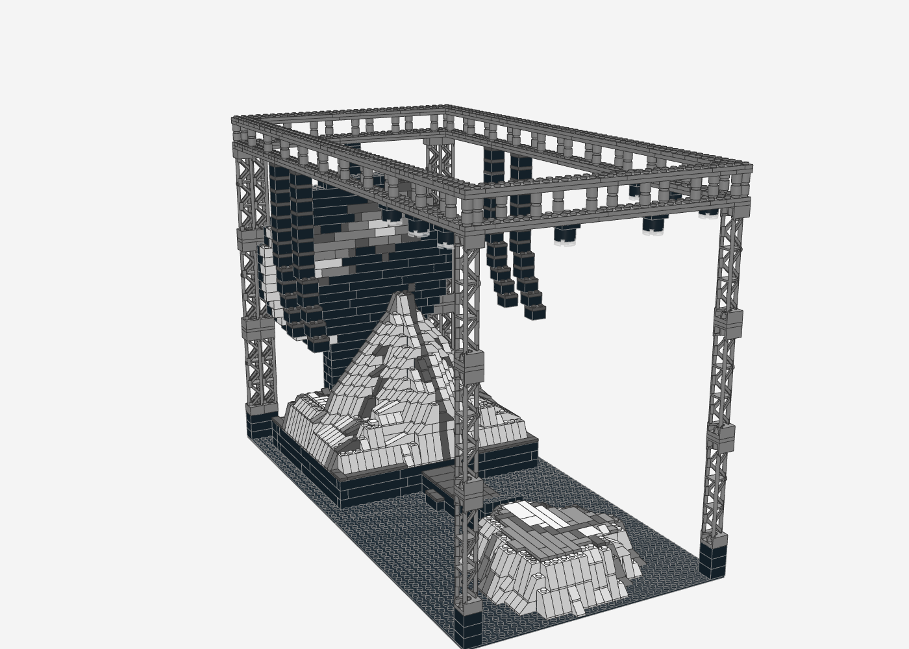
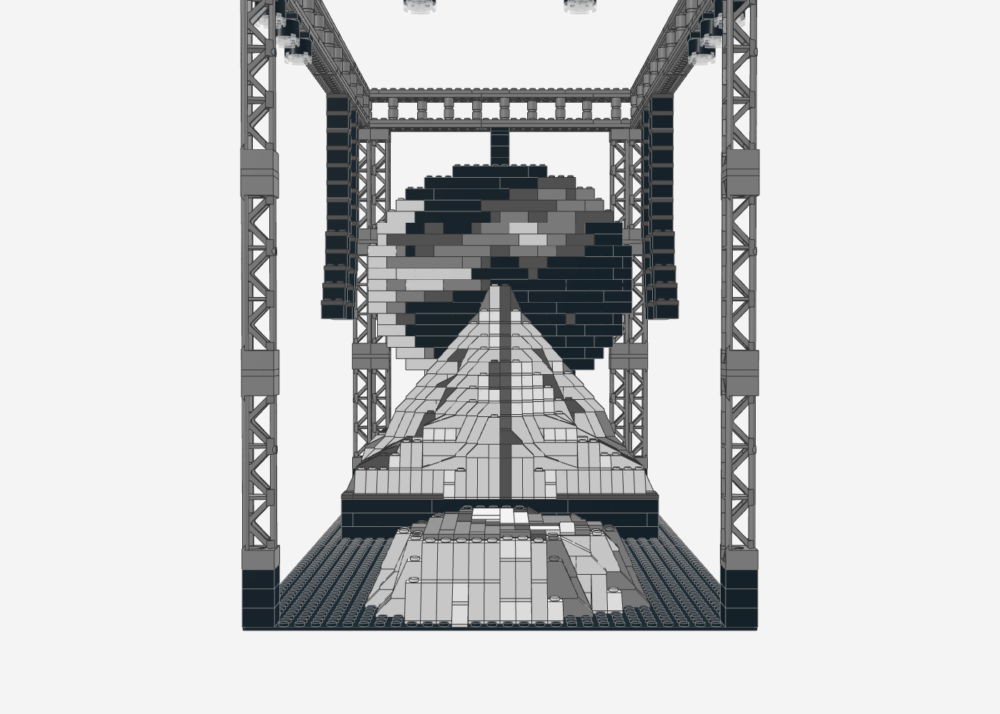
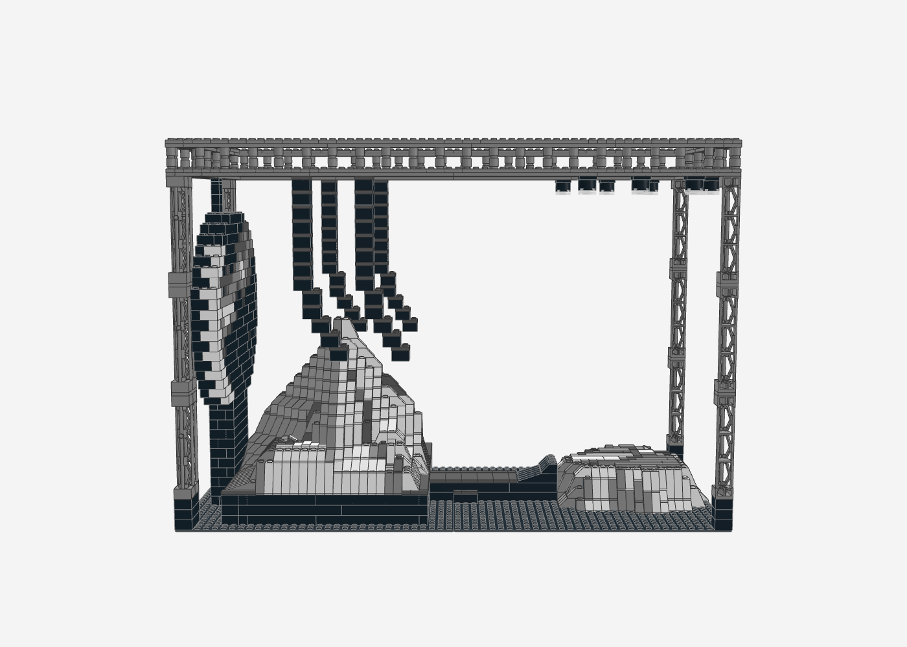
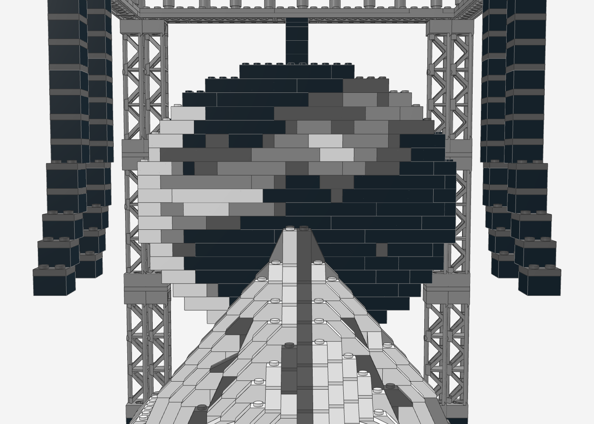
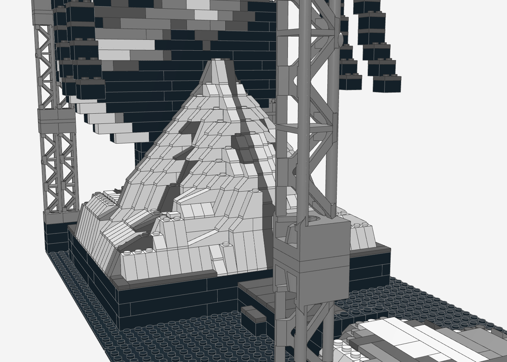
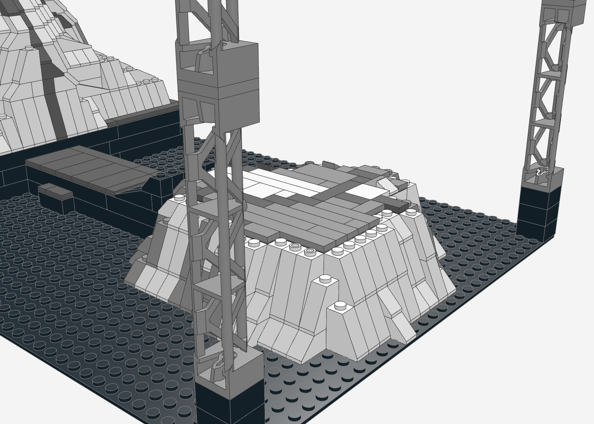
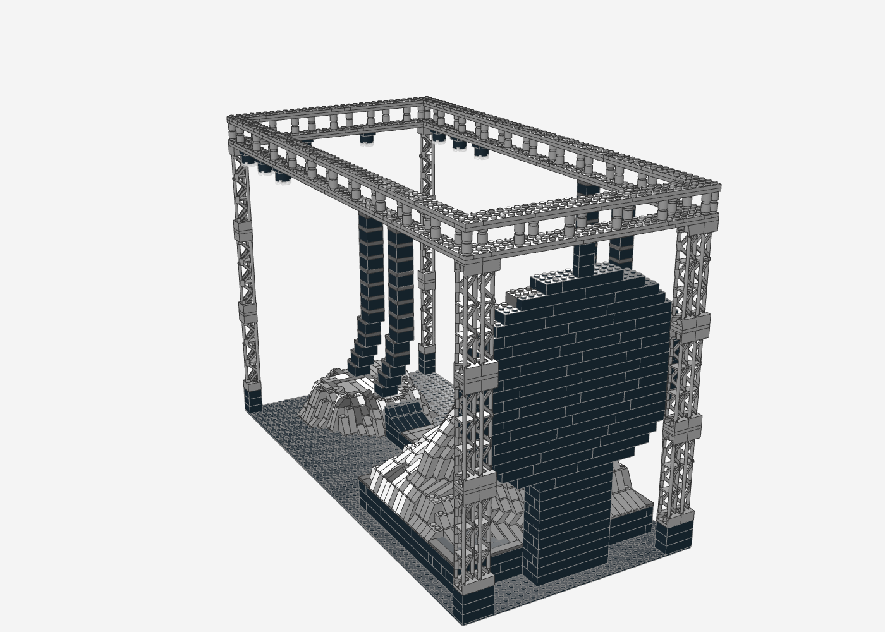

# Yeezus Stage – Mount Yeezus (LEGO MOC)

Nachbau der Yeezus-Tour-Bühne auf **zwei Baseplates 32 × 32** (64 × 32 Noppen, ca. 51 × 26 cm):
Mount Yeezus als zerklüftete weiße Fels-Pyramide mit Simsen und Rissen, dahinter der runde Screen mit
Sturmhimmel. Ein Laufsteg führt mit Rampe zur Lower Stage (Felsplateau) im Publikum, darüber hängen
Line-Arrays und Moving Heads an einem Traversen-Rechteck. Vorlage waren die Ansichtszeichnungen
(Elevation) und die Konzertfotos.



## Ausrichtung

Das Modell ist auf die **Publikumssicht** der Konzertfotos ausgerichtet:

- **Vorne:** die Lower Stage im Publikum. Der Laufsteg führt zum Berg, direkt dahinter steht mittig der runde Screen.
- **Screen:** Er zeigt zum Publikum. Die Pyramidenspitze ragt in seine untere Hälfte.
- **Seitenansicht:** Die Ansichtszeichnung „The Yeezus Tour_Elevation“ ist die Seitenansicht. So gesehen steht der Berg links und die Lower Stage rechts.

| Publikumssicht (wie auf den Fotos) | Seitenansicht (wie die Elevation-Zeichnung) |
|---|---|
|  |  |

| Screen | Mount Yeezus | Lower Stage | Rückseite |
|---|---|---|---|
|  |  |  |  |

## Kennzahlen

- **2.004 Teile**, 116 Positionen (Teil × Farbe), keine Minifiguren
- **Grundfläche** 64 × 32 Noppen (2 Baseplates hintereinander), **Höhe** ca. 36 cm
- **Mount Yeezus** 20 Steine hoch, Pyramide um 45° gedreht (Grat zum Publikum), Gipfelplattform 2 × 2
- **Screen** oval, 28 Noppen breit und 20 Lagen hoch, direkt hinter dem Berg

## Aufbau (Submodelle)

1. **Grundplatten** – 2 × Baseplate 32 × 32 schwarz
2. **Bühnenpodest** – schwarzer Block 24 × 28 Noppen, 3 Steine hoch, Kante mit dunkelgrauen Fliesen
3. **Mount Yeezus** – Pyramide mit Grat nach vorne, davor eine breite untere Stufe mit Sims (Platz für den Chor), seitlich zwei asymmetrische Felsmassen; Risse als dunkelgraue Kerben, vorne eine durchgehende Gratlinie von der Spitze nach unten
4. **Laufsteg mit Rampe** – 5 Noppen breit, mit Stufe und Rampe zur Lower Stage
5. **Lower Stage** – Felsplateau mit unregelmäßigem Rand und steilen Felswänden
6. **Runder Screen** – Wand aus 3 Noppen Tiefe, hinten schwarz. Vorne ein dunkler Sturmhimmel wie auf den Fotos: heller Sichelrand links, Wolkenband oben rechts. Er steht auf einem Sockel hinter dem Berg und ist oben an der hinteren Traverse aufgehängt
7. **Ecktürme und Traversen-Rechteck** – vorne je 1, hinten (hinter dem Screen) je 2 Gitterträger-Stapel 95347; oben läuft ein Traversen-Rechteck mit Pfosten im Zickzack. Die Mitte bleibt frei, damit die Blickachse nicht zugestellt wird
8. **Line-Arrays** – 4 Stränge links und rechts neben dem Berg (wie PA-Anlagen), unten J-förmig zum Publikum geneigt; ihre Länge passt der Generator an die Oberfläche darunter an
9. **Moving Heads** – 8 Scheinwerfer an den Seitentraversen über der Lower Stage und an der vorderen Traverse

## Wie der Berg entsteht

- **Höhenfeld:** Der Generator setzt den Berg aus einer Pyramide (Spitze) und drei gekappten Felsmassen
  zusammen. Das Maximum ergibt die Oberfläche, Risslinien senken die Oberfläche um einen Stein ab.
- **Schale statt Vollbau:** Jede Lage ist außen 2 Noppen dick massiv. Offene Flächen im Inneren sind
  Plattendecks auf 2 × 2-Pfeilern. Die Stütz-Propagation sorgt dafür, dass alles eine Auflage hat.
- **Slopes an jeder Stufenkante,** passend zu Stufenbreite und -höhe:

  | Stufe | Teil |
  |---|---|
  | 1 Noppe breit, 1 Stein hoch | Slope 45° 2 × 1 (3040b) |
  | 2 / 3 Noppen breit | Slope 33° 3 × 1 (4286) / 18° 4 × 1 (60477) |
  | 2 / 3 Steine hoch (steile Wand) | Slope 65° 2 × 1 × 2 (60481) / 75° 2 × 1 × 3 (4460b) |

- **Farben:** Die Felsflächen sind nach der Lichtrichtung schattiert, zugewandte Flächen weiß, abgewandte
  hellgrau. Flecken kommen aus einer glatten Rauschfunktion, Risse sind dunkelgrau. Das Innere ist schwarz.

## Prüfung

Der Generator prüft nach jedem Lauf:
- **0 nicht verbundene Teile:** Alles hängt an den Baseplates.
- **0 schwebende Teile:** Die 21 Ausnahmen hängen mit Klemmkraft von oben, nämlich Line-Arrays, Moving Heads und Teile der unteren Traversenlage.
- **0 Kollisionen.**
- **Traverse als ein Stück:** Die zwei Plattenlagen verbindet ein Verbund-Algorithmus, und das wird geprüft.

Die Line-Arrays enden mindestens 2 Steine über der Bergoberfläche.

## Neu erzeugen

```bash
python3 yeezus-stage/generate_yeezus_stage.py
```

Die Parameter für Berg (Flächen, Massen, Risse), Lower Stage, Screen (Größe, Himmel), Traverse und Line-Arrays stehen im Skript.

## Hinweise

- **Chor und Performer:** Die Figuren sind nicht enthalten. Auf den Simsen und der Gipfelplattform ist Platz für Minifiguren in weißen Roben.
- **Lichtkegel:** Die Lichtkegel der Moving Heads (rot/gelb in der Zeichnung) lassen sich nicht sinnvoll aus Steinen bauen.
  Die Scheinwerfer haben trans-klare Linsen. Wie bei der Globe Stage könnten dort echte LEDs sitzen.
- **Geneigte Traverse:** In der Zeichnung hängt die Traverse schräg über dem Berg. Im Modell ist sie waagerecht, weil geneigte Verbindungen mit Noppen nicht stabil gehen.
- **Echte Bühne ohne Stützen:** Auf der echten Bühne hing alles unter der Hallendecke. Das Modell braucht die Ecktürme als Stützen. Sie stehen ganz außen, damit die Sicht auf Berg und Screen frei bleibt.
